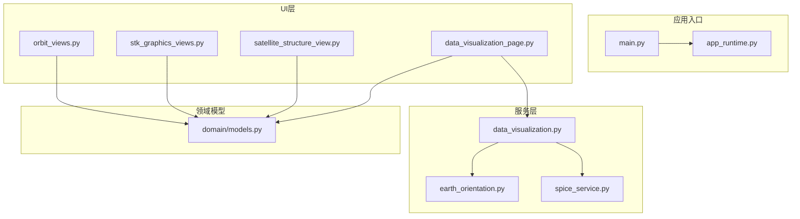
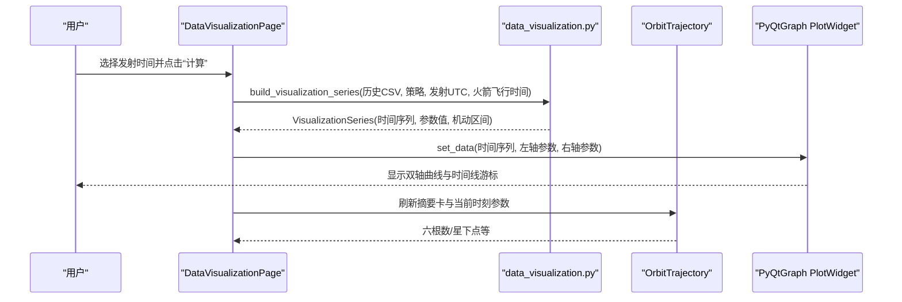
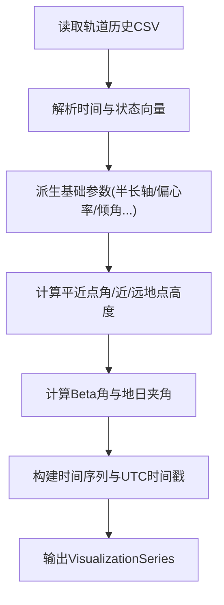
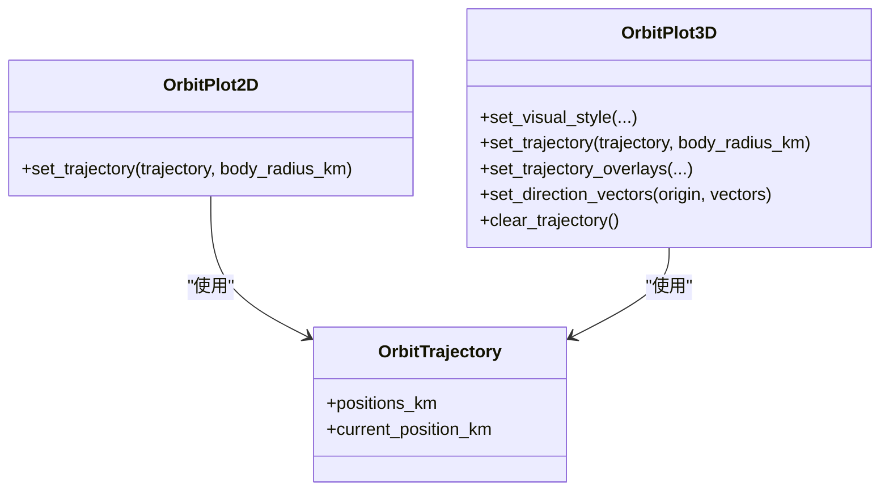
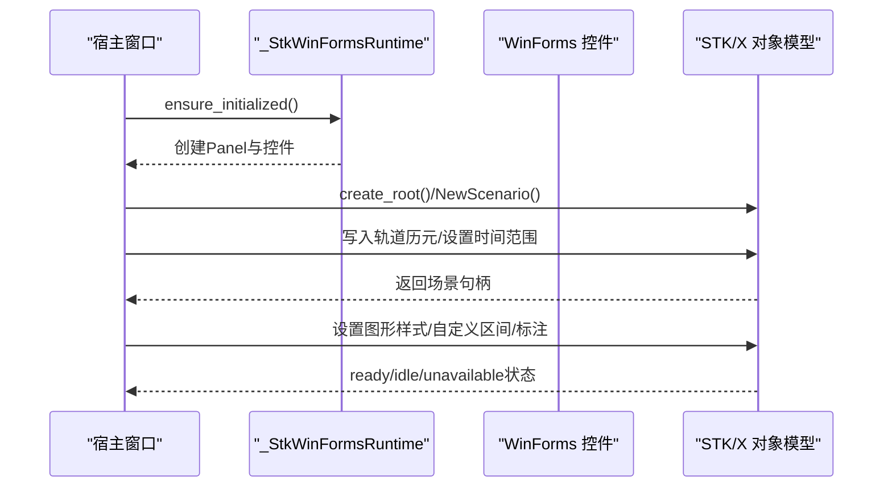
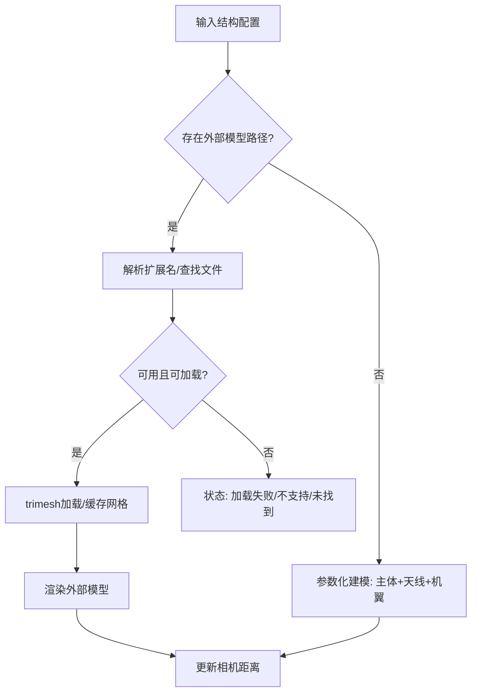
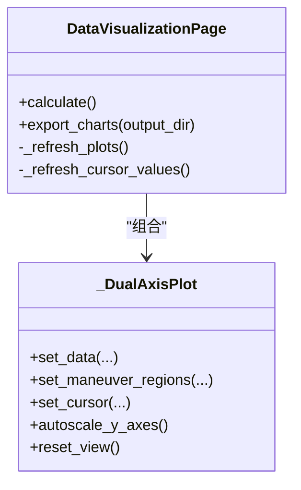
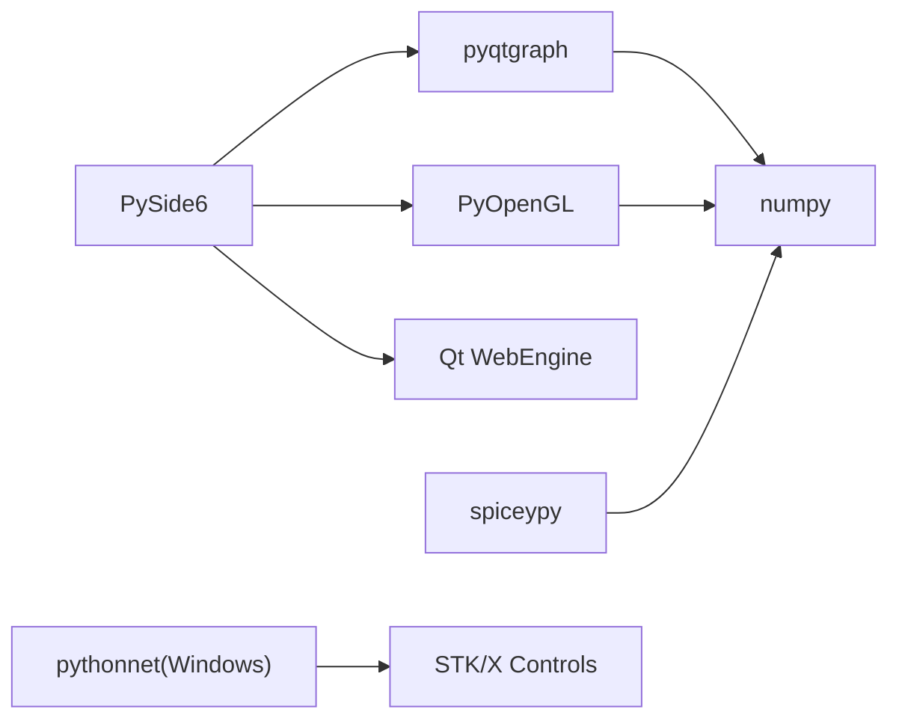

# 数据可视化

<cite>
**本文引用的文件**   
- [src\smart\services\data_visualization.py](file://src/smart/services/data_visualization.py)
- [src\smart\ui\widgets\data_visualization_page.py](file://src/smart/ui/widgets/data_visualization_page.py)
- [src\smart\ui\widgets\orbit_views.py](file://src/smart/ui/widgets/orbit_views.py)
- [src\smart\ui\widgets\stk_graphics_views.py](file://src/smart/ui/widgets/stk_graphics_views.py)
- [src\smart\ui\widgets\satellite_structure_view.py](file://src/smart/ui/widgets/satellite_structure_view.py)
- [src\smart\domain\models.py](file://src/smart/domain/models.py)
- [src\smart\services\earth_orientation.py](file://src/smart/services/earth_orientation.py)
- [src\smart\services\spice_service.py](file://src/smart/services/spice_service.py)
- [src\smart\main.py](file://src/smart/main.py)
- [src\smart\app_runtime.py](file://src/smart/app_runtime.py)
- [pyproject.toml](file://pyproject.toml)
- [tests\test_data_visualization.py](file://tests/test_data_visualization.py)
</cite>

## 目录
1. [简介](#简介)
2. [项目结构](#项目结构)
3. [核心组件](#核心组件)
4. [架构总览](#架构总览)
5. [详细组件分析](#详细组件分析)
6. [依赖分析](#依赖分析)
7. [性能考虑](#性能考虑)
8. [故障排查指南](#故障排查指南)
9. [结论](#结论)
10. [附录](#附录)

## 简介
本文件面向SMART项目的“数据可视化”能力，系统性梳理轨道视图、科学图表与交互式分析的实现原理，覆盖2D/3D轨道渲染、坐标系转换、科学数据绘制、动态更新与性能优化、以及与PyQtGraph、PyOpenGL、STK/X等可视化库的集成方案，并提供可扩展的自定义开发指南与最佳实践。

## 项目结构
围绕可视化功能的关键模块分布如下：
- 服务层（数据与算法）
  - 轨道参数构建与科学图表数据准备：[src\smart\services\data_visualization.py](file://src/smart/services/data_visualization.py)
  - 地球定向与坐标系转换：[src\smart\services\earth_orientation.py](file://src/smart/services/earth_orientation.py)、[src\smart\services\spice_service.py](file://src/smart/services/spice_service.py)
- UI层（界面与控件）
  - 科学图表页面：[src\smart\ui\widgets\data_visualization_page.py](file://src/smart/ui/widgets/data_visualization_page.py)
  - 轨道视图（2D/3D）：[src\smart\ui\widgets\orbit_views.py](file://src/smart/ui/widgets/orbit_views.py)
  - STK/X 嵌入式图形：[src\smart\ui\widgets\stk_graphics_views.py](file://src/smart/ui/widgets/stk_graphics_views.py)
  - 卫星结构3D预览：[src\smart\ui\widgets\satellite_structure_view.py](file://src/smart/ui/widgets/satellite_structure_view.py)
- 领域模型（数据结构）
  - 轨道轨迹与结构配置：[src\smart\domain\models.py](file://src/smart/domain/models.py)
- 应用入口与运行时
  - 主程序与主题/图标：[src\smart\main.py](file://src/smart/main.py)
  - 图形后端配置（Qt/OpenGL/WebGL）：[src\smart\app_runtime.py](file://src/smart/app_runtime.py)
  - 依赖声明：[pyproject.toml](file://pyproject.toml)
- 测试
  - 可视化数据构建测试：[tests\test_data_visualization.py](file://tests/test_data_visualization.py)

**图表来源**
- [src\smart\main.py:10-31](file://src/smart/main.py#L10-L31)
- [src/smart/app_runtime.py:31-90](file://src/smart/app_runtime.py#L31-L90)
- [src/smart/services/data_visualization.py:49-107](file://src/smart/services/data_visualization.py#L49-L107)
- [src/smart/services/earth_orientation.py:86-159](file://src/smart/services/earth_orientation.py#L86-L159)
- [src/smart/services/spice_service.py:241-305](file://src/smart/services/spice_service.py#L241-L305)
- [src/smart/ui/widgets/data_visualization_page.py:346-373](file://src/smart/ui/widgets/data_visualization_page.py#L346-L373)
- [src/smart/ui/widgets/orbit_views.py:104-154](file://src/smart/ui/widgets/orbit_views.py#L104-L154)
- [src/smart/ui/widgets/stk_graphics_views.py:259-305](file://src/smart/ui/widgets/stk_graphics_views.py#L259-L305)
- [src/smart/ui/widgets/satellite_structure_view.py:66-131](file://src/smart/ui/widgets/satellite_structure_view.py#L66-L131)
- [src/smart/domain/models.py:69-78](file://src/smart/domain/models.py#L69-L78)

**章节来源**
- [src/smart/main.py:10-31](file://src/smart/main.py#L10-L31)
- [src/smart/app_runtime.py:31-90](file://src/smart/app_runtime.py#L31-L90)
- [pyproject.toml:11-22](file://pyproject.toml#L11-L22)

## 核心组件
- 科学图表与参数系列
  - 参数选项与单位映射、时间线构建、轨道要素推导（含平近点角、Beta角、地日夹角等）、发射/目标时刻推断。
  - 关键函数：[build_visualization_series:49-107](file://src/smart/services/data_visualization.py#L49-L107)、[default_launch_utc_from_configs:110-127](file://src/smart/services/data_visualization.py#L110-L127)、[parameter_label:130-134](file://src/smart/services/data_visualization.py#L130-L134)、[parameter_unit:137-141](file://src/smart/services/data_visualization.py#L137-L141)。
- 2D/3D轨道视图
  - 2D平面轨道与地球圆盘叠加、3D地球与轨道线/标记点、方向矢量与机动段可视化、信息覆盖层。
  - 关键类：[OrbitPlot2D:104-154](file://src/smart/ui/widgets/orbit_views.py#L104-L154)、[OrbitPlot3D:156-547](file://src/smart/ui/widgets/orbit_views.py#L156-L547)。
- STK/X 嵌入式图形
  - 在Windows平台通过.NET桥接加载STK/X 2D/3D控件，写入轨道历元并设置图形样式、标注机动区间。
  - 关键类：[StkManeuverGraphicsWidget:259-764](file://src/smart/ui/widgets/stk_graphics_views.py#L259-L764)。
- 卫星结构3D预览
  - 参数化立方体主体与天线/太阳能板构件，支持外部GLB/GLTF/DAE模型加载与材质启发式处理。
  - 关键类：[SatelliteStructureView:66-472](file://src/smart/ui/widgets/satellite_structure_view.py#L66-L472)。
- 领域模型
  - 轨道轨迹数据结构（位置/速度/半径/速度/时间），用于2D/3D视图渲染。
  - 关键类：[OrbitTrajectory:69-78](file://src/smart/domain/models.py#L69-L78)。

**章节来源**
- [src/smart/services/data_visualization.py:21-107](file://src/smart/services/data_visualization.py#L21-L107)
- [src/smart/ui/widgets/orbit_views.py:104-547](file://src/smart/ui/widgets/orbit_views.py#L104-L547)
- [src/smart/ui/widgets/stk_graphics_views.py:259-764](file://src/smart/ui/widgets/stk_graphics_views.py#L259-L764)
- [src/smart/ui/widgets/satellite_structure_view.py:66-472](file://src/smart/ui/widgets/satellite_structure_view.py#L66-L472)
- [src/smart/domain/models.py:69-78](file://src/smart/domain/models.py#L69-L78)

## 架构总览
SMART的可视化采用“服务层数据准备 + UI层渲染”的分层架构：
- 服务层负责从轨道历史CSV与策略配置中提取并派生科学参数，构建统一的时间序列与参数集合。
- UI层通过PyQtGraph与PyOpenGL分别实现2D/3D轨道视图与科学图表；在Windows平台通过pythonnet嵌入STK/X进行高级图形展示。
- 坐标系转换由SPICE与地球定向工具提供，确保ECI/ECEF/GMST等框架间的一致性。

**图表来源**
- [src/smart/ui/widgets/data_visualization_page.py:346-373](file://src/smart/ui/widgets/data_visualization_page.py#L346-L373)
- [src/smart/services/data_visualization.py:49-107](file://src/smart/services/data_visualization.py#L49-L107)
- [src/smart/domain/models.py:69-78](file://src/smart/domain/models.py#L69-L78)

## 详细组件分析

### 科学图表与参数系列（时间序列分析）
- 数据来源与处理
  - 从轨道历史CSV读取状态向量与几何参数，派生半长轴、偏心率、倾角、升交点赤经、近地点幅角、真/平/偏近点角、近/远地点高度、星下点经纬度、质量、Beta角、地日夹角等。
  - 时间轴以分钟为单位，结合发射时刻与火箭飞行时间推导T0时刻，生成UTC时间戳序列。
- 关键流程
  - 构建时间线与机动区间，计算平均近点角、近/远地点高度、Beta角与地日夹角。
  - 提供默认发射UTC推断逻辑，优先使用飞行计划与策略配置。
- 可视化呈现
  - 双轴Plot控件支持左右参数切换、同步缩放、时间线游标联动、手动重置视图、读出窗口等。

**图表来源**
- [src/smart/services/data_visualization.py:49-107](file://src/smart/services/data_visualization.py#L49-L107)

**章节来源**
- [src/smart/services/data_visualization.py:21-107](file://src/smart/services/data_visualization.py#L21-L107)
- [src/smart/ui/widgets/data_visualization_page.py:444-460](file://src/smart/ui/widgets/data_visualization_page.py#L444-L460)
- [tests/test_data_visualization.py:110-139](file://tests/test_data_visualization.py#L110-L139)

### 2D/3D轨道视图（渲染机制与坐标系转换）
- 2D轨道视图
  - 固定纵横比，绘制轨道平面投影与地球圆盘，实时标注当前时刻位置。
  - 使用PyQtGraph的PlotWidget与ViewBox，支持网格、背景色与轴样式定制。
- 3D轨道视图
  - 使用PyOpenGL（pyqtgraph.opengl）渲染地球球体（纹理或纯色）、轨道线、标记点、起始点、子卫星点、方向矢量与机动段。
  - 支持相机位置、网格、坐标轴与信息覆盖层布局。
- 坐标系转换
  - ECI/ECEF/GMST旋转：提供GMST角度与旋转矩阵，兼容SPICE变换。
  - SPICE接口：提供帧间变换（pxform/sxform）与状态向量转换，保障高精度。
- 性能与样式
  - 3D地球网格细分与纹理映射；方向矢量与箭头网格按需生成；相机距离基于最大半径自动调整。

**图表来源**
- [src/smart/ui/widgets/orbit_views.py:104-154](file://src/smart/ui/widgets/orbit_views.py#L104-L154)
- [src/smart/ui/widgets/orbit_views.py:156-547](file://src/smart/ui/widgets/orbit_views.py#L156-L547)
- [src/smart/domain/models.py:69-78](file://src/smart/domain/models.py#L69-L78)

**章节来源**
- [src/smart/ui/widgets/orbit_views.py:104-547](file://src/smart/ui/widgets/orbit_views.py#L104-L547)
- [src/smart/services/earth_orientation.py:86-159](file://src/smart/services/earth_orientation.py#L86-L159)
- [src/smart/services/spice_service.py:251-285](file://src/smart/services/spice_service.py#L251-L285)

### STK/X 嵌入式图形（Windows专用）
- 运行时初始化
  - 通过pythonnet加载STK/X托管程序集，创建WinForms面板与控件，禁用Logo水印，同步尺寸与消息泵。
- 场景管理
  - 新建/关闭场景，卸载预览卫星与标注，隐藏3D覆盖层，执行命令控制图形属性。
- 轨迹加载
  - 将轨道历元写入STK可读格式，设置分析时间段与动画边界，应用主星体图形样式与自定义区间（机动/后机动）。
- 错误处理
  - 对不可用平台、COM初始化失败、特征码查询失败等情况提供错误信息。

**图表来源**
- [src/smart/ui/widgets/stk_graphics_views.py:35-198](file://src/smart/ui/widgets/stk_graphics_views.py#L35-L198)
- [src/smart/ui/widgets/stk_graphics_views.py:259-764](file://src/smart/ui/widgets/stk_graphics_views.py#L259-L764)

**章节来源**
- [src/smart/ui/widgets/stk_graphics_views.py:35-198](file://src/smart/ui/widgets/stk_graphics_views.py#L35-L198)
- [src/smart/ui/widgets/stk_graphics_views.py:259-764](file://src/smart/ui/widgets/stk_graphics_views.py#L259-L764)

### 卫星结构3D预览（参数化与外部模型）
- 参数化建模
  - 立方体主体与天线/太阳能板构件，按数量与尺寸序列化排列，自动计算相机距离。
- 外部模型支持
  - 通过trimesh加载GLB/GLTF/DAE，提取网格与材质，缓存变换后的顶点/面片，支持启发式颜色与边框。
- 错误与回退
  - 不支持的模型类型、缺失文件、缺少依赖时提供状态事件与提示。

**图表来源**
- [src/smart/ui/widgets/satellite_structure_view.py:212-280](file://src/smart/ui/widgets/satellite_structure_view.py#L212-L280)
- [src/smart/ui/widgets/satellite_structure_view.py:66-131](file://src/smart/ui/widgets/satellite_structure_view.py#L66-L131)

**章节来源**
- [src/smart/ui/widgets/satellite_structure_view.py:66-472](file://src/smart/ui/widgets/satellite_structure_view.py#L66-L472)

### 科学图表页面（交互与样式定制）
- 组件构成
  - 工具栏：发射时间选择器、计算按钮、状态标签。
  - 左侧摘要卡：当前时刻的六根数与星下点等关键参数。
  - 右侧双轴曲线：上下两个Plot控件，支持左右参数选择、同步X轴、时间线游标联动、读出窗口。
- 交互行为
  - 计算按钮触发数据重建，异常时显示状态信息。
  - 双轴控件共享X轴范围，游标移动同步更新摘要卡与读出窗口。
- 样式定制
  - 背景色、网格色、轴色、曲线宽度与颜色、字体与字号等通过全局常量与控件样式方法统一管理。

**图表来源**
- [src/smart/ui/widgets/data_visualization_page.py:282-442](file://src/smart/ui/widgets/data_visualization_page.py#L282-L442)
- [src/smart/ui/widgets/data_visualization_page.py:444-521](file://src/smart/ui/widgets/data_visualization_page.py#L444-L521)

**章节来源**
- [src/smart/ui/widgets/data_visualization_page.py:282-653](file://src/smart/ui/widgets/data_visualization_page.py#L282-L653)

## 依赖分析
- 可视化与图形库
  - PyQtGraph：科学图表与2D轨道视图。
  - PyOpenGL：3D轨道与卫星结构视图。
  - STK/X（Windows）：通过pythonnet嵌入。
- 数学与内核
  - NumPy：数组计算与向量化。
  - SPICE：高精度坐标系变换与历元查询。
- 运行时环境
  - Qt Quick/OpenGL上下文共享与WebEngine后端选择，避免D3D11与OpenGL组合导致的黑屏问题。

**图表来源**
- [pyproject.toml:11-22](file://pyproject.toml#L11-L22)
- [src/smart/app_runtime.py:31-90](file://src/smart/app_runtime.py#L31-L90)

**章节来源**
- [pyproject.toml:11-22](file://pyproject.toml#L11-L22)
- [src/smart/app_runtime.py:31-90](file://src/smart/app_runtime.py#L31-L90)

## 性能考虑
- 数据层面
  - 使用NumPy向量化计算轨道要素与几何量，避免Python循环；NaN/无穷值过滤与安全归一化减少异常传播。
- 渲染层面
  - 2D/3D视图仅在必要时更新数据与样式；3D地球网格与纹理缓存；方向矢量与箭头按需增删，避免频繁重建。
- 运行时层面
  - 强制OpenGL桌面后端与上下文共享，确保混合UI（含WebEngine）稳定；WebEngine默认SwiftShader以提升兼容性。
- 交互层面
  - X轴范围同步与读出窗口定位采用最小化重绘与延迟更新策略，保证滑动与缩放流畅。

[本节为通用指导，无需特定文件引用]

## 故障排查指南
- STK/X不可用
  - 平台非Windows、pythonnet缺失、STK安装目录或PIA缺失、OLE初始化失败、特征码查询失败。
  - 解决：确认平台与依赖；检查STK安装与PIA路径；查看状态标签与错误信息。
  - 参考：[src/smart/ui/widgets/stk_graphics_views.py:35-198](file://src/smart/ui/widgets/stk_graphics_views.py#L35-L198)
- OpenGL初始化失败
  - 3D视图不可用时，检查OpenGL运行时与驱动；确认Qt图形API设置与上下文共享。
  - 参考：[src/smart/ui/widgets/orbit_views.py:195-210](file://src/smart/ui/widgets/orbit_views.py#L195-L210)、[src/smart/app_runtime.py:31-90](file://src/smart/app_runtime.py#L31-L90)
- SPICE不可用或内核未加载
  - 报错“SpiceyPy不可用”或变换失败时，检查依赖安装与内核目录。
  - 参考：[src/smart/services/spice_service.py:174-221](file://src/smart/services/spice_service.py#L174-L221)
- WebGL黑屏（WebEngine）
  - 使用诊断页检测WebGL上下文创建与渲染器信息，必要时切换后端。
  - 参考：[src/smart/assets/diagnostics/webgl_probe.html:88-121](file://src/smart/assets/diagnostics/webgl_probe.html#L88-L121)、[src/smart/app_runtime.py:47-90](file://src/smart/app_runtime.py#L47-L90)

**章节来源**
- [src/smart/ui/widgets/stk_graphics_views.py:35-198](file://src/smart/ui/widgets/stk_graphics_views.py#L35-L198)
- [src/smart/ui/widgets/orbit_views.py:195-210](file://src/smart/ui/widgets/orbit_views.py#L195-L210)
- [src/smart/services/spice_service.py:174-221](file://src/smart/services/spice_service.py#L174-L221)
- [src/smart/app_runtime.py:31-90](file://src/smart/app_runtime.py#L31-L90)

## 结论
SMART的可视化体系以服务层统一数据准备、UI层多库渲染为核心，兼顾科学图表与轨道视图的交互体验。通过SPICE与地球定向工具确保坐标系一致性，借助PyQtGraph与PyOpenGL实现高效渲染，并在Windows平台提供STK/X的高级图形能力。整体架构清晰、扩展性强，适合进一步定制与集成。

[本节为总结，无需特定文件引用]

## 附录

### 配置选项与样式定制清单
- 科学图表
  - 参数项：半长轴、偏心率、倾角、升交点赤经、近地点幅角、真/平/偏近点角、近/远地点高度、星下点经纬度、质量、Beta角、地日夹角。
  - 样式：背景色、网格色、轴色、曲线颜色与宽度、字体大小、单位显示。
  - 参考：[src/smart/services/data_visualization.py:21-36](file://src/smart/services/data_visualization.py#L21-L36)、[src/smart/ui/widgets/data_visualization_page.py:28-31](file://src/smart/ui/widgets/data_visualization_page.py#L28-L31)
- 2D/3D轨道视图
  - 背景色、轨道线宽、标记点颜色、方向矢量颜色与长度、地球纹理/尺寸、相机距离与视角。
  - 参考：[src/smart/ui/widgets/orbit_views.py:20-24](file://src/smart/ui/widgets/orbit_views.py#L20-L24)、[src/smart/ui/widgets/orbit_views.py:321-340](file://src/smart/ui/widgets/orbit_views.py#L321-L340)
- STK/X图形
  - 主卫星颜色、机动区间颜色与线宽、标注文本与标记样式、背景图像开关、地图属性显示开关。
  - 参考：[src/smart/ui/widgets/stk_graphics_views.py:21-32](file://src/smart/ui/widgets/stk_graphics_views.py#L21-L32)
- 卫星结构视图
  - 主体尺寸、天线/机翼数量与尺寸、外部模型路径、材质启发式颜色与边框。
  - 参考：[src/smart/ui/widgets/satellite_structure_view.py:188-204](file://src/smart/ui/widgets/satellite_structure_view.py#L188-L204)

**章节来源**
- [src/smart/services/data_visualization.py:21-36](file://src/smart/services/data_visualization.py#L21-L36)
- [src/smart/ui/widgets/data_visualization_page.py:28-31](file://src/smart/ui/widgets/data_visualization_page.py#L28-L31)
- [src/smart/ui/widgets/orbit_views.py:20-24](file://src/smart/ui/widgets/orbit_views.py#L20-L24)
- [src/smart/ui/widgets/stk_graphics_views.py:21-32](file://src/smart/ui/widgets/stk_graphics_views.py#L21-L32)
- [src/smart/ui/widgets/satellite_structure_view.py:188-204](file://src/smart/ui/widgets/satellite_structure_view.py#L188-L204)

### 数据驱动的动态更新机制
- 触发方式
  - 用户操作（发射时间变更、参数切换、游标移动、视图重置）与内部刷新（轨迹变化、策略更新）。
- 更新策略
  - 仅在必要时重建数据与样式；同步X轴范围与读出窗口；对3D对象按需增删与重置变换。
- 参考
  - [src/smart/ui/widgets/data_visualization_page.py:436-544](file://src/smart/ui/widgets/data_visualization_page.py#L436-L544)
  - [src/smart/ui/widgets/orbit_views.py:341-417](file://src/smart/ui/widgets/orbit_views.py#L341-L417)

**章节来源**
- [src/smart/ui/widgets/data_visualization_page.py:436-544](file://src/smart/ui/widgets/data_visualization_page.py#L436-L544)
- [src/smart/ui/widgets/orbit_views.py:341-417](file://src/smart/ui/widgets/orbit_views.py#L341-L417)

### 自定义图表与视图开发指南
- 新增科学参数
  - 在参数选项中添加新键值与单位；在数据服务中实现派生逻辑与单位换算。
  - 参考：[src/smart/services/data_visualization.py:21-36](file://src/smart/services/data_visualization.py#L21-L36)、[src/smart/services/data_visualization.py:144-160](file://src/smart/services/data_visualization.py#L144-L160)
- 扩展2D/3D视图
  - 复用现有PlotWidget/GLViewWidget基类，新增数据绑定与样式方法；注意相机/网格/纹理的生命周期管理。
  - 参考：[src/smart/ui/widgets/orbit_views.py:104-154](file://src/smart/ui/widgets/orbit_views.py#L104-L154)、[src/smart/ui/widgets/orbit_views.py:156-547](file://src/smart/ui/widgets/orbit_views.py#L156-L547)
- 集成第三方库
  - Windows平台可嵌入STK/X；Linux/macOS平台建议使用PyQtGraph/PyOpenGL；WebEngine场景可参考WebGL探测页。
  - 参考：[src/smart/ui/widgets/stk_graphics_views.py:35-198](file://src/smart/ui/widgets/stk_graphics_views.py#L35-L198)、[src/smart/assets/diagnostics/webgl_probe.html:88-121](file://src/smart/assets/diagnostics/webgl_probe.html#L88-L121)

**章节来源**
- [src/smart/services/data_visualization.py:21-36](file://src/smart/services/data_visualization.py#L21-L36)
- [src/smart/ui/widgets/orbit_views.py:104-154](file://src/smart/ui/widgets/orbit_views.py#L104-L154)
- [src/smart/ui/widgets/stk_graphics_views.py:35-198](file://src/smart/ui/widgets/stk_graphics_views.py#L35-L198)
- [src/smart/assets/diagnostics/webgl_probe.html:88-121](file://src/smart/assets/diagnostics/webgl_probe.html#L88-L121)

### 实际分析场景与最佳实践
- 轨道参数曲线
  - 使用双轴Plot对比半长轴与偏心率、近/远地点高度与质量，结合机动区间高亮，辅助策略评估。
  - 参考：[src/smart/ui/widgets/data_visualization_page.py:422-442](file://src/smart/ui/widgets/data_visualization_page.py#L422-L442)
- 2D/3D轨道浏览
  - 2D用于快速概览，3D用于深入观测轨道与姿态；开启方向矢量与子卫星点有助于理解动力学。
  - 参考：[src/smart/ui/widgets/orbit_views.py:104-154](file://src/smart/ui/widgets/orbit_views.py#L104-L154)、[src/smart/ui/widgets/orbit_views.py:370-417](file://src/smart/ui/widgets/orbit_views.py#L370-L417)
- STK/X高级图形
  - 在Windows环境下进行复杂场景演示与报告导出；注意清理旧场景与标注，避免资源泄漏。
  - 参考：[src/smart/ui/widgets/stk_graphics_views.py:363-447](file://src/smart/ui/widgets/stk_graphics_views.py#L363-L447)

**章节来源**
- [src/smart/ui/widgets/data_visualization_page.py:422-442](file://src/smart/ui/widgets/data_visualization_page.py#L422-L442)
- [src/smart/ui/widgets/orbit_views.py:104-154](file://src/smart/ui/widgets/orbit_views.py#L104-L154)
- [src/smart/ui/widgets/stk_graphics_views.py:363-447](file://src/smart/ui/widgets/stk_graphics_views.py#L363-L447)