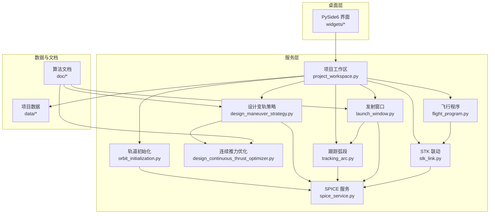
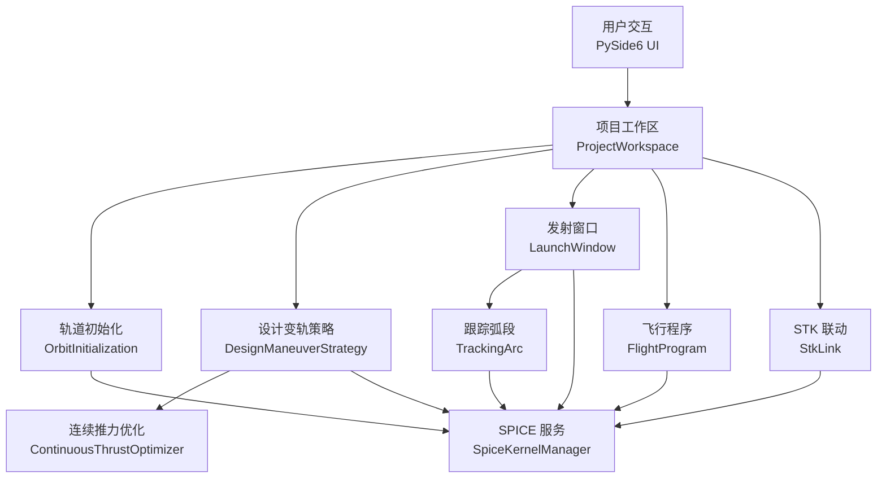
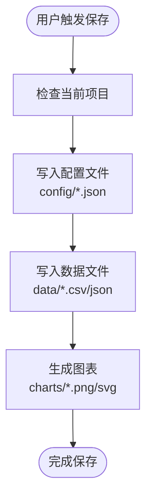
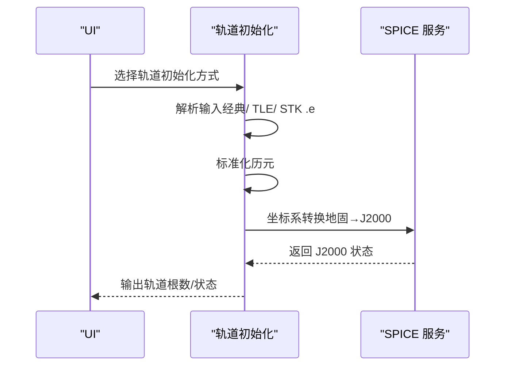
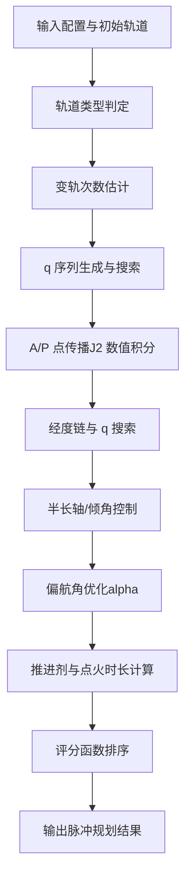
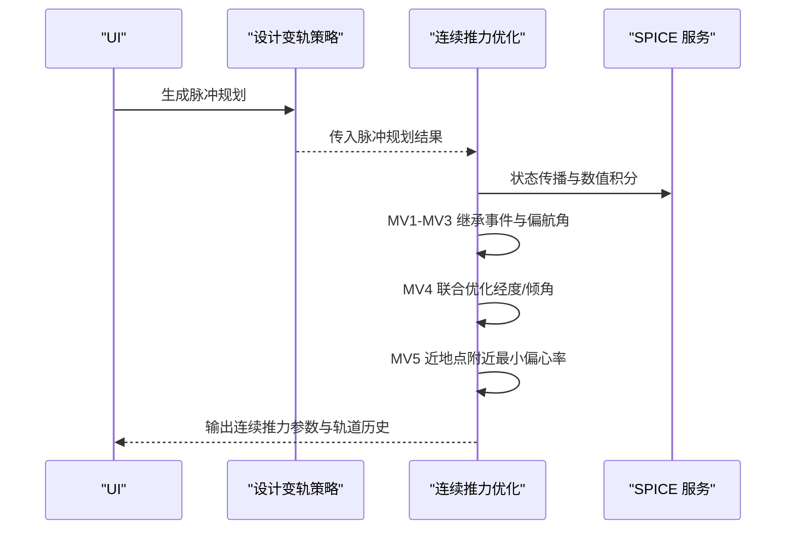
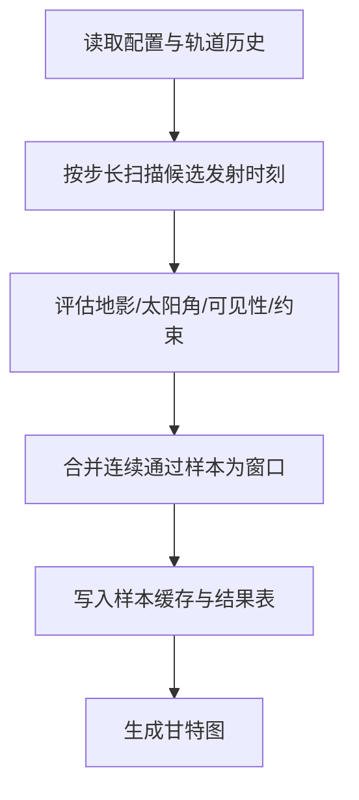
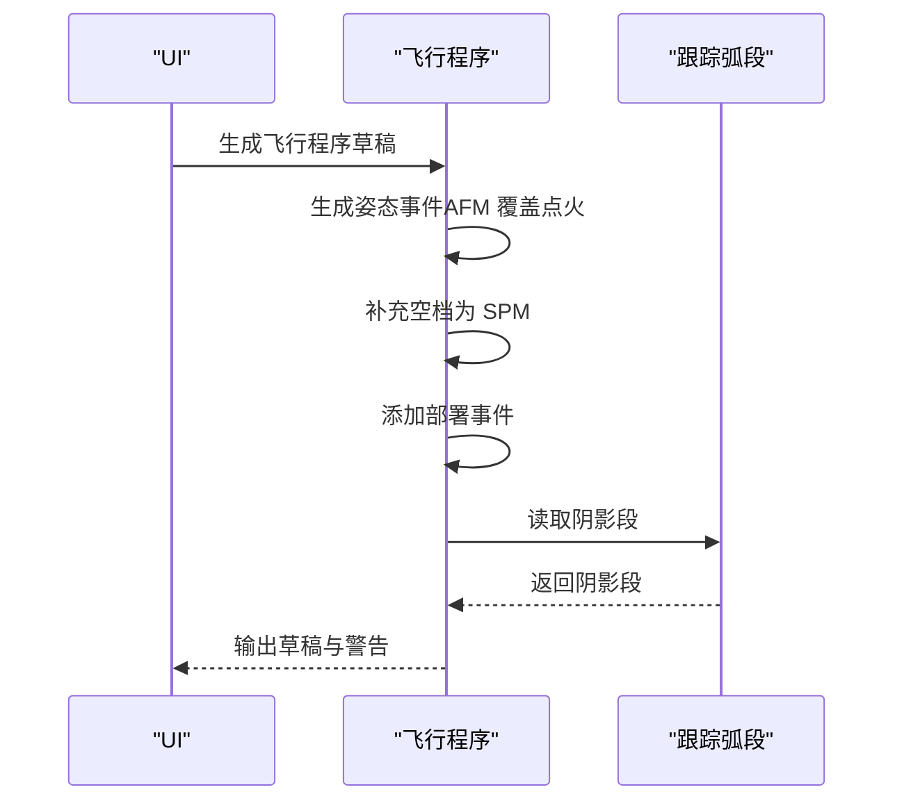
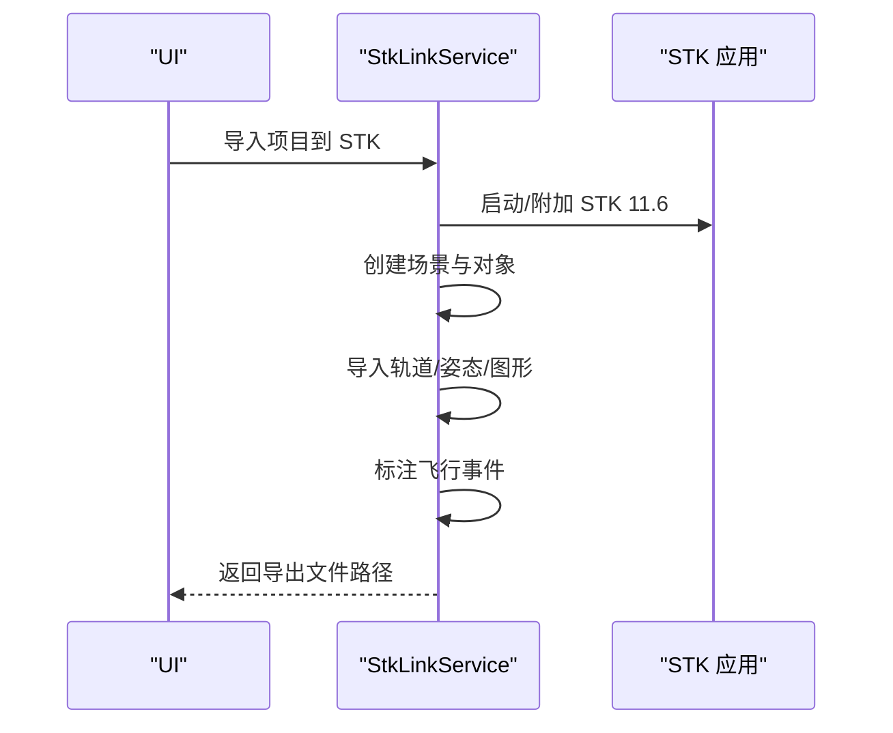
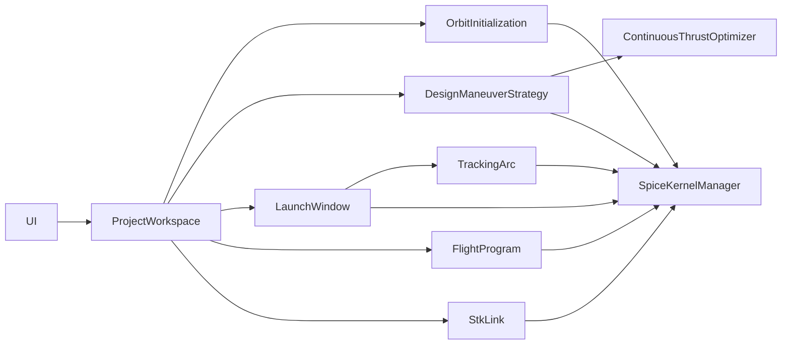

# 核心功能模块

<cite>
**本文档引用的文件**
- [README.md](file://README.md)
- [doc/ai_project_analysis.md](file://doc/ai_project_analysis.md)
- [doc/design_maneuver_pulse_planning_algorithm.md](file://doc/design_maneuver_pulse_planning_algorithm.md)
- [doc/design_continuous_thrust_parameter_optimization_algorithm.md](file://doc/design_continuous_thrust_parameter_optimization_algorithm.md)
- [doc/launch_window_workflow.md](file://doc/launch_window_workflow.md)
- [doc/planning_workflow.md](file://doc/planning_workflow.md)
- [doc/spice_usage.md](file://doc/spice_usage.md)
- [src/smart/services/project_workspace.py](file://src/smart/services/project_workspace.py)
- [src/smart/services/orbit_initialization.py](file://src/smart/services/orbit_initialization.py)
- [src/smart/services/design_maneuver_strategy.py](file://src/smart/services/design_maneuver_strategy.py)
- [src/smart/services/design_continuous_thrust_optimizer.py](file://src/smart/services/design_continuous_thrust_optimizer.py)
- [src/smart/services/launch_window.py](file://src/smart/services/launch_window.py)
- [src/smart/services/tracking_arc.py](file://src/smart/services/tracking_arc.py)
- [src/smart/services/flight_program.py](file://src/smart/services/flight_program.py)
- [src/smart/services/stk_link.py](file://src/smart/services/stk_link.py)
</cite>

## 目录
1. [引言](#引言)
2. [项目结构](#项目结构)
3. [核心组件](#核心组件)
4. [架构总览](#架构总览)
5. [详细组件分析](#详细组件分析)
6. [依赖关系分析](#依赖关系分析)
7. [性能考虑](#性能考虑)
8. [故障排查指南](#故障排查指南)
9. [结论](#结论)
10. [附录](#附录)

## 引言
SMART 是一个面向航天任务设计与工程分析的桌面软件，围绕 STK 11.6 + SPICE + PySide6 构建统一工作流，解决传统任务分析中多工具切换、时间与坐标系转换易错、结果留痕分散等问题。项目当前已覆盖项目管理、卫星3D模型配置、轨道初始化、设计变轨策略、连续推力参数优化、导入变轨策略、发射窗口分析、跟踪弧段分析、飞行程序设计、STK 联动、SPICE 内核管理、项目化数据落盘和 AI 辅助项目解读等核心链路。

## 项目结构
仓库采用分层组织：domain/ 用于领域模型，services/ 用于服务层（数值计算、轨道力学、SPICE、STK 集成等），ui/ 用于桌面界面与控件，data/kernels/ 用于本地 SPICE 内核，doc/ 用于算法与工作流文档，tests/ 用于测试。

**图表来源**
- [src/smart/services/project_workspace.py:64-116](file://src/smart/services/project_workspace.py#L64-L116)
- [src/smart/services/orbit_initialization.py:128-216](file://src/smart/services/orbit_initialization.py#L128-L216)
- [src/smart/services/design_maneuver_strategy.py:535-672](file://src/smart/services/design_maneuver_strategy.py#L535-L672)
- [src/smart/services/design_continuous_thrust_optimizer.py:44-200](file://src/smart/services/design_continuous_thrust_optimizer.py#L44-L200)
- [src/smart/services/launch_window.py:565-619](file://src/smart/services/launch_window.py#L565-L619)
- [src/smart/services/tracking_arc.py:66-120](file://src/smart/services/tracking_arc.py#L66-L120)
- [src/smart/services/flight_program.py:144-226](file://src/smart/services/flight_program.py#L144-L226)
- [src/smart/services/stk_link.py:199-337](file://src/smart/services/stk_link.py#L199-L337)

**章节来源**
- [README.md:1-204](file://README.md#L1-L204)

## 核心组件
- 项目管理与数据落盘：负责项目生命周期、配置与数据文件的持久化与版本化，确保工程可追溯。
- 卫星3D模型配置：为 SMART 三维场景与 STK 场景导入提供统一的卫星结构与载荷配置。
- 轨道初始化：支持经典轨道根数、TLE 与 STK .e 星历导入，地固系星历通过 SPICE 转到 J2000。
- 设计变轨策略：基于 V5.1 硬约束相位搜索，生成 q 序列、控后近地点目标、终端经度/倾角约束与方向角优化的脉冲规划。
- 连续推力参数优化：从脉冲规划结果生成 5 次连续推力点火参数，MV4/MV5 联合优化经度与倾角，MV5 保持近地点附近并最小化偏心率。
- 导入变轨策略：将设计页生成的连续推力策略引入工程变轨页面，生成 full_orbit_history.csv。
- 发射窗口分析：复用变轨输出轨道历史，完成约束扫描、窗口结果表、样本缓存与甘特图输出。
- 跟踪弧段分析：围绕测控可见性、发射窗口与轨道历史生成可跟踪弧段结果。
- 飞行程序设计：复用变轨结果与 STK 联动数据，形成飞行程序参考段、事件表与时间线。
- STK 联动：面向 STK 11.6 的对象创建、轨道/姿态/图形标注与结果导出链路。
- SPICE 内核管理：本地内核扫描、加载、下载提示与运行状态检查。
- AI 项目分析：通过大语言模型分析当前项目的配置与数据，生成报告并支持导出。

**章节来源**
- [README.md:32-46](file://README.md#L32-L46)
- [src/smart/services/project_workspace.py:64-116](file://src/smart/services/project_workspace.py#L64-L116)

## 架构总览
SMART 的系统架构以“服务层优先复用 SPICE 与本地 STK 11.6 能力”为核心，UI 层统一以北京时间配置任务参数，服务层提供轨道力学、约束分析与图形验证，项目结果按 config/data/charts 结构自动沉淀，便于复算与交接。

**图表来源**
- [src/smart/services/project_workspace.py:64-116](file://src/smart/services/project_workspace.py#L64-L116)
- [src/smart/services/orbit_initialization.py:128-216](file://src/smart/services/orbit_initialization.py#L128-L216)
- [src/smart/services/design_maneuver_strategy.py:535-672](file://src/smart/services/design_maneuver_strategy.py#L535-L672)
- [src/smart/services/design_continuous_thrust_optimizer.py:44-200](file://src/smart/services/design_continuous_thrust_optimizer.py#L44-L200)
- [src/smart/services/launch_window.py:565-619](file://src/smart/services/launch_window.py#L565-L619)
- [src/smart/services/tracking_arc.py:66-120](file://src/smart/services/tracking_arc.py#L66-L120)
- [src/smart/services/flight_program.py:144-226](file://src/smart/services/flight_program.py#L144-L226)
- [src/smart/services/stk_link.py:199-337](file://src/smart/services/stk_link.py#L199-L337)

## 详细组件分析

### 项目管理与数据落盘
- 职责：创建/打开项目，按 projects/<name>/ 自动生成 config/data/charts 目录，负责项目元数据与配置文件的读写与校验。
- 关键接口：创建项目、保存/加载配置、保存/加载轨道历史、保存/加载变轨策略与结果、保存/加载发射窗口与跟踪弧段、保存/加载飞行程序与结果。
- 数据流：UI 触发保存 → Workspace 写入 JSON/CSV → 项目目录结构化落盘 → 自动生成图表与报告。
- 依赖：SPICE 内核加载、STK 联动导出、AI 分析报告生成。

**图表来源**
- [src/smart/services/project_workspace.py:82-116](file://src/smart/services/project_workspace.py#L82-L116)
- [src/smart/services/project_workspace.py:213-285](file://src/smart/services/project_workspace.py#L213-L285)
- [src/smart/services/project_workspace.py:332-396](file://src/smart/services/project_workspace.py#L332-L396)

**章节来源**
- [src/smart/services/project_workspace.py:64-116](file://src/smart/services/project_workspace.py#L64-L116)
- [src/smart/services/project_workspace.py:213-396](file://src/smart/services/project_workspace.py#L213-L396)

### 卫星3D模型配置
- 职责：定义卫星结构尺寸、天线阵列、太阳能板、推进系统等，支持导入 .dae/.glb/.gltf 模型并在 SMART 与 STK 中显示。
- 数据结构：包含卫星结构参数、天线配置、推进器配置、地面资产与中继卫星配置。
- 交互：UI 表单编辑 → Workspace 保存 → STK 导出时应用模型与图形样式。

**章节来源**
- [src/smart/services/project_workspace.py:398-482](file://src/smart/services/project_workspace.py#L398-L482)

### 轨道初始化
- 职责：支持经典轨道根数、TLE 与 STK .e 星历导入；地固系星历通过 SPICE 转到 J2000。
- 关键流程：解析输入 → 标准化历元 → SPICE 转换（如需）→ 生成 OrbitalElements → 写入项目数据。
- 错误处理：对非法格式、不支持的坐标系与内核缺失进行异常提示。

**图表来源**
- [src/smart/services/orbit_initialization.py:128-216](file://src/smart/services/orbit_initialization.py#L128-L216)
- [src/smart/services/orbit_initialization.py:255-280](file://src/smart/services/orbit_initialization.py#L255-L280)

**章节来源**
- [src/smart/services/orbit_initialization.py:45-67](file://src/smart/services/orbit_initialization.py#L45-L67)
- [src/smart/services/orbit_initialization.py:128-216](file://src/smart/services/orbit_initialization.py#L128-L216)
- [doc/spice_usage.md:134-151](file://doc/spice_usage.md#L134-L151)

### 设计变轨策略（脉冲规划）
- 职责：工程初设级脉冲初值规划，快速给出多次 A/P 点火策略初值；支持 V5.1 硬约束相位搜索与回退 V4.2。
- 核心算法：轨道类型判定（超同步/标准转移）→ 变轨次数估计 → q 序列生成 → A/P 点传播（J2 数值积分）→ 经度链与 q 序列搜索 → 半长轴/倾角控制 → 偏航角与推进剂优化 → 评分函数排序。
- 输出：DesignManeuverResult（含 summary、burns、checks、warnings）。

**图表来源**
- [doc/design_maneuver_pulse_planning_algorithm.md:10-17](file://doc/design_maneuver_pulse_planning_algorithm.md#L10-L17)
- [src/smart/services/design_maneuver_strategy.py:535-672](file://src/smart/services/design_maneuver_strategy.py#L535-L672)

**章节来源**
- [doc/design_maneuver_pulse_planning_algorithm.md:1-741](file://doc/design_maneuver_pulse_planning_algorithm.md#L1-L741)
- [src/smart/services/design_maneuver_strategy.py:535-672](file://src/smart/services/design_maneuver_strategy.py#L535-L672)

### 连续推力参数优化
- 职责：从脉冲规划结果生成 5 次连续推力点火参数，MV1-MV3 继承脉冲事件与偏航角；MV4 联合优化经度与倾角；MV5 保持近地点附近并最小化偏心率。
- 约束：MV4 控后近地点高度=同步高度，MV4 控后倾角≈目标倾角；MV5 控后半长轴=target.a_km，MV5 熄火经度≈目标经度，MV5 点火开始点与名义近地点偏差≤3min，MV5 控后偏心率≤1.0e-3。
- 优化：MV4 采用局部优化，MV5 采用“近地点附近最小偏心率”规则。

**图表来源**
- [src/smart/services/design_maneuver_strategy.py:535-672](file://src/smart/services/design_maneuver_strategy.py#L535-L672)
- [src/smart/services/design_continuous_thrust_optimizer.py:44-200](file://src/smart/services/design_continuous_thrust_optimizer.py#L44-L200)

**章节来源**
- [doc/design_continuous_thrust_parameter_optimization_algorithm.md:1-375](file://doc/design_continuous_thrust_parameter_optimization_algorithm.md#L1-L375)
- [src/smart/services/design_continuous_thrust_optimizer.py:44-200](file://src/smart/services/design_continuous_thrust_optimizer.py#L44-L200)

### 导入变轨策略
- 职责：将设计页生成的连续推力策略转换为工程变轨策略，生成 full_orbit_history.csv，供后续发射窗口、跟踪弧段与飞行程序复用。
- 关键步骤：参数映射（起止时间、偏航角、推进剂）、状态传播、历史记录写入。

**章节来源**
- [src/smart/services/design_maneuver_strategy.py:737-790](file://src/smart/services/design_maneuver_strategy.py#L737-L790)

### 发射窗口分析
- 职责：扫描候选发射时刻，评估地影、太阳角、地面站/中继星可见性与约束，合并为窗口并生成甘特图。
- 数据流：读取 config/launch_window.json、config/maneuver_strategy.json、data/full_orbit_history.csv → 按 sample_step_min 扫描 → 评估每个样本 → 合并窗口 → 写入 data/launch_window_samples.csv 与 data/launch_window_results.csv。
- 性能：保持地影、可见性等计算的向量化实现，避免重复读取与控件创建。

**图表来源**
- [doc/launch_window_workflow.md:5-17](file://doc/launch_window_workflow.md#L5-L17)
- [src/smart/services/launch_window.py:565-619](file://src/smart/services/launch_window.py#L565-L619)

**章节来源**
- [doc/launch_window_workflow.md:1-117](file://doc/launch_window_workflow.md#L1-L117)
- [src/smart/services/launch_window.py:565-619](file://src/smart/services/launch_window.py#L565-L619)

### 跟踪弧段分析
- 职责：围绕测控可见性、发射窗口与轨道历史生成可跟踪弧段结果，支持地面站与中继星的多资产组合。
- 关键流程：构建时间线（位置、视线、倾角等）→ 评估各资产可见性 → 生成段落与汇总 → 输出轨道结果。

**章节来源**
- [src/smart/services/tracking_arc.py:66-120](file://src/smart/services/tracking_arc.py#L66-L120)
- [src/smart/services/tracking_arc.py:160-268](file://src/smart/services/tracking_arc.py#L160-L268)

### 飞行程序设计
- 职责：基于变轨策略与跟踪弧段生成飞行程序草稿，包含姿态模式（SPM/EPM/AFM/Transition）与部署事件，支持验证与采样。
- 关键流程：读取轨道历史 → 生成姿态事件（AFM 覆盖点火区间）→ 补充空档为 SPM → 添加部署事件 → 校验重叠与阴影交叠 → 采样状态。

**图表来源**
- [src/smart/services/flight_program.py:144-226](file://src/smart/services/flight_program.py#L144-L226)
- [src/smart/services/flight_program.py:229-289](file://src/smart/services/flight_program.py#L229-L289)

**章节来源**
- [src/smart/services/flight_program.py:144-226](file://src/smart/services/flight_program.py#L144-L226)
- [src/smart/services/flight_program.py:229-289](file://src/smart/services/flight_program.py#L229-L289)

### STK 联动
- 职责：连接/启动 STK 11.6，创建场景，导入卫星轨道与姿态，创建地面站与中继星，标注飞行事件，导出星历与姿态文件。
- 关键流程：连接 STK（COM 或 Socket）→ 创建场景 → 导入轨道/姿态 → 应用图形与模型 → 标注事件 → 导出文件。

**图表来源**
- [src/smart/services/stk_link.py:199-337](file://src/smart/services/stk_link.py#L199-L337)
- [src/smart/services/stk_link.py:560-632](file://src/smart/services/stk_link.py#L560-L632)

**章节来源**
- [src/smart/services/stk_link.py:199-337](file://src/smart/services/stk_link.py#L199-L337)

### SPICE 内核管理
- 职责：自动发现与加载本地内核，提供 UTC/ET 转换、位置/状态向量参考系转换、天体状态查询等服务。
- 默认加载顺序：项目 data/kernels/ → 仓库 data/kernels/，同名文件去重，优先保留前者。
- 服务接口：utc_to_et、et_to_utc、transform_position/state、state 查询等。

**章节来源**
- [doc/spice_usage.md:54-71](file://doc/spice_usage.md#L54-L71)
- [doc/spice_usage.md:73-96](file://doc/spice_usage.md#L73-L96)

### AI 项目分析
- 职责：通过大语言模型分析当前项目的配置与数据，生成报告并支持导出。页面内置“SMART 航天器任务分析专家”agent profile，支持 tool calls 调用受控的 SMART 本地工具。
- 数据范围：smart_project.json、config/*.json、data/orbit_elements.json、data/full_orbit_history.csv 与 data/launch_window_samples.csv 的统计与抽样。
- 安全边界：不上传完整大 CSV、二进制文件、SPICE kernels、临时文件或 API key；报告保存至 data/ai_project_analysis.md。

**章节来源**
- [doc/ai_project_analysis.md:1-103](file://doc/ai_project_analysis.md#L1-L103)

## 依赖关系分析
- 服务层依赖：SPICE 服务贯穿轨道初始化、设计变轨策略、发射窗口与跟踪弧段分析；STK 联动依赖飞行程序与轨道历史。
- UI 与服务：UI 通过 Workspace 与各服务交互，服务层负责数据持久化与算法实现。
- 数据传递：设计变轨策略 → 连续推力优化 → full_orbit_history.csv → 发射窗口/跟踪弧段/飞行程序 → STK 导出。

**图表来源**
- [src/smart/services/project_workspace.py:64-116](file://src/smart/services/project_workspace.py#L64-L116)
- [src/smart/services/orbit_initialization.py:128-216](file://src/smart/services/orbit_initialization.py#L128-L216)
- [src/smart/services/design_maneuver_strategy.py:535-672](file://src/smart/services/design_maneuver_strategy.py#L535-L672)
- [src/smart/services/design_continuous_thrust_optimizer.py:44-200](file://src/smart/services/design_continuous_thrust_optimizer.py#L44-L200)
- [src/smart/services/launch_window.py:565-619](file://src/smart/services/launch_window.py#L565-L619)
- [src/smart/services/tracking_arc.py:66-120](file://src/smart/services/tracking_arc.py#L66-L120)
- [src/smart/services/flight_program.py:144-226](file://src/smart/services/flight_program.py#L144-L226)
- [src/smart/services/stk_link.py:199-337](file://src/smart/services/stk_link.py#L199-L337)

## 性能考虑
- 向量化计算：发射窗口与跟踪弧段分析中，地影时长、最长连续时长、可见性计算尽量使用 NumPy 向量化，避免逐点循环。
- 缓存与增量：发射窗口样本缓存 data/launch_window_samples.csv 与 meta.json，仅在配置/策略/历史变更时刷新。
- 内存控制：候选点分块批量计算时控制内存占用，避免一次性加载过多样本。
- 积分步长：连续推力优化中，不同阶段采用不同积分步长（粗/细），平衡精度与性能。

**章节来源**
- [doc/launch_window_workflow.md:98-106](file://doc/launch_window_workflow.md#L98-L106)
- [doc/design_continuous_thrust_parameter_optimization_algorithm.md:330-375](file://doc/design_continuous_thrust_parameter_optimization_algorithm.md#L330-L375)

## 故障排查指南
- SPICE 内核缺失：检查 data/kernels/ 目录是否包含必需内核（naif0012.tls、pck00011.tpc、earth_assoc_itrf93.tf、de440s.bsp 等），确认默认加载顺序与自动加载逻辑。
- STK 连接失败：确认 STK 11.6 已安装并可启动，COM 或 Socket 连接端口（默认 127.0.0.1:5001）可用；若 pywin32 不可用，使用 Socket 模式。
- 轨道初始化错误：检查输入格式（经典/ TLE/ STK .e），确认坐标系转换所需的内核已加载。
- 发射窗口/跟踪弧段异常：检查配置项（地面站/中继星、可见性阈值、约束行）与样本缓存是否过期，必要时重新计算。
- 飞行程序冲突：检查姿态事件重叠与阴影交叠警告，调整事件区间或过渡时间。

**章节来源**
- [doc/spice_usage.md:22-53](file://doc/spice_usage.md#L22-L53)
- [src/smart/services/stk_link.py:111-141](file://src/smart/services/stk_link.py#L111-L141)
- [src/smart/services/orbit_initialization.py:128-216](file://src/smart/services/orbit_initialization.py#L128-L216)
- [src/smart/services/launch_window.py:565-619](file://src/smart/services/launch_window.py#L565-L619)
- [src/smart/services/flight_program.py:229-289](file://src/smart/services/flight_program.py#L229-L289)

## 结论
SMART 通过服务层优先复用 SPICE 与本地 STK 11.6 能力，实现了从轨道初始化到飞行程序设计的完整分析链路。项目管理与数据落盘确保工程可追溯，AI 分析页提供辅助解读与报告导出。建议在实际使用中严格遵循 SPICE 优先策略、合理配置发射窗口与跟踪弧段约束、优化连续推力参数以满足工程限制，并利用缓存与向量化提升性能。

## 附录
- 快速开始与运行脚本：参见 README.md 的“快速开始”与“运行脚本”章节。
- 规划工作流：参见 doc/planning_workflow.md，用于复杂任务的文件化规划与验证记录。

**章节来源**
- [README.md:82-124](file://README.md#L82-L124)
- [doc/planning_workflow.md:1-127](file://doc/planning_workflow.md#L1-L127)