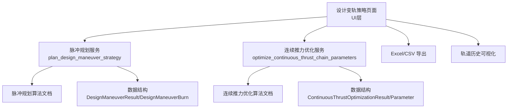
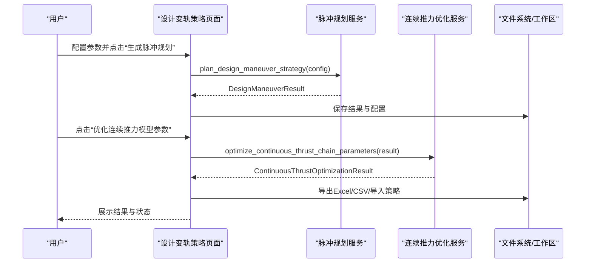
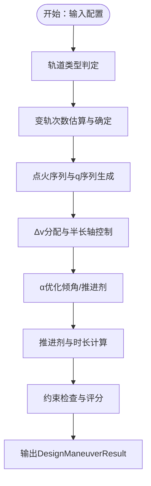
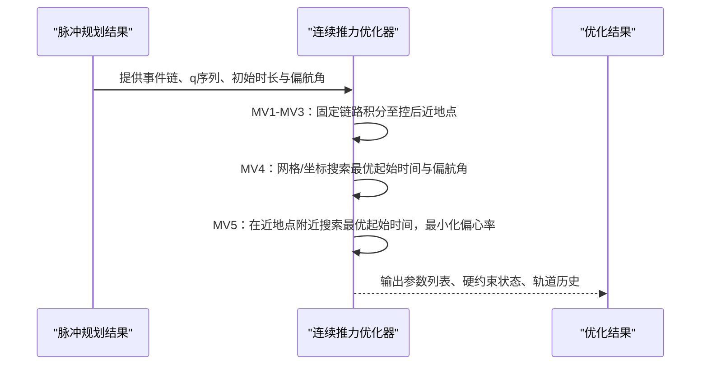
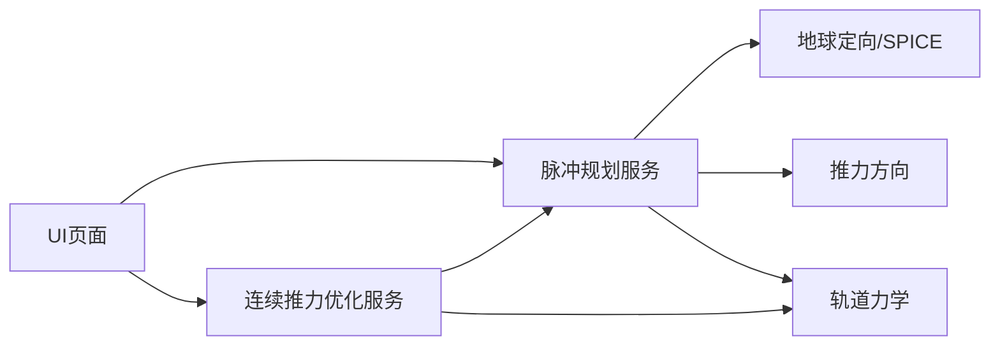

# 设计变轨策略

<cite>
**本文引用的文件**
- [src/smart/services/design_maneuver_strategy.py](file://src/smart/services/design_maneuver_strategy.py)
- [src/smart/services/design_continuous_thrust_optimizer.py](file://src/smart/services/design_continuous_thrust_optimizer.py)
- [src/smart/ui/widgets/design_maneuver_strategy_page.py](file://src/smart/ui/widgets/design_maneuver_strategy_page.py)
- [doc/design_maneuver_pulse_planning_algorithm.md](file://doc/design_maneuver_pulse_planning_algorithm.md)
- [doc/design_continuous_thrust_parameter_optimization_algorithm.md](file://doc/design_continuous_thrust_parameter_optimization_algorithm.md)
- [src/smart/services/thrust_direction.py](file://src/smart/services/thrust_direction.py)
- [src/smart/services/earth_orientation.py](file://src/smart/services/earth_orientation.py)
- [src/smart/domain/models.py](file://src/smart/domain/models.py)
- [src/smart/services/orbital_mechanics.py](file://src/smart/services/orbital_mechanics.py)
- [projects/F4/data/design_maneuver_results.json](file://projects/F4/data/design_maneuver_results.json)
- [projects/F4/data/design_continuous_thrust_results.json](file://projects/F4/data/design_continuous_thrust_results.json)
- [tests/test_design_maneuver_strategy.py](file://tests/test_design_maneuver_strategy.py)
</cite>

## 目录
1. [引言](#引言)
2. [项目结构](#项目结构)
3. [核心组件](#核心组件)
4. [架构总览](#架构总览)
5. [详细组件分析](#详细组件分析)
6. [依赖分析](#依赖分析)
7. [性能考量](#性能考量)
8. [故障排查指南](#故障排查指南)
9. [结论](#结论)
10. [附录](#附录)

## 引言
本文件面向SMART项目的“设计变轨策略”功能，系统化阐述两类变轨策略：脉冲变轨设计与连续推力优化。文档围绕算法原理、数据结构设计、参数优化、界面配置与调优、对比分析、结果验证与可视化、以及工程实践建议展开，帮助不同背景读者高效理解与使用。

## 项目结构
- 服务层：脉冲规划与连续推力优化算法集中于服务模块，提供标准化配置、评分与约束检查、推进剂与时长计算等能力。
- UI层：设计变轨策略页面提供参数配置、规划执行、结果展示与导出能力。
- 文档与示例：配套算法说明文档与工程示例数据，便于对照与回归验证。
- 测试：覆盖脉冲规划、连续推力优化、界面交互与导出流程的关键行为。

图表来源
- [src/smart/ui/widgets/design_maneuver_strategy_page.py:697-782](file://src/smart/ui/widgets/design_maneuver_strategy_page.py#L697-L782)
- [src/smart/services/design_maneuver_strategy.py:535-672](file://src/smart/services/design_maneuver_strategy.py#L535-L672)
- [src/smart/services/design_continuous_thrust_optimizer.py:44-200](file://src/smart/services/design_continuous_thrust_optimizer.py#L44-L200)

章节来源
- [src/smart/ui/widgets/design_maneuver_strategy_page.py:120-520](file://src/smart/ui/widgets/design_maneuver_strategy_page.py#L120-L520)
- [doc/design_maneuver_pulse_planning_algorithm.md:1-120](file://doc/design_maneuver_pulse_planning_algorithm.md#L1-L120)
- [doc/design_continuous_thrust_parameter_optimization_algorithm.md:1-60](file://doc/design_continuous_thrust_parameter_optimization_algorithm.md#L1-L60)

## 核心组件
- 脉冲变轨策略服务：负责轨道类型识别、变轨次数推荐、q序列与经度链搜索、半长轴与倾角控制、alpha优化、推进剂与时长计算、约束检查与评分。
- 连续推力优化服务：基于脉冲规划事件链，对MV4/MV5进行联合优化，确保经度与倾角硬约束满足，同时最小化推进剂消耗。
- 数据结构：DesignManeuverResult/DesignManeuverBurn与ContinuousThrustOptimizationResult/ContinuousThrustManeuverParameter承载规划与优化结果，支持序列化与导入。
- UI页面：提供参数配置、规划执行、结果表格、连续推力参数表、导出与可视化入口。
- 工具与支撑：推力方向计算、经纬度与地固坐标转换、轨道根数与状态转换等基础能力。

章节来源
- [src/smart/services/design_maneuver_strategy.py:39-186](file://src/smart/services/design_maneuver_strategy.py#L39-L186)
- [src/smart/services/design_continuous_thrust_optimizer.py:44-200](file://src/smart/services/design_continuous_thrust_optimizer.py#L44-L200)
- [src/smart/services/thrust_direction.py:8-37](file://src/smart/services/thrust_direction.py#L8-L37)
- [src/smart/services/earth_orientation.py:50-70](file://src/smart/services/earth_orientation.py#L50-L70)
- [src/smart/services/orbital_mechanics.py:175-252](file://src/smart/services/orbital_mechanics.py#L175-L252)

## 架构总览
脉冲规划与连续推力优化在服务层解耦，UI层统一调度。脉冲规划输出的事件链与参数作为连续推力优化的种子与硬约束来源，形成“初值规划—精细展开”的两阶段流程。

图表来源
- [src/smart/ui/widgets/design_maneuver_strategy_page.py:697-782](file://src/smart/ui/widgets/design_maneuver_strategy_page.py#L697-L782)
- [src/smart/services/design_maneuver_strategy.py:535-672](file://src/smart/services/design_maneuver_strategy.py#L535-L672)
- [src/smart/services/design_continuous_thrust_optimizer.py:44-200](file://src/smart/services/design_continuous_thrust_optimizer.py#L44-L200)

## 详细组件分析

### 脉冲变轨设计策略
- 算法定位：工程初设级脉冲初值规划，非有限推力高精度传播器，不替代后续有限推力展开或姿轨耦合优化。
- 关键流程
  - 轨道类型判定：根据初始远地点与目标同步轨道高度判断超同步/标准转移。
  - 变轨次数确定：基于总Δv与单次设计Δv估算，结合工程下限、用户指定与固定尾段要求。
  - q序列与经度链：以整数回归圈数q控制两次点火间经度变化，优先选择满足经度窗口与终端误差的候选。
  - 半长轴与倾角控制：固定控后半长轴时反解Δv，α优化在半长轴链锁定后进行，按权重分配倾角控制。
  - 推进剂与时长：沉底段与主发动机段分别计算，考虑姿控效率损失与是否计入总时长。
  - 约束检查与评分：按经度误差、倾角误差、半长轴误差、推进剂消耗、最大时长与均匀性排序。
- 输出数据结构
  - DesignManeuverResult：包含配置、摘要、每次点火的DesignManeuverBurn、检查项与警告。
  - DesignManeuverBurn：记录索引、类型、A/P点、航时、北京时间、经度、Δv、α、控后轨道根数、推进剂、质量、半长轴控制量等。

图表来源
- [src/smart/services/design_maneuver_strategy.py:535-672](file://src/smart/services/design_maneuver_strategy.py#L535-L672)
- [doc/design_maneuver_pulse_planning_algorithm.md:116-180](file://doc/design_maneuver_pulse_planning_algorithm.md#L116-L180)

章节来源
- [doc/design_maneuver_pulse_planning_algorithm.md:1-741](file://doc/design_maneuver_pulse_planning_algorithm.md#L1-L741)
- [src/smart/services/design_maneuver_strategy.py:535-672](file://src/smart/services/design_maneuver_strategy.py#L535-L672)
- [projects/F4/data/design_maneuver_results.json:1-547](file://projects/F4/data/design_maneuver_results.json#L1-L547)

### 连续推力优化策略
- 适用范围：基于脉冲规划事件链，针对超同步转移的5次连续推力参数优化。
- 核心规则
  - MV1-MV3：继承脉冲事件、时长与偏航角，不参与终端相位优化，积分至控后近地点目标。
  - MV4：以点火开始时间与偏航角为变量，联合优化经度相位闭合与倾角控制，同时评估后续MV5结果。
  - MV5：近地点附近面内减速，最小化控后偏心率，满足半长轴目标，严格限制点火窗口。
- 目标函数与约束
  - MV4：最小化经度误差平方、倾角误差、MV5偏心率、MV4时间漂移等加权和。
  - MV5：在半长轴达标前提下最小化偏心率，限制点火窗口与偏心率上限。
- 输出数据结构
  - ContinuousThrustOptimizationResult：包含参数列表、总推进剂、目标ΔG、时间步长、偏航步长、硬约束状态与轨道历史。
  - ContinuousThrustManeuverParameter：记录每次连续推力的起止时间、偏航角、经度、Δv、推进剂、控后轨道根数、约束满足情况与优化模式。

图表来源
- [src/smart/services/design_continuous_thrust_optimizer.py:44-200](file://src/smart/services/design_continuous_thrust_optimizer.py#L44-L200)
- [doc/design_continuous_thrust_parameter_optimization_algorithm.md:221-260](file://doc/design_continuous_thrust_parameter_optimization_algorithm.md#L221-L260)

章节来源
- [doc/design_continuous_thrust_parameter_optimization_algorithm.md:1-375](file://doc/design_continuous_thrust_parameter_optimization_algorithm.md#L1-L375)
- [src/smart/services/design_continuous_thrust_optimizer.py:44-200](file://src/smart/services/design_continuous_thrust_optimizer.py#L44-L200)
- [projects/F4/data/design_continuous_thrust_results.json:1-174](file://projects/F4/data/design_continuous_thrust_results.json#L1-L174)

### 数据结构设计思路
- DesignManeuverResult/DesignManeuverBurn
  - 设计为不可变数据类，字段覆盖脉冲规划全过程关键指标，便于序列化与跨模块传递。
  - summary汇总关键统计与诊断信息，checks与warnings提供约束与风险提示。
- ContinuousThrustOptimizationResult/ContinuousThrustManeuverParameter
  - 参数化描述连续推力的起止、偏航角、推进剂、控后轨道与约束满足情况，支持导出与仿真导入。
  - 通过objective_delta_g_kg与total_propellant_kg统一推进剂目标，便于比较与筛选。

章节来源
- [src/smart/services/design_maneuver_strategy.py:39-186](file://src/smart/services/design_maneuver_strategy.py#L39-L186)
- [src/smart/services/design_continuous_thrust_optimizer.py:22-37](file://src/smart/services/design_continuous_thrust_optimizer.py#L22-L37)

### 参数优化算法与求解器配置
- 脉冲规划评分函数：按约束优先级排序，先排除无效方案，再依次满足经度、倾角、半长轴误差，最后最小化推进剂与离散度。
- 连续推力优化：MV4采用网格/坐标搜索，MV5采用近地点附近局部搜索，目标函数包含经度误差、倾角误差、偏心率与时间漂移的加权项。
- 求解器与权重：脉冲规划支持多种优化方法与权重配置；连续推力优化通过时间步长、偏航步长与搜索窗口控制收敛精度与稳定性。

章节来源
- [doc/design_maneuver_pulse_planning_algorithm.md:461-518](file://doc/design_maneuver_pulse_planning_algorithm.md#L461-L518)
- [doc/design_continuous_thrust_parameter_optimization_algorithm.md:179-220](file://doc/design_continuous_thrust_parameter_optimization_algorithm.md#L179-L220)

### 界面配置与参数调优
- 参数配置卡片：涵盖初始轨道、目标轨道、发动机与点火约束、地球模型、轨道类型与变轨次数、估算参数、经度窗口与分配、超同步尾段与方向角、V5.1硬约束等。
- 高级设置：提供沉底开关、J2开关、q序列、A-P q候选、控后近地点高度约束等高级选项。
- 运行流程：保存配置→生成脉冲规划→保存结果→优化连续推力→导出Excel/CSV/导入策略。
- 调优建议
  - 脉冲规划：合理设置终端容差与均匀性权重，确保经度与倾角误差满足；必要时放宽q上限或调整α范围。
  - 连续推力：减小时间步长与偏航步长以提升精度，适当扩大搜索窗口；确保MV5点火窗口与偏心率约束满足。

章节来源
- [src/smart/ui/widgets/design_maneuver_strategy_page.py:120-520](file://src/smart/ui/widgets/design_maneuver_strategy_page.py#L120-L520)
- [src/smart/ui/widgets/design_maneuver_strategy_page.py:697-782](file://src/smart/ui/widgets/design_maneuver_strategy_page.py#L697-L782)

### 脉冲变轨与连续推力对比分析
- 脉冲变轨：工程初设级，速度快、易理解，适合快速生成事件链与初值；不模拟有限推力弧段。
- 连续推力：基于脉冲事件链展开，考虑J2与常值偏航角，更贴近有限推力特性；对经度与倾角的联合控制更精细。
- 适用场景
  - 脉冲变轨：任务早期概念设计、快速评估、与其他工具衔接。
  - 连续推力：进入详细设计阶段，需要更精确的推进剂与轨迹预测。

章节来源
- [doc/design_maneuver_pulse_planning_algorithm.md:720-741](file://doc/design_maneuver_pulse_planning_algorithm.md#L720-L741)
- [doc/design_continuous_thrust_parameter_optimization_algorithm.md:1-20](file://doc/design_continuous_thrust_parameter_optimization_algorithm.md#L1-L20)

### 结果验证、性能评估与可视化
- 验证方法
  - 约束检查：经度、倾角、半长轴、偏心率、推进剂、最大时长与均匀性。
  - 硬约束：连续推力需满足MV4/MV5的近地点高度、倾角、半长轴、经度与偏心率等硬约束。
- 性能评估
  - 推进剂消耗：对比不同策略的总推进剂与单位Δv消耗。
  - 计算耗时：脉冲规划与连续推力优化的时间步长与搜索网格影响性能。
- 可视化
  - 轨道历史CSV导出：包含半长轴、偏心率、倾角、RAAN、近地点幅角、真近点角、位置速度、推力方向、经度等。
  - UI表格：脉冲规划与连续推力参数表，支持导出Excel。

章节来源
- [src/smart/services/design_maneuver_strategy.py:710-734](file://src/smart/services/design_maneuver_strategy.py#L710-L734)
- [src/smart/ui/widgets/design_maneuver_strategy_page.py:784-800](file://src/smart/ui/widgets/design_maneuver_strategy_page.py#L784-L800)
- [tests/test_design_maneuver_strategy.py:114-193](file://tests/test_design_maneuver_strategy.py#L114-L193)

### 工程案例经验与参数设置建议
- 案例参考：F4项目提供了完整的脉冲规划与连续推力优化结果，可用于对照与回归验证。
- 参数建议
  - 脉冲规划：终端经度误差容差建议≤0.02°，倾角误差容差≤0.01°；均匀性权重适中，避免过度分散。
  - 连续推力：时间步长建议≤10s，偏航步长建议≤0.05°；MV5点火窗口限制±3min，偏心率上限≤1e-3。
  - 硬约束：启用V5.1硬约束可显著提升可行性与推进剂经济性，建议开启原始与规划窗口硬约束。

章节来源
- [projects/F4/data/design_maneuver_results.json:1-547](file://projects/F4/data/design_maneuver_results.json#L1-L547)
- [projects/F4/data/design_continuous_thrust_results.json:1-174](file://projects/F4/data/design_continuous_thrust_results.json#L1-L174)
- [tests/test_design_maneuver_strategy.py:114-193](file://tests/test_design_maneuver_strategy.py#L114-L193)

## 依赖分析
- 组件耦合
  - UI依赖脉冲规划与连续推力优化服务，二者相互独立，通过数据结构解耦。
  - 脉冲规划依赖地球定向、推力方向与轨道力学工具；连续推力优化依赖脉冲规划结果与数值积分。
- 外部依赖
  - SPICE内核用于高精度状态变换与天体定向；若不可用则回退到数值实现。
  - SciPy用于优化与积分；若缺失则部分功能降级。

图表来源
- [src/smart/ui/widgets/design_maneuver_strategy_page.py:11-26](file://src/smart/ui/widgets/design_maneuver_strategy_page.py#L11-L26)
- [src/smart/services/design_maneuver_strategy.py:22-37](file://src/smart/services/design_maneuver_strategy.py#L22-L37)
- [src/smart/services/design_continuous_thrust_optimizer.py:22-37](file://src/smart/services/design_continuous_thrust_optimizer.py#L22-L37)

章节来源
- [src/smart/services/earth_orientation.py:145-240](file://src/smart/services/earth_orientation.py#L145-L240)
- [src/smart/services/orbital_mechanics.py:175-252](file://src/smart/services/orbital_mechanics.py#L175-L252)

## 性能考量
- 脉冲规划
  - q序列搜索规模与网格密度直接影响计算时间；可通过预筛选Top-K与快速优化降低开销。
  - α优化采用坐标搜索，步长越细越精确但耗时越高；建议先粗后精。
- 连续推力
  - 时间步长与偏航步长越小，积分精度越高；需在精度与性能间折中。
  - 搜索窗口与网格跨度影响收敛速度；建议结合脉冲规划结果设定合理范围。
- I/O与导出
  - 轨道历史CSV导出包含大量采样点，建议按需采样与压缩。

## 故障排查指南
- 常见问题
  - 点火经度超出规划窗口：检查经度窗口设置与q序列；必要时放宽窗口或调整q。
  - 最大点火时长超限：降低单次Δv或延长利用系数；检查沉底段是否计入。
  - 推进剂消耗过高：优化α与q序列，提高均匀性权重，收紧终端误差。
  - 连续推力硬约束不满足：缩小MV4/MV5搜索窗口，减小时间步长与偏航步长。
- 调试建议
  - 使用测试用例与回归数据核对关键指标（经度误差、倾角误差、推进剂）。
  - 逐步放宽约束观察结果变化，定位瓶颈与异常点。

章节来源
- [tests/test_design_maneuver_strategy.py:76-112](file://tests/test_design_maneuver_strategy.py#L76-L112)
- [tests/test_design_maneuver_strategy.py:114-193](file://tests/test_design_maneuver_strategy.py#L114-L193)

## 结论
SMART的“设计变轨策略”通过脉冲规划与连续推力优化两条路径，实现了从工程初设到精细展开的完整流程。脉冲规划提供快速可靠的事件链与初值，连续推力优化在满足硬约束前提下进一步提升推进剂经济性与轨迹精度。配合完善的UI配置、导出与可视化能力，能够满足复杂任务的设计需求。

## 附录
- 相关文档与示例
  - 脉冲规划算法说明：[design_maneuver_pulse_planning_algorithm.md](file://doc/design_maneuver_pulse_planning_algorithm.md)
  - 连续推力优化算法说明：[design_continuous_thrust_parameter_optimization_algorithm.md](file://doc/design_continuous_thrust_parameter_optimization_algorithm.md)
  - 工程示例数据：F4项目脉冲与连续推力结果JSON
- 测试用例
  - 覆盖脉冲规划、连续推力优化、UI交互与导出的关键行为