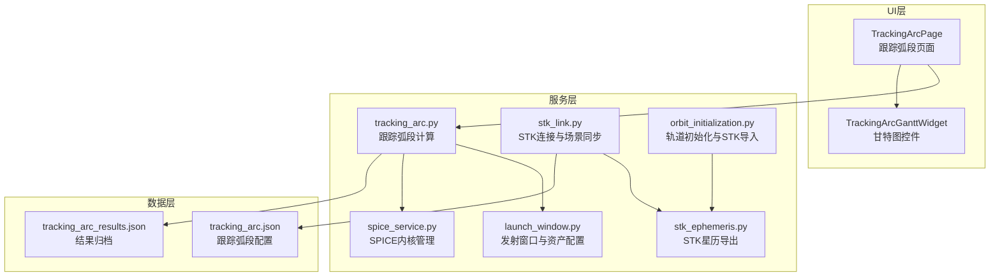
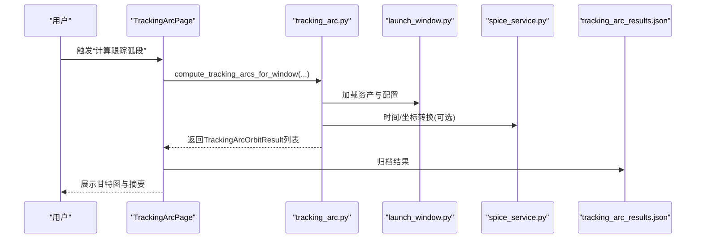
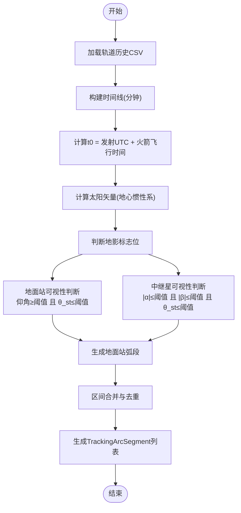
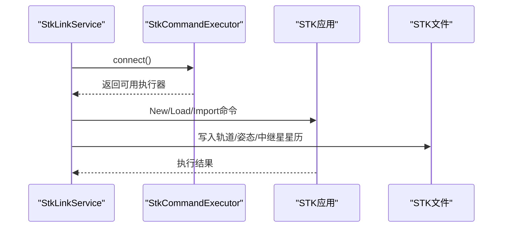
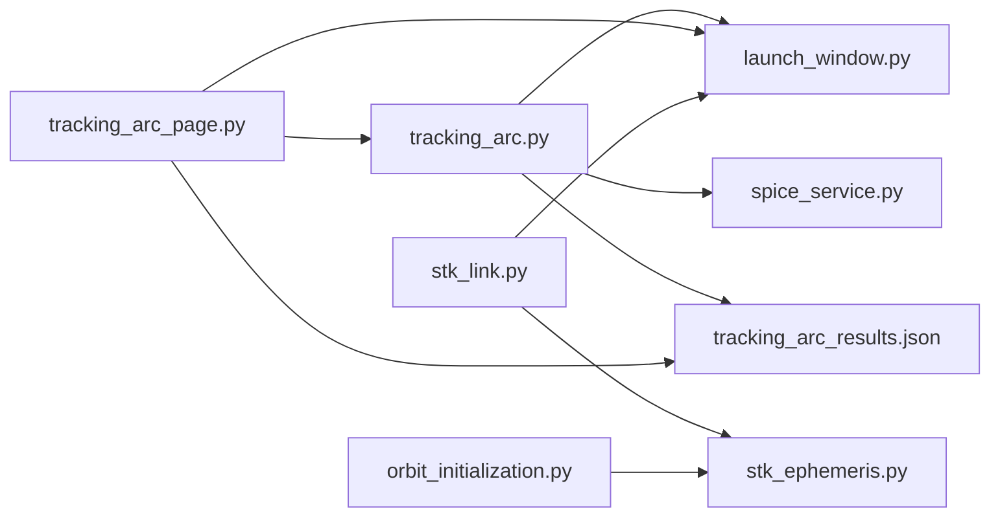

# 跟踪弧段分析

<cite>
**本文引用的文件列表**
- [tracking_arc.py](file://src/smart/services/tracking_arc.py)
- [tracking_arc_page.py](file://src/smart/ui/widgets/tracking_arc_page.py)
- [launch_window.py](file://src/smart/services/launch_window.py)
- [tracking_arc.json](file://projects/F4/config/tracking_arc.json)
- [tracking_arc_results.json](file://projects/F4/data/tracking_arc_results.json)
- [spice_service.py](file://src/smart/services/spice_service.py)
- [stk_link.py](file://src/smart/services/stk_link.py)
- [stk_ephemeris.py](file://src/smart/services/stk_ephemeris.py)
- [orbit_initialization.py](file://src/smart/services/orbit_initialization.py)
- [test_tracking_arc.py](file://tests/test_tracking_arc.py)
</cite>

## 目录
1. [简介](#简介)
2. [项目结构](#项目结构)
3. [核心组件](#核心组件)
4. [架构总览](#架构总览)
5. [详细组件分析](#详细组件分析)
6. [依赖关系分析](#依赖关系分析)
7. [性能考量](#性能考量)
8. [故障排查指南](#故障排查指南)
9. [结论](#结论)
10. [附录](#附录)

## 简介
本技术文档围绕SMART项目的“跟踪弧段分析”功能，系统阐述测控可见性分析的算法原理、数据结构与实现方法，详解TrackingArcResult数据结构与弧段参数定义，说明地面站配置、卫星轨道计算与可视性判断的完整流程，并给出跟踪弧段可视化展示（甘特图）的实现细节、与STK系统的数据交换与轨道外推算法，以及性能优化策略与大规模计算处理方案。文末提供实际测控任务中的弧段分析案例与配置建议。

## 项目结构
- 服务层：负责轨道历史解析、测控资产配置、可见性计算与结果聚合
- UI层：提供交互界面、参数设置、可视化展示与结果归档
- 数据层：项目配置与历史数据、STK导出与导入
- 外部集成：SPICE内核管理、STK连接与场景同步

图表来源
- [tracking_arc_page.py:671-1519](file://src/smart/ui/widgets/tracking_arc_page.py#L671-L1519)
- [tracking_arc.py:66-268](file://src/smart/services/tracking_arc.py#L66-L268)
- [launch_window.py:54-192](file://src/smart/services/launch_window.py#L54-L192)
- [stk_link.py:199-552](file://src/smart/services/stk_link.py#L199-L552)
- [stk_ephemeris.py:34-114](file://src/smart/services/stk_ephemeris.py#L34-L114)
- [orbit_initialization.py:131-200](file://src/smart/services/orbit_initialization.py#L131-L200)
- [spice_service.py:174-305](file://src/smart/services/spice_service.py#L174-L305)
- [tracking_arc.json:1-230](file://projects/F4/config/tracking_arc.json#L1-L230)
- [tracking_arc_results.json:1-800](file://projects/F4/data/tracking_arc_results.json#L1-L800)

章节来源
- [tracking_arc_page.py:671-1519](file://src/smart/ui/widgets/tracking_arc_page.py#L671-L1519)
- [tracking_arc.py:66-268](file://src/smart/services/tracking_arc.py#L66-L268)
- [launch_window.py:54-192](file://src/smart/services/launch_window.py#L54-L192)

## 核心组件
- 跟踪弧段计算服务：基于轨道历史与变轨策略，构建时间线，计算地面站与中继星的可视性、地影时段与变轨点火时段，并汇总为TrackingArcOrbitResult
- UI页面与甘特图：提供参数设置、计算触发、结果展示与交互缩放
- 发射窗口与资产配置：定义地面站与中继星预设、约束条件与配置项
- STK集成：连接STK、导入轨道与姿态、导出星历与场景
- SPICE内核：提供时间转换、坐标系转换与天体状态查询

章节来源
- [tracking_arc.py:33-64](file://src/smart/services/tracking_arc.py#L33-L64)
- [tracking_arc_page.py:38-84](file://src/smart/ui/widgets/tracking_arc_page.py#L38-L84)
- [launch_window.py:54-192](file://src/smart/services/launch_window.py#L54-L192)
- [stk_link.py:199-552](file://src/smart/services/stk_link.py#L199-L552)
- [spice_service.py:174-305](file://src/smart/services/spice_service.py#L174-L305)

## 架构总览
跟踪弧段分析以“轨道历史+变轨策略+测控资产配置”为核心输入，通过时间线构建与可见性判断，输出多轨道（窗口前沿、中点、后沿）的可视性弧段与统计摘要。UI层负责参数配置与可视化，服务层负责计算与归档，STK与SPICE提供外部数据与坐标转换支撑。

图表来源
- [tracking_arc_page.py:1104-1129](file://src/smart/ui/widgets/tracking_arc_page.py#L1104-L1129)
- [tracking_arc.py:66-120](file://src/smart/services/tracking_arc.py#L66-L120)
- [launch_window.py:123-146](file://src/smart/services/launch_window.py#L123-L146)
- [spice_service.py:241-249](file://src/smart/services/spice_service.py#L241-L249)
- [tracking_arc_results.json:1-800](file://projects/F4/data/tracking_arc_results.json#L1-L800)

## 详细组件分析

### 数据结构与参数定义
- TrackingArcSegment：单条弧段，包含起止UTC、所属行标签、类型(kind)与提示文本
- TrackingArcAssetSummary：资产维度统计，包含名称、类型、区间数量、总时长、最长区间时长
- TrackingArcOrbitResult：一次发射点的完整结果，包含轨道点键、标签、发射UTC、t0UTC、时间线起止、行标签、弧段列表、资产统计、地影总时长与变轨次数

章节来源
- [tracking_arc.py:33-64](file://src/smart/services/tracking_arc.py#L33-L64)
- [tracking_arc.py:51-64](file://src/smart/services/tracking_arc.py#L51-L64)
- [tracking_arc.py:33-40](file://src/smart/services/tracking_arc.py#L33-L40)

### 可视性分析算法与实现
- 时间线准备：从轨道历史CSV加载行，构建时间轴（分钟），推导t0时刻（发射时刻+火箭飞行时间）
- 地影判断：根据太阳矢量与卫星位置，计算地影标志位序列
- 地面站可视性：以地面站最小仰角与最大θ_st约束过滤
- 中继星可视性：以α、β角绝对值与最大θ_st约束过滤
- 变轨点火时段：按策略区间映射到时间线，形成burn段
- 弧段合并：将连续有效时间片段合并为区间，生成TrackingArcSegment列表

图表来源
- [tracking_arc.py:123-146](file://src/smart/services/tracking_arc.py#L123-L146)
- [tracking_arc.py:160-268](file://src/smart/services/tracking_arc.py#L160-L268)
- [tracking_arc.py:271-324](file://src/smart/services/tracking_arc.py#L271-L324)

章节来源
- [tracking_arc.py:123-146](file://src/smart/services/tracking_arc.py#L123-L146)
- [tracking_arc.py:160-268](file://src/smart/services/tracking_arc.py#L160-L268)
- [tracking_arc.py:271-324](file://src/smart/services/tracking_arc.py#L271-L324)

### 地面站配置与中继星配置
- 预设与自定义：支持地面站与中继星预设列表，以及自定义站点
- 资产类型：地面站与中继星两类，中继星默认位于地球同步轨道
- 配置项：最小仰角、最大θ_st、α/β角阈值等

章节来源
- [launch_window.py:137-153](file://src/smart/services/launch_window.py#L137-L153)
- [launch_window.py:156-192](file://src/smart/services/launch_window.py#L156-L192)
- [tracking_arc.json:143-230](file://projects/F4/config/tracking_arc.json#L143-L230)

### 轨道历史与时间线
- 轨道历史CSV字段：包含时间偏移、轨道要素、位置速度、子卫星经纬度等
- 时间线步长：由配置决定，默认10分钟；计算时会推断步长以确保连续性
- t0时刻：发射UTC加上火箭飞行时间，作为时间线基准

章节来源
- [tracking_arc.py:123-146](file://src/smart/services/tracking_arc.py#L123-L146)
- [tracking_arc.py:376-384](file://src/smart/services/tracking_arc.py#L376-L384)

### 可视性曲线与覆盖范围
- 可视性曲线：以时间轴为横轴，地面站/中继星为纵轴，用不同颜色表示不同资产类别
- 覆盖范围：通过仰角与θ_st约束确定资产对卫星的覆盖时段
- 交互缩放：支持局部放大、平移查看，鼠标悬停显示弧段详情

章节来源
- [tracking_arc_page.py:38-84](file://src/smart/ui/widgets/tracking_arc_page.py#L38-L84)
- [tracking_arc_page.py:142-346](file://src/smart/ui/widgets/tracking_arc_page.py#L142-L346)

### 弧段质量评估指标
- 可见时间：各资产的总可见时长与最长连续区间
- 仰角约束：地面站最小仰角达标率与时长
- θ_st约束：跟踪天线相对于反太阳方向的角度限制
- 地影影响：地影总时长与最长地影区间
- 变轨点火：点火时段数量与分布

章节来源
- [tracking_arc.py:351-364](file://src/smart/services/tracking_arc.py#L351-L364)
- [tracking_arc.py:366-370](file://src/smart/services/tracking_arc.py#L366-L370)

### 与STK系统的数据交换
- 连接方式：COM或Socket两种执行器，自动探测可用连接
- 导入轨道：将full_orbit_history.csv转换为STK星历文件并导入
- 导入姿态：根据飞行程序与姿态模式生成姿态DCM文件
- 同步资产：创建地面站与中继星对象，设置地理坐标与图形样式
- 场景时间：设置分析时间段与动画起止时间

图表来源
- [stk_link.py:111-142](file://src/smart/services/stk_link.py#L111-L142)
- [stk_link.py:280-337](file://src/smart/services/stk_link.py#L280-L337)
- [stk_ephemeris.py:34-114](file://src/smart/services/stk_ephemeris.py#L34-L114)

章节来源
- [stk_link.py:199-552](file://src/smart/services/stk_link.py#L199-L552)
- [stk_ephemeris.py:34-114](file://src/smart/services/stk_ephemeris.py#L34-L114)

### 轨道外推与SPICE集成
- SPICE内核：提供时间转换（UTC↔ET）、坐标系变换（pxform/sxform）、天体状态查询（spkezr）
- STK导入：STK星历文件支持地心惯性系与地固系，地固系需通过SPICE转换至J2000
- 外推精度：采用高阶插值（Lagrange Order 5）与地固系转换

章节来源
- [spice_service.py:174-305](file://src/smart/services/spice_service.py#L174-L305)
- [orbit_initialization.py:131-200](file://src/smart/services/orbit_initialization.py#L131-L200)
- [stk_ephemeris.py:34-114](file://src/smart/services/stk_ephemeris.py#L34-L114)

### 可视化实现细节
- 甘特图控件：绘制时间轴、资产行、彩色条形表示弧段，支持缩放与平移
- 颜色体系：变轨点火(burn)、地面站(ground)、中继星(relay)、地影(shadow)
- 交互行为：滚轮缩放、拖拽平移、悬停提示、双击重置

章节来源
- [tracking_arc_page.py:38-84](file://src/smart/ui/widgets/tracking_arc_page.py#L38-L84)
- [tracking_arc_page.py:142-346](file://src/smart/ui/widgets/tracking_arc_page.py#L142-L346)

## 依赖关系分析

图表来源
- [tracking_arc.py:10-25](file://src/smart/services/tracking_arc.py#L10-L25)
- [tracking_arc_page.py:23-29](file://src/smart/ui/widgets/tracking_arc_page.py#L23-L29)
- [stk_link.py:18-26](file://src/smart/services/stk_link.py#L18-L26)
- [stk_ephemeris.py:13-19](file://src/smart/services/stk_ephemeris.py#L13-L19)
- [orbit_initialization.py:16-17](file://src/smart/services/orbit_initialization.py#L16-L17)

章节来源
- [tracking_arc.py:10-25](file://src/smart/services/tracking_arc.py#L10-L25)
- [tracking_arc_page.py:23-29](file://src/smart/ui/widgets/tracking_arc_page.py#L23-L29)
- [stk_link.py:18-26](file://src/smart/services/stk_link.py#L18-L26)

## 性能考量
- 时间线步长：合理设置采样步长（如2分钟）可在精度与性能间取得平衡
- 向量化运算：使用NumPy进行批量角度与标志位计算，避免Python循环
- 区间合并：在生成弧段后进行合并，减少后续渲染与统计开销
- 外部依赖：SPICE内核加载与坐标转换为CPU密集操作，应尽量复用内核与缓存
- 大规模计算：分批处理多个发射窗口，异步计算并在UI中显示进度

章节来源
- [tracking_arc.py:271-324](file://src/smart/services/tracking_arc.py#L271-L324)
- [tracking_arc_page.py:1104-1129](file://src/smart/ui/widgets/tracking_arc_page.py#L1104-L1129)
- [spice_service.py:205-221](file://src/smart/services/spice_service.py#L205-L221)

## 故障排查指南
- 计算失败：检查轨道历史CSV格式与字段完整性，确认配置payload正确
- STK连接失败：确认STK安装路径、COM或Socket端口可用，必要时切换连接方式
- SPICE内核缺失：确保本地内核目录存在所需内核文件，或下载并放置于data/kernels
- 结果为空：检查时间线是否为空、步长推断是否异常、资产列表是否为空

章节来源
- [tracking_arc_page.py:1115-1117](file://src/smart/ui/widgets/tracking_arc_page.py#L1115-L1117)
- [stk_link.py:111-142](file://src/smart/services/stk_link.py#L111-L142)
- [spice_service.py:133-172](file://src/smart/services/spice_service.py#L133-L172)

## 结论
跟踪弧段分析通过“轨道历史+变轨策略+测控资产配置”的组合，实现了对多轨道、多资产的可视性与地影时段的自动化分析，并以甘特图直观呈现。结合STK与SPICE，系统能够高效完成数据交换与坐标转换，满足复杂测控任务的需求。通过合理的参数设置与性能优化策略，可在保证精度的同时提升大规模计算效率。

## 附录

### 实际测控任务案例与配置建议
- 案例：某发射窗口的前沿、中点、后沿三轨分析，地面站与中继星覆盖范围显著，地影时段较短，变轨点火分布均匀
- 配置建议：
  - 地面站：最小仰角≥5°，最大θ_st≤70°
  - 中继星：α/β角绝对值≤20°/40°，最大θ_st≤80°
  - 时间步长：2分钟以兼顾精度与性能
  - 归档策略：每次计算结果归档至tracking_arc_results.json，便于回溯与对比

章节来源
- [tracking_arc_results.json:274-724](file://projects/F4/data/tracking_arc_results.json#L274-L724)
- [tracking_arc.json:1-30](file://projects/F4/config/tracking_arc.json#L1-L30)