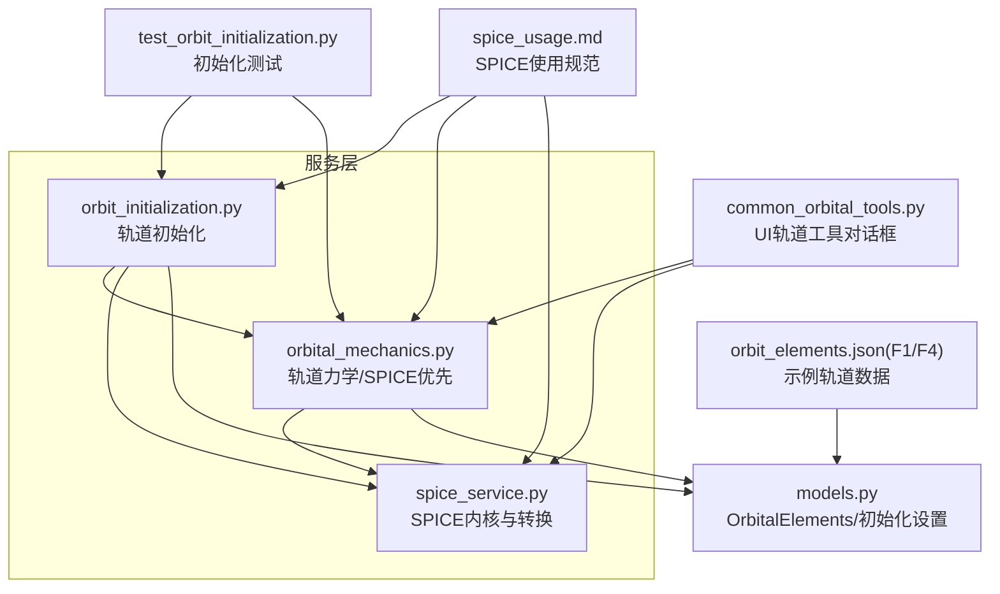
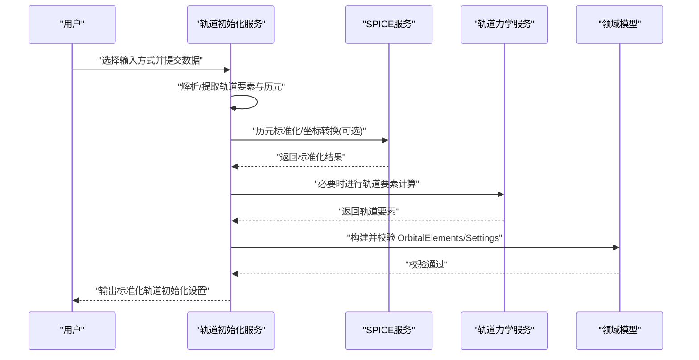
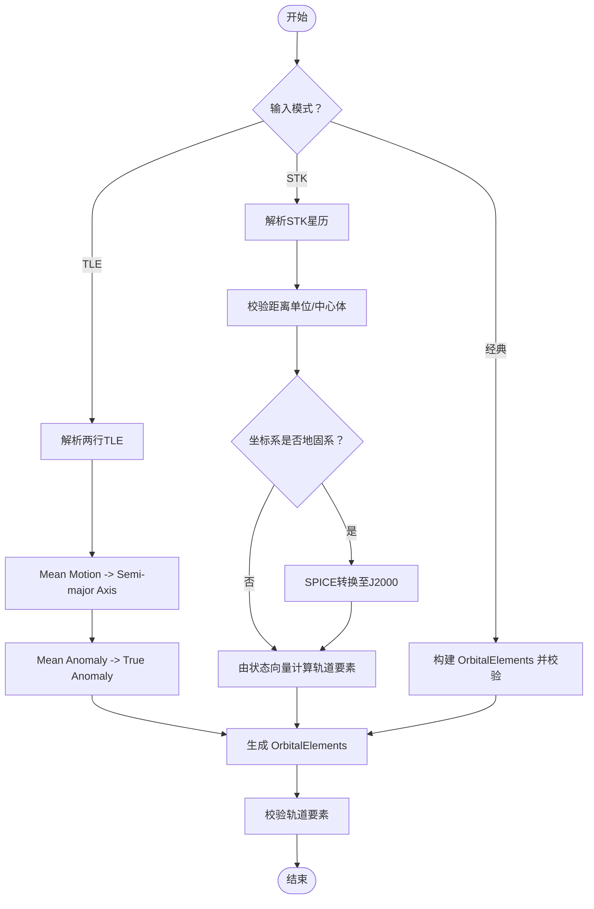
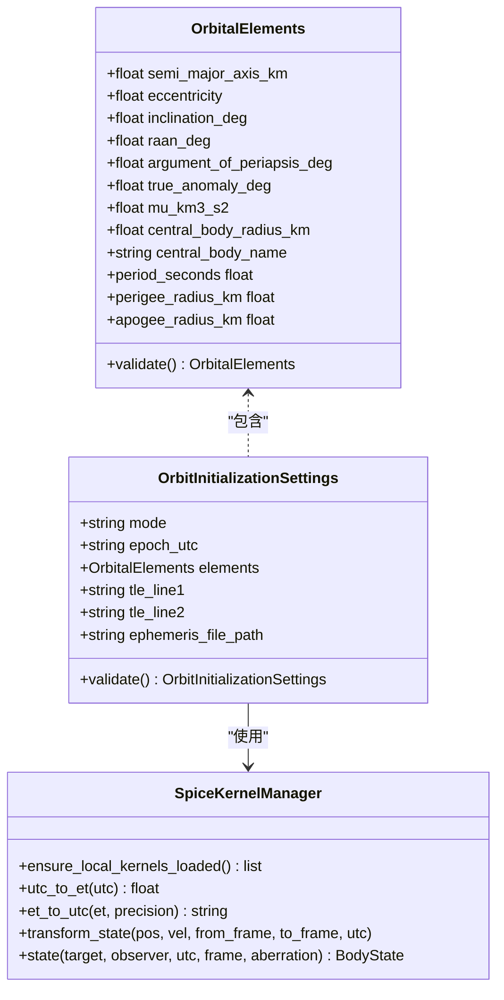
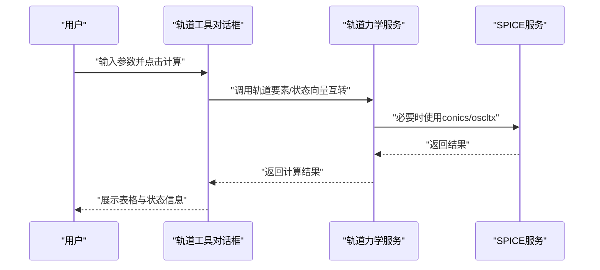
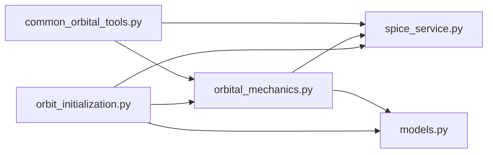

# 轨道初始化

<cite>
**本文引用的文件**
- [orbit_initialization.py](file://src/smart/services/orbit_initialization.py)
- [orbital_mechanics.py](file://src/smart/services/orbital_mechanics.py)
- [models.py](file://src/smart/domain/models.py)
- [spice_service.py](file://src/smart/services/spice_service.py)
- [common_orbital_tools.py](file://src/smart/ui/widgets/common_orbital_tools.py)
- [spice_usage.md](file://doc/spice_usage.md)
- [README.md](file://README.md)
- [test_orbit_initialization.py](file://tests/test_orbit_initialization.py)
- [test_common_orbital_tools.py](file://tests/test_common_orbital_tools.py)
- [orbit_elements.json(F1)](file://projects/F1/data/orbit_elements.json)
- [orbit_elements.json(F4)](file://projects/F4/data/orbit_elements.json)
</cite>

## 目录
1. [简介](#简介)
2. [项目结构](#项目结构)
3. [核心组件](#核心组件)
4. [架构总览](#架构总览)
5. [详细组件分析](#详细组件分析)
6. [依赖关系分析](#依赖关系分析)
7. [性能考虑](#性能考虑)
8. [故障排查指南](#故障排查指南)
9. [结论](#结论)
10. [附录](#附录)

## 简介
本文件聚焦 SMART 项目的“轨道初始化”功能，系统化阐述多种轨道参数输入方式（经典轨道根数、TLE、STK 星历）、OrbitalElements 数据模型、轨道参数校验规则、单位转换机制、数值稳定性处理、轨道工具集使用指南、与 SPICE 系统的接口集成以及天体动力学计算流程。文档还提供错误处理、精度控制与性能优化策略，并给出实际应用场景中的参数设置示例与最佳实践建议。

## 项目结构
轨道初始化相关代码主要分布在以下模块：
- 服务层：轨道初始化、轨道力学、SPICE 服务
- 领域模型：轨道元素与初始化设置的数据结构
- UI 工具：轨道转换、轨道要素计算等通用工具对话框
- 文档与测试：SPICE 使用规范、单元测试与示例数据

**图表来源**
- [orbit_initialization.py:1-307](file://src/smart/services/orbit_initialization.py#L1-L307)
- [orbital_mechanics.py:1-780](file://src/smart/services/orbital_mechanics.py#L1-L780)
- [spice_service.py:1-305](file://src/smart/services/spice_service.py#L1-L305)
- [models.py:1-255](file://src/smart/domain/models.py#L1-L255)
- [common_orbital_tools.py:1-800](file://src/smart/ui/widgets/common_orbital_tools.py#L1-L800)
- [spice_usage.md:1-235](file://doc/spice_usage.md#L1-L235)
- [test_orbit_initialization.py:1-87](file://tests/test_orbit_initialization.py#L1-L87)
- [orbit_elements.json(F1):1-11](file://projects/F1/data/orbit_elements.json#L1-L11)
- [orbit_elements.json(F4):1-11](file://projects/F4/data/orbit_elements.json#L1-L11)

**章节来源**
- [README.md:32-71](file://README.md#L32-L71)
- [spice_usage.md:1-235](file://doc/spice_usage.md#L1-L235)

## 核心组件
- 轨道初始化服务：支持经典轨道根数、TLE、STK 星历三种输入方式，负责解析、校验、单位转换与坐标系转换，并输出标准化的轨道初始化设置。
- 轨道力学服务：提供轨道要素与状态向量互转、轨道采样、二体传播、轨道转移等算法，优先使用 SPICE，失败时回退手工实现。
- SPICE 服务：封装内核加载、时间转换、坐标系转换、天体状态查询等能力。
- 领域模型：OrbitalElements、OrbitInitializationSettings 等数据结构及校验规则。
- UI 轨道工具：提供轨道六根数与状态向量互转、近远地点参数、圆轨道周期/高度、近点角换算、两体传播等交互式工具。

**章节来源**
- [orbit_initialization.py:70-126](file://src/smart/services/orbit_initialization.py#L70-L126)
- [orbital_mechanics.py:312-357](file://src/smart/services/orbital_mechanics.py#L312-L357)
- [spice_service.py:174-305](file://src/smart/services/spice_service.py#L174-L305)
- [models.py:17-67](file://src/smart/domain/models.py#L17-L67)
- [common_orbital_tools.py:315-496](file://src/smart/ui/widgets/common_orbital_tools.py#L315-L496)

## 架构总览
轨道初始化的总体流程如下：
- 输入解析：根据模式（经典/ TLE/ STK）解析文本或文件，提取轨道要素与历元。
- 参数校验：对轨道要素进行物理合理性与边界检查。
- 单位与坐标系转换：将输入单位统一为千米，必要时将地固系转换为 J2000。
- SPICE 集成：优先使用 SPICE 执行历元标准化、坐标转换与轨道要素计算，失败时回退手工公式。
- 输出：生成标准化的 OrbitInitializationSettings，供后续设计与分析使用。

**图表来源**
- [orbit_initialization.py:45-67](file://src/smart/services/orbit_initialization.py#L45-L67)
- [spice_service.py:241-249](file://src/smart/services/spice_service.py#L241-L249)
- [orbital_mechanics.py:312-357](file://src/smart/services/orbital_mechanics.py#L312-L357)
- [models.py:29-66](file://src/smart/domain/models.py#L29-L66)

## 详细组件分析

### 组件A：轨道初始化服务（orbit_initialization.py）
- 支持的输入模式
  - 经典轨道根数：直接构造 OrbitalElements 并校验。
  - TLE：解析两行轨道根数，计算半长轴与真近点角，生成 OrbitalElements。
  - STK 星历：解析 .e 文件，提取 ScenarioEpoch、距离单位、坐标系与 TimePosVel 样本，必要时通过 SPICE 将地固系转换为 J2000，再由状态向量反推轨道要素。
- 关键流程
  - 历元归一化：优先使用 SPICE 的 str2et/et2utc，失败则回退 Python 标准库。
  - STK 坐标转换：地固系（ITRF93/IAU_Earth/Fixed）通过 SPICE pxform/sxform 转至 J2000。
  - TLE 计算：Mean Motion -> Semi-major Axis；Mean Anomaly -> True Anomaly（牛顿法迭代）。
- 错误处理
  - 对非法格式、单位不支持、坐标系不可转换等情况抛出 OrbitInitializationError。
  - 对历元解析失败、SPICE 不可用等场景提供清晰的异常信息。

**图表来源**
- [orbit_initialization.py:78-126](file://src/smart/services/orbit_initialization.py#L78-L126)
- [orbit_initialization.py:128-217](file://src/smart/services/orbit_initialization.py#L128-L217)
- [orbit_initialization.py:228-253](file://src/smart/services/orbit_initialization.py#L228-L253)
- [orbit_initialization.py:255-281](file://src/smart/services/orbit_initialization.py#L255-L281)

**章节来源**
- [orbit_initialization.py:45-67](file://src/smart/services/orbit_initialization.py#L45-L67)
- [orbit_initialization.py:78-126](file://src/smart/services/orbit_initialization.py#L78-L126)
- [orbit_initialization.py:128-217](file://src/smart/services/orbit_initialization.py#L128-L217)
- [orbit_initialization.py:228-253](file://src/smart/services/orbit_initialization.py#L228-L253)
- [orbit_initialization.py:255-281](file://src/smart/services/orbit_initialization.py#L255-L281)

### 组件B：轨道力学与 SPICE 集成（orbital_mechanics.py + spice_service.py）
- SPICE 优先策略
  - state_from_true_anomaly/sample_orbit/orbital_elements_from_state_vector 优先使用 SPICE 的 conics/oscltx，失败时回退手工公式。
  - 通过 SpiceKernelManager 的 transform_state 实现地固系到 J2000 的转换。
- 核心算法
  - 轨道要素与状态向量互转：基于经典二体解，手工实现与 SPICE 接口兼容。
  - 轨道采样与传播：基于 Mean Anomaly 与 Mean Motion，采样轨道轨迹。
  - 转移与相位计算：Hohmann、Lambert、平面改变 ΔV 等。
- 数值稳定性
  - 使用向量容差阈值避免零向量与零半径。
  - 迭代求解（如偏近点角）设置最大迭代次数与收敛阈值。
  - 角度归一化防止越界。

**图表来源**
- [models.py:17-67](file://src/smart/domain/models.py#L17-L67)
- [spice_service.py:174-305](file://src/smart/services/spice_service.py#L174-L305)
- [orbital_mechanics.py:312-357](file://src/smart/services/orbital_mechanics.py#L312-L357)

**章节来源**
- [orbital_mechanics.py:255-310](file://src/smart/services/orbital_mechanics.py#L255-L310)
- [orbital_mechanics.py:312-357](file://src/smart/services/orbital_mechanics.py#L312-L357)
- [spice_service.py:241-285](file://src/smart/services/spice_service.py#L241-L285)
- [models.py:17-67](file://src/smart/domain/models.py#L17-L67)

### 组件C：UI 轨道工具集（common_orbital_tools.py）
- 轨道六根数↔状态向量互转对话框：输入六根数或位置速度，输出另一侧结果。
- 近远地点参数对话框：输入近/远地点高度，输出半长轴、偏心率、周期等。
- 圆轨道周期/高度对话框：圆轨道高度↔周期互算。
- 近点角换算对话框：真/偏/平近点角相互换算。
- 两体传播对话框：输入初始状态与时间，输出传播后的状态与子午点。
- 太阳/月亮位置对话框：输入历元，输出相对地球的位置速度与地理经纬度。

**图表来源**
- [common_orbital_tools.py:315-496](file://src/smart/ui/widgets/common_orbital_tools.py#L315-L496)
- [common_orbital_tools.py:498-800](file://src/smart/ui/widgets/common_orbital_tools.py#L498-L800)
- [orbital_mechanics.py:255-310](file://src/smart/services/orbital_mechanics.py#L255-L310)

**章节来源**
- [common_orbital_tools.py:315-496](file://src/smart/ui/widgets/common_orbital_tools.py#L315-L496)
- [common_orbital_tools.py:498-800](file://src/smart/ui/widgets/common_orbital_tools.py#L498-L800)

### 组件D：OrbitalElements 数据模型
- 字段定义与物理意义
  - 半长轴（km）：决定轨道大小与周期。
  - 偏心率（无量纲）：决定轨道形状（0 为圆，0~1 为椭圆）。
  - 轨道倾角（deg）：轨道平面与参考平面夹角。
  - 升交点赤经（deg）：升交点在参考平面的方位角。
  - 近地点幅角（deg）：从升交点到近地点的角度。
  - 真近点角（deg）：从近地点到卫星瞬时位置的角度。
  - 地心引力参数（km³/s²）与中心体半径/名称：用于动力学计算与边界校验。
- 校验规则
  - 半长轴必须大于中心体半径。
  - 偏心率必须满足 0 ≤ e < 1。
  - 近地点高度必须高于中心体表面（半长轴×(1-e)）。
- 衍生属性
  - 周期、近地点/远地点半径等派生值。

**章节来源**
- [models.py:17-67](file://src/smart/domain/models.py#L17-L67)

## 依赖关系分析
- 耦合与内聚
  - 轨道初始化服务与轨道力学服务耦合于 OrbitalElements 与 SPICE 接口；内聚良好，职责清晰。
  - UI 工具通过服务层调用轨道力学与 SPICE，保持界面与逻辑分离。
- 外部依赖
  - SPICE（SpiceyPy）：提供历元、坐标转换、轨道要素与状态向量互转。
  - NumPy：高性能数值计算基础。
  - SciPy：部分迭代求解（如 Lambert）。
- 循环依赖
  - 未发现循环依赖；模块间单向依赖。

**图表来源**
- [orbit_initialization.py:1-16](file://src/smart/services/orbit_initialization.py#L1-L16)
- [orbital_mechanics.py:1-24](file://src/smart/services/orbital_mechanics.py#L1-L24)
- [spice_service.py:1-16](file://src/smart/services/spice_service.py#L1-L16)
- [models.py:1-10](file://src/smart/domain/models.py#L1-L10)

**章节来源**
- [orbit_initialization.py:1-16](file://src/smart/services/orbit_initialization.py#L1-L16)
- [orbital_mechanics.py:1-24](file://src/smart/services/orbital_mechanics.py#L1-L24)
- [spice_service.py:1-16](file://src/smart/services/spice_service.py#L1-L16)
- [models.py:1-10](file://src/smart/domain/models.py#L1-L10)

## 性能考虑
- SPICE 优先策略：在可用时优先使用 SPICE 的原生函数，显著提升精度与性能。
- 向量化与批处理：轨道采样与状态批量计算利用 NumPy 向量化，减少循环开销。
- 迭代收敛：对非线性方程（如偏近点角迭代）设置合理阈值与最大迭代次数，避免过长耗时。
- 内核加载：通过 SpiceKernelManager 自动发现与去重加载，避免重复加载造成性能损耗。
- 回退策略：SPICE 不可用或失败时，手工实现作为兜底，确保功能可用性。

[本节为通用性能讨论，无需特定文件来源]

## 故障排查指南
- 历元解析失败
  - 现象：输入历元格式不被识别。
  - 处理：确认 ISO-8601 UTC 格式；若 SPICE 不可用，检查 Python 标准库解析逻辑。
  - 参考：[normalize_utc_epoch:45-67](file://src/smart/services/orbit_initialization.py#L45-L67)
- STK 星历导入错误
  - 现象：坐标系不支持、距离单位不支持、中心体非 Earth。
  - 处理：确认坐标系为 J2000/ICRF/Inertial 或地固系并通过 SPICE 转换；检查距离单位映射。
  - 参考：[parse_stk_ephemeris_text:137-217](file://src/smart/services/orbit_initialization.py#L137-L217)
- TLE 解析错误
  - 现象：行首标识或长度不符合 TLE 格式。
  - 处理：检查两行记录格式与字段截取。
  - 参考：[parse_tle_lines:84-126](file://src/smart/services/orbit_initialization.py#L84-L126)
- SPICE 不可用
  - 现象：抛出 SpiceUnavailableError 或转换失败。
  - 处理：安装 SpiceyPy 并准备本地内核；确认内核加载顺序与可用性。
  - 参考：[runtime_summary:79-89](file://src/smart/services/spice_service.py#L79-L89)
- UI 工具计算失败
  - 现象：对话框显示“计算失败：...”。
  - 处理：检查输入参数范围与单位；查看状态栏提示。
  - 参考：[OrbitalConversionDialog:447-496](file://src/smart/ui/widgets/common_orbital_tools.py#L447-L496)

**章节来源**
- [orbit_initialization.py:45-67](file://src/smart/services/orbit_initialization.py#L45-L67)
- [orbit_initialization.py:137-217](file://src/smart/services/orbit_initialization.py#L137-L217)
- [orbit_initialization.py:84-126](file://src/smart/services/orbit_initialization.py#L84-L126)
- [spice_service.py:79-89](file://src/smart/services/spice_service.py#L79-L89)
- [common_orbital_tools.py:447-496](file://src/smart/ui/widgets/common_orbital_tools.py#L447-L496)

## 结论
SMART 的轨道初始化功能通过“SPICE 优先 + 手工兜底”的策略，在保证高精度与高可靠性的前提下，提供了多样化的轨道参数输入方式与完善的工具集。数据模型严格定义了轨道要素及其校验规则，配合单位转换与坐标系转换机制，确保不同来源数据的一致性与可追溯性。UI 工具进一步降低了使用门槛，使工程师能够快速完成轨道要素计算与可视化验证。

[本节为总结性内容，无需特定文件来源]

## 附录

### 实际应用场景与参数设置示例
- 经典轨道根数
  - 示例：F1/F4 项目中的 orbit_elements.json 展示了标准的六根数配置。
  - 参考：[orbit_elements.json(F1):1-11](file://projects/F1/data/orbit_elements.json#L1-L11)，[orbit_elements.json(F4):1-11](file://projects/F4/data/orbit_elements.json#L1-L11)
- TLE 导入
  - 测试用例展示了 ISS TLE 的解析与轨道要素生成。
  - 参考：[test_orbit_initialization.py:12-31](file://tests/test_orbit_initialization.py#L12-L31)
- STK 星历导入
  - 测试用例展示了地心 J2000 与地固系的转换与校验。
  - 参考：[test_orbit_initialization.py:33-64](file://tests/test_orbit_initialization.py#L33-L64)，[test_orbit_initialization.py:66-87](file://tests/test_orbit_initialization.py#L66-L87)

### 最佳实践建议
- 优先使用 SPICE：在具备 SpiceyPy 与本地内核的前提下，优先使用 SPICE 进行历元与坐标转换。
- 输入校验前置：在 UI 层与服务层均进行参数范围与格式校验，尽早暴露问题。
- 单位与坐标系一致性：统一使用千米与度，地固系通过 SPICE 转换为 J2000。
- 回退路径明确：在 SPICE 不可用或失败时，确保手工实现路径可运行并输出一致结果。
- 结果落盘与可追溯：将轨道初始化结果与中间过程保存到项目 data/config 目录，便于复算与交接。

**章节来源**
- [README.md:125-152](file://README.md#L125-L152)
- [spice_usage.md:152-164](file://doc/spice_usage.md#L152-L164)
- [test_orbit_initialization.py:12-31](file://tests/test_orbit_initialization.py#L12-L31)
- [test_orbit_initialization.py:33-64](file://tests/test_orbit_initialization.py#L33-L64)
- [test_orbit_initialization.py:66-87](file://tests/test_orbit_initialization.py#L66-L87)