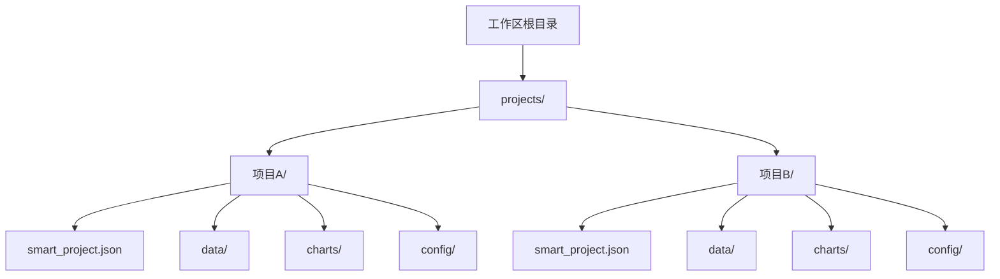
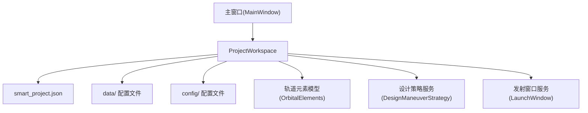
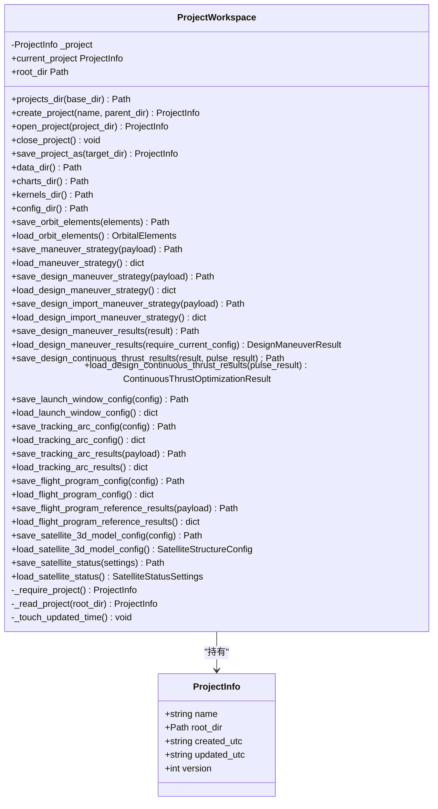
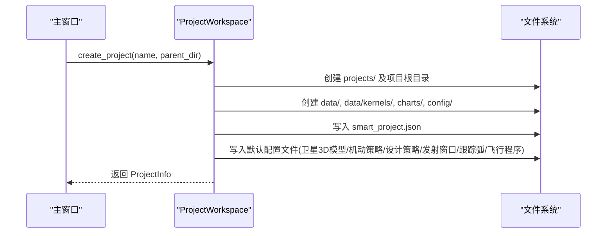
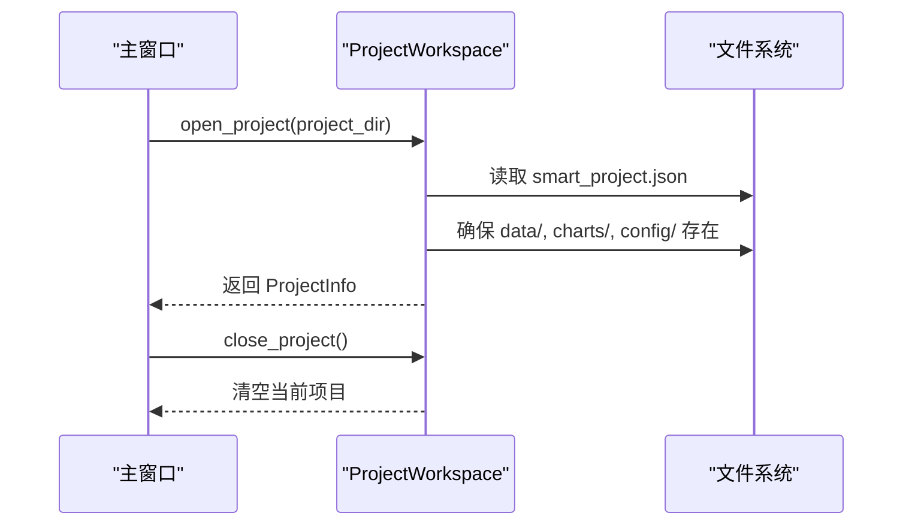
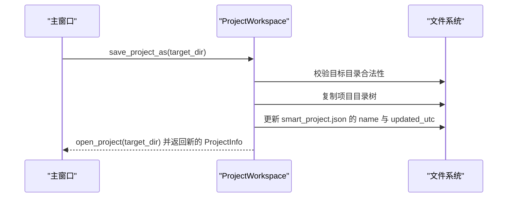
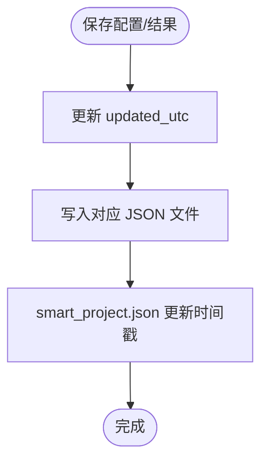
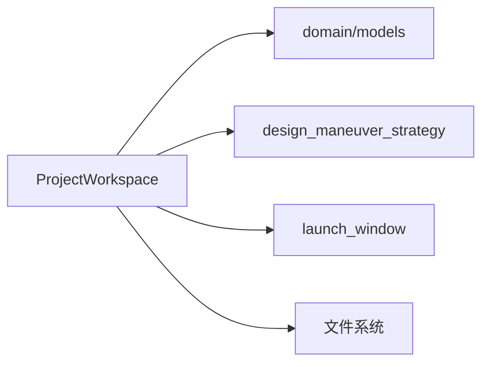

# 项目管理

<cite>
**本文引用的文件列表**
- [project_workspace.py](file://src/smart/services/project_workspace.py)
- [test_project_workspace.py](file://tests/test_project_workspace.py)
- [models.py](file://src/smart/domain/models.py)
- [design_maneuver_strategy.py](file://src/smart/services/design_maneuver_strategy.py)
- [launch_window.py](file://src/smart/services/launch_window.py)
- [main_window.py](file://src/smart/ui/main_window.py)
- [F1/smart_project.json](file://projects/F1/smart_project.json)
- [F4/smart_project.json](file://projects/F4/smart_project.json)
</cite>

## 目录
1. [简介](#简介)
2. [项目结构](#项目结构)
3. [核心组件](#核心组件)
4. [架构总览](#架构总览)
5. [详细组件分析](#详细组件分析)
6. [依赖关系分析](#依赖关系分析)
7. [性能考量](#性能考量)
8. [故障排查指南](#故障排查指南)
9. [结论](#结论)
10. [附录](#附录)

## 简介
本文件面向SMART项目的“项目管理”功能，围绕以下目标展开：  
- 项目创建工作流程与文件结构组织  
- 项目元数据与状态持久化机制  
- 项目生命周期管理（创建/打开/关闭/复制）  
- ProjectWorkspace类的设计与实现要点  
- 项目配置文件格式（smart_project.json）与状态跟踪  
- 版本控制策略与数据迁移注意事项  
- 与UI与各业务模块的数据交互关系与依赖约束  
- API使用示例、错误处理与性能优化最佳实践  

## 项目结构
SMART项目采用“工作区-项目”的层次化组织方式：
- 工作区根目录下存在 projects/ 子目录，作为所有项目容器
- 每个项目以独立子目录存在，内部包含 data/、charts/、config/ 三类标准子目录
- 每个项目根目录包含一个 smart_project.json 元数据文件，记录项目名称、版本、创建与更新时间等

图表来源
- [project_workspace.py:82-116](file://src/smart/services/project_workspace.py#L82-L116)
- [project_workspace.py:156-169](file://src/smart/services/project_workspace.py#L156-L169)
- [F1/smart_project.json:1-6](file://projects/F1/smart_project.json#L1-L6)
- [F4/smart_project.json:1-6](file://projects/F4/smart_project.json#L1-L6)

章节来源
- [project_workspace.py:82-116](file://src/smart/services/project_workspace.py#L82-L116)
- [project_workspace.py:156-169](file://src/smart/services/project_workspace.py#L156-L169)
- [F1/smart_project.json:1-6](file://projects/F1/smart_project.json#L1-L6)
- [F4/smart_project.json:1-6](file://projects/F4/smart_project.json#L1-L6)

## 核心组件
- ProjectWorkspace：项目管理核心类，负责项目创建、打开、关闭、复制、路径解析与各类配置/结果文件的读写
- ProjectInfo：项目元数据载体，包含项目名、根目录、创建/更新时间、版本号
- 项目配置文件：smart_project.json 记录项目元数据；其他配置文件位于 config/ 下，如 maneuver_strategy.json、design_maneuver_strategy.json、launch_window.json、tracking_arc.json、flight_program.json 等
- 项目数据文件：位于 data/ 下，如 orbit_elements.json、design_maneuver_results.json、design_continuous_thrust_results.json、tracking_arc_results.json、flight_program_reference_results.json 等

章节来源
- [project_workspace.py:55-62](file://src/smart/services/project_workspace.py#L55-L62)
- [project_workspace.py:33-53](file://src/smart/services/project_workspace.py#L33-L53)
- [project_workspace.py:118-127](file://src/smart/services/project_workspace.py#L118-L127)

## 架构总览
ProjectWorkspace 通过统一的文件系统接口管理项目生命周期，并与多个服务模块协作：
- 与 orbital/力学相关模块协作：保存/加载轨道元素
- 与设计策略模块协作：保存/加载机动策略与结果
- 与发射窗口模块协作：保存/加载发射窗口配置与结果
- 与UI主窗口协作：响应菜单动作，激活项目并刷新页面

图表来源
- [main_window.py:138-171](file://src/smart/ui/main_window.py#L138-L171)
- [project_workspace.py:213-246](file://src/smart/services/project_workspace.py#L213-L246)
- [project_workspace.py:332-384](file://src/smart/services/project_workspace.py#L332-L384)
- [project_workspace.py:398-404](file://src/smart/services/project_workspace.py#L398-L404)

## 详细组件分析

### ProjectWorkspace 类设计与职责
- 职责边界清晰：仅负责项目文件系统层面的操作与元数据管理，不直接参与业务计算
- 生命周期管理：create/open/close/save_project_as 四个核心方法
- 路径抽象：提供 data_dir()/charts_dir()/config_dir()/kernels_dir() 等统一访问入口
- 数据持久化：提供 save/load 方法族，覆盖轨道元素、卫星3D模型、机动策略、设计策略结果、连续变推结果、发射窗口配置、跟踪弧配置与结果、飞行程序配置与参考结果等

图表来源
- [project_workspace.py:55-62](file://src/smart/services/project_workspace.py#L55-L62)
- [project_workspace.py:64-131](file://src/smart/services/project_workspace.py#L64-L131)
- [project_workspace.py:213-404](file://src/smart/services/project_workspace.py#L213-L404)

章节来源
- [project_workspace.py:64-131](file://src/smart/services/project_workspace.py#L64-L131)
- [project_workspace.py:213-404](file://src/smart/services/project_workspace.py#L213-L404)

### 项目创建流程（含默认配置）
- 输入校验：项目名非空
- 目录创建：确保 projects/ 存在，创建项目根目录及其 data/、data/kernels/、charts/、config/
- 写入元数据：生成 smart_project.json，包含 name/version/created_utc/updated_utc
- 初始化默认配置：写入卫星3D模型、机动策略、设计机动策略、发射窗口配置、跟踪弧配置、飞行程序配置

图表来源
- [project_workspace.py:82-116](file://src/smart/services/project_workspace.py#L82-L116)
- [main_window.py:370-408](file://src/smart/ui/main_window.py#L370-L408)

章节来源
- [project_workspace.py:82-116](file://src/smart/services/project_workspace.py#L82-L116)
- [main_window.py:370-408](file://src/smart/ui/main_window.py#L370-L408)

### 项目打开/关闭流程
- 打开：定位到项目根目录，读取 smart_project.json，若不存在则抛出异常；同时确保 data/、charts/、config/ 目录存在
- 关闭：清空当前项目上下文

图表来源
- [project_workspace.py:118-127](file://src/smart/services/project_workspace.py#L118-L127)
- [main_window.py:409-438](file://src/smart/ui/main_window.py#L409-L438)

章节来源
- [project_workspace.py:118-127](file://src/smart/services/project_workspace.py#L118-L127)
- [main_window.py:409-438](file://src/smart/ui/main_window.py#L409-L438)

### 项目复制（另存为）
- 校验：目标目录不能是当前项目目录，不能是当前项目的子目录，且必须为空目录
- 复制：递归复制整个项目目录
- 更新元数据：重写 smart_project.json 的 name 与 updated_utc，并重新打开新项目

图表来源
- [project_workspace.py:132-154](file://src/smart/services/project_workspace.py#L132-L154)
- [main_window.py:463-476](file://src/smart/ui/main_window.py#L463-L476)

章节来源
- [project_workspace.py:132-154](file://src/smart/services/project_workspace.py#L132-L154)
- [main_window.py:463-476](file://src/smart/ui/main_window.py#L463-L476)

### 项目状态持久化与版本控制
- 元数据文件：smart_project.json，包含 name、version、created_utc、updated_utc
- 更新策略：每次保存配置/结果后，调用内部更新时间戳逻辑，刷新 updated_utc
- 版本字段：用于未来可能的迁移策略预留
- 结果文件校验：设计机动与连续变推结果文件包含 metadata 字段，其中包含配置哈希，用于判断结果是否与当前配置一致

图表来源
- [project_workspace.py:654-660](file://src/smart/services/project_workspace.py#L654-L660)
- [project_workspace.py:277-298](file://src/smart/services/project_workspace.py#L277-L298)
- [project_workspace.py:300-330](file://src/smart/services/project_workspace.py#L300-L330)

章节来源
- [project_workspace.py:654-660](file://src/smart/services/project_workspace.py#L654-L660)
- [project_workspace.py:277-298](file://src/smart/services/project_workspace.py#L277-L298)
- [project_workspace.py:300-330](file://src/smart/services/project_workspace.py#L300-L330)

### 项目配置文件格式与默认值
- smart_project.json：项目元数据
- config/ 下的配置文件：
  - maneuver_strategy.json：机动策略
  - design_maneuver_strategy.json：设计机动策略
  - launch_window.json：发射窗口配置
  - tracking_arc.json：跟踪弧配置
  - flight_program.json：飞行程序配置
- data/ 下的结果文件：
  - orbit_elements.json：轨道元素
  - design_maneuver_results.json：设计机动结果
  - design_continuous_thrust_results.json：连续变推结果
  - tracking_arc_results.json：跟踪弧结果
  - flight_program_reference_results.json：飞行程序参考结果
- 默认配置生成：项目创建时自动生成默认配置文件，部分默认值来自专用函数

章节来源
- [project_workspace.py:33-53](file://src/smart/services/project_workspace.py#L33-L53)
- [project_workspace.py:118-127](file://src/smart/services/project_workspace.py#L118-L127)
- [project_workspace.py:767-800](file://src/smart/services/project_workspace.py#L767-L800)

### 项目数据迁移与兼容性
- 卫星状态配置迁移：旧版卫星状态文件（config/satellite_status.json 与 data/satellite_status.json）已迁移到新的 config/satellite_3d_model.json，并删除旧文件
- 加载兼容：若新文件不存在，优先尝试从旧路径加载并转换为新结构
- 设计策略结果校验：通过 config 哈希判断结果是否与当前策略一致，避免误用过期结果

章节来源
- [project_workspace.py:398-404](file://src/smart/services/project_workspace.py#L398-L404)
- [project_workspace.py:484-626](file://src/smart/services/project_workspace.py#L484-L626)
- [project_workspace.py:287-298](file://src/smart/services/project_workspace.py#L287-L298)
- [project_workspace.py:316-330](file://src/smart/services/project_workspace.py#L316-L330)

### 与UI及业务模块的数据交互
- UI主窗口通过 ProjectWorkspace 提供的路径与读写接口，驱动各页面刷新与数据展示
- 项目激活时，根据 smart_project.json 与各配置/结果文件决定页面初始状态
- 业务模块（如设计策略、发射窗口、轨道力学）通过 ProjectWorkspace 的读写接口进行数据持久化

章节来源
- [main_window.py:534-547](file://src/smart/ui/main_window.py#L534-L547)
- [project_workspace.py:213-246](file://src/smart/services/project_workspace.py#L213-L246)
- [project_workspace.py:332-384](file://src/smart/services/project_workspace.py#L332-L384)

## 依赖关系分析
- 内部依赖
  - ProjectWorkspace 依赖于 domain/models 中的 OrbitalElements、AntennaConfig、GroundAssetConfig、RelaySatelliteConfig、SatelliteStructureConfig 等数据模型
  - 依赖于 design_maneuver_strategy 与 launch_window 等服务模块提供的默认配置与规范化函数
- 外部依赖
  - 文件系统：路径解析、目录创建、文件读写
  - UI：菜单事件与消息提示

图表来源
- [project_workspace.py:10-31](file://src/smart/services/project_workspace.py#L10-L31)
- [models.py:17-200](file://src/smart/domain/models.py#L17-L200)
- [design_maneuver_strategy.py:188-200](file://src/smart/services/design_maneuver_strategy.py#L188-L200)
- [launch_window.py:156-192](file://src/smart/services/launch_window.py#L156-L192)

章节来源
- [project_workspace.py:10-31](file://src/smart/services/project_workspace.py#L10-L31)
- [models.py:17-200](file://src/smart/domain/models.py#L17-L200)
- [design_maneuver_strategy.py:188-200](file://src/smart/services/design_maneuver_strategy.py#L188-L200)
- [launch_window.py:156-192](file://src/smart/services/launch_window.py#L156-L192)

## 性能考量
- 文件I/O最小化：批量写入时尽量减少多次打开/关闭文件的次数
- 哈希校验：通过稳定哈希避免重复计算与无效加载
- 目录预创建：在创建项目时一次性创建所需目录，降低后续IO开销
- 复制优化：另存为时先清理目标目录再复制，避免中间态文件干扰

## 故障排查指南
- 无法打开项目：检查项目根目录是否存在 smart_project.json
- 项目复制失败：确认目标目录为空且不在当前项目内部
- 读取结果异常：若 require_current_config 为真，需确保当前策略与结果中的配置哈希一致
- 卫星配置加载失败：确认新旧文件均已删除或正确迁移至新位置

章节来源
- [project_workspace.py:641-652](file://src/smart/services/project_workspace.py#L641-L652)
- [project_workspace.py:132-154](file://src/smart/services/project_workspace.py#L132-L154)
- [project_workspace.py:287-298](file://src/smart/services/project_workspace.py#L287-L298)
- [project_workspace.py:398-404](file://src/smart/services/project_workspace.py#L398-L404)

## 结论
ProjectWorkspace 将项目管理从UI与业务逻辑中解耦，提供了清晰的生命周期管理与稳定的文件系统抽象。通过标准化的配置/结果文件命名与默认值生成，配合元数据与哈希校验机制，既保证了易用性，也为未来的版本迁移与数据一致性提供了基础。

## 附录

### API 使用示例（步骤说明）
- 创建项目
  - 在主窗口触发“新建项目”，输入项目名，调用 Workspace.create_project，随后激活项目并刷新页面
  - 参考：[main_window.py:370-408](file://src/smart/ui/main_window.py#L370-L408)，[project_workspace.py:82-116](file://src/smart/services/project_workspace.py#L82-L116)
- 打开项目
  - 在主窗口触发“打开项目”，选择项目目录，调用 Workspace.open_project，随后激活项目并加载历史数据
  - 参考：[main_window.py:409-438](file://src/smart/ui/main_window.py#L409-L438)，[project_workspace.py:118-127](file://src/smart/services/project_workspace.py#L118-L127)
- 关闭项目
  - 在主窗口触发“关闭项目”，调用 Workspace.close_project
  - 参考：[main_window.py:463-476](file://src/smart/ui/main_window.py#L463-L476)，[project_workspace.py:129-131](file://src/smart/services/project_workspace.py#L129-L131)
- 另存为（复制项目）
  - 在主窗口触发“另存为”，选择目标目录，调用 Workspace.save_project_as，返回的新项目即为当前项目
  - 参考：[main_window.py:463-476](file://src/smart/ui/main_window.py#L463-L476)，[project_workspace.py:132-154](file://src/smart/services/project_workspace.py#L132-L154)

### 测试用例参考
- 项目创建结构验证与默认配置生成
  - 参考：[test_project_workspace.py:21-91](file://tests/test_project_workspace.py#L21-L91)
- 另存为复制与关闭行为
  - 参考：[test_project_workspace.py:107-123](file://tests/test_project_workspace.py#L107-L123)
- 轨道元素保存/加载
  - 参考：[test_project_workspace.py:138-156](file://tests/test_project_workspace.py#L138-L156)
- 机动策略保存/加载
  - 参考：[test_project_workspace.py:158-235](file://tests/test_project_workspace.py#L158-L235)
- 发射窗口与跟踪弧配置独立保存
  - 参考：[test_project_workspace.py:237-251](file://tests/test_project_workspace.py#L237-L251)
- 飞行程序参考结果保存/加载
  - 参考：[test_project_workspace.py:253-266](file://tests/test_project_workspace.py#L253-L266)
- 设计机动结果保存/加载
  - 参考：[test_project_workspace.py:268-281](file://tests/test_project_workspace.py#L268-L281)
- 连续变推结果保存/加载
  - 参考：[test_project_workspace.py:283-339](file://tests/test_project_workspace.py#L283-L339)
- 卫星3D模型配置保存/加载与旧文件兼容
  - 参考：[test_project_workspace.py:350-432](file://tests/test_project_workspace.py#L350-L432)