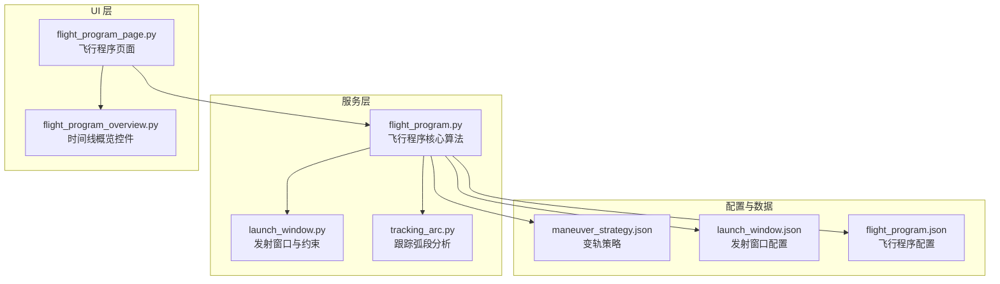
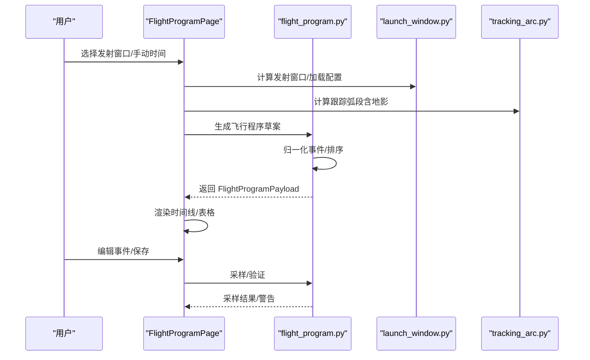
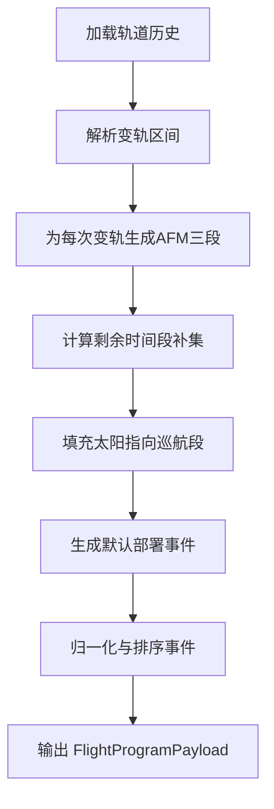
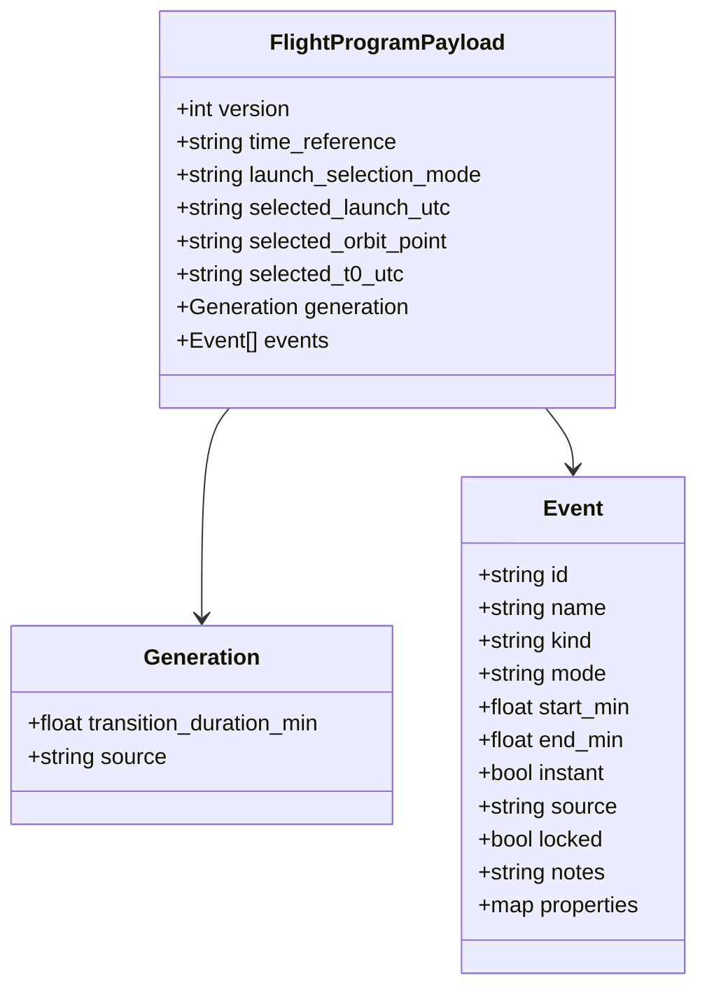
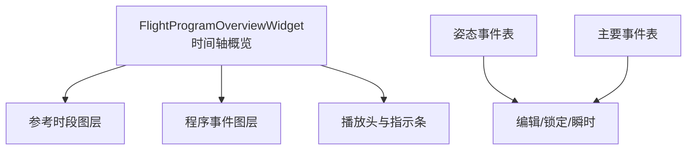
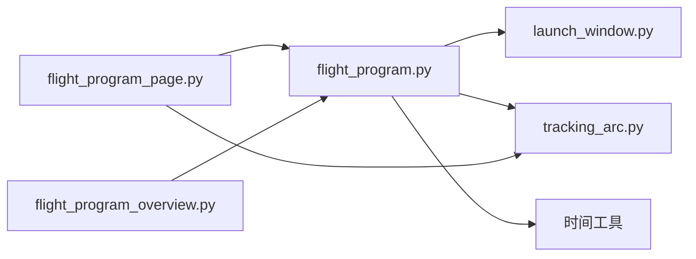

# 飞行程序设计

<cite>
**本文引用的文件**
- [flight_program.py](file://src/smart/services/flight_program.py)
- [flight_program_page.py](file://src/smart/ui/widgets/flight_program_page.py)
- [flight_program_overview.py](file://src/smart/ui/widgets/flight_program_overview.py)
- [launch_window.py](file://src/smart/services/launch_window.py)
- [tracking_arc.py](file://src/smart/services/tracking_arc.py)
- [flight_program.json](file://projects/F4/config/flight_program.json)
- [launch_window.json](file://projects/F4/config/launch_window.json)
- [maneuver_strategy.json](file://projects/F4/config/maneuver_strategy.json)
- [test_flight_program.py](file://tests/test_flight_program.py)
- [README.md](file://README.md)
- [planning_workflow.md](file://doc/planning_workflow.md)
</cite>

## 目录
1. [简介](#简介)
2. [项目结构](#项目结构)
3. [核心组件](#核心组件)
4. [架构总览](#架构总览)
5. [详细组件分析](#详细组件分析)
6. [依赖关系分析](#依赖关系分析)
7. [性能考量](#性能考量)
8. [故障排查指南](#故障排查指南)
9. [结论](#结论)
10. [附录](#附录)

## 简介
本文件面向 SMART 项目的“飞行程序设计”功能，系统化阐述飞行程序时间线生成的算法原理与实现细节，解释 FlightProgramPayload 数据结构与任务事件定义，梳理飞行程序的层次化组织结构（阶段划分、事件排序与时序约束），给出可视化展示方案（时间轴视图与事件表格），说明参考结果生成与验证机制，并阐明飞行程序与变轨策略、发射窗口的集成关系。同时提供模板系统与批量处理思路，结合实际飞行任务案例与优化策略，帮助读者快速上手并扩展该功能。

## 项目结构
- 服务层（Python）：飞行程序核心算法位于服务模块，负责事件归一化、草案生成、采样与验证。
- UI 层（PySide6）：飞行程序页面负责交互、表格编辑、时间线可视化与与 STK 联动。
- 配置与数据：项目配置文件（如 maneuver_strategy.json、launch_window.json、flight_program.json）承载策略与结果；测试用例验证关键行为。
- 文档与流程：README 提供整体能力说明；planning_workflow.md 规范工程化研究与记录流程。

**图表来源**
- [flight_program.py:1-635](file://src/smart/services/flight_program.py#L1-L635)
- [flight_program_page.py:1-800](file://src/smart/ui/widgets/flight_program_page.py#L1-L800)
- [flight_program_overview.py:1-523](file://src/smart/ui/widgets/flight_program_overview.py#L1-L523)
- [launch_window.py:1-200](file://src/smart/services/launch_window.py#L1-L200)
- [tracking_arc.py:1-200](file://src/smart/services/tracking_arc.py#L1-L200)
- [maneuver_strategy.json:1-103](file://projects/F4/config/maneuver_strategy.json#L1-L103)
- [launch_window.json:1-230](file://projects/F4/config/launch_window.json#L1-L230)
- [flight_program.json:1-367](file://projects/F4/config/flight_program.json#L1-L367)

**章节来源**
- [README.md:1-204](file://README.md#L1-L204)

## 核心组件
- FlightProgramPayload：飞行程序的 JSON 结构，包含版本、时间基准、发射选择模式、事件列表等。
- FlightProgramSample：对某一时刻的飞行程序状态采样，包含姿态模式、位置/速度、太阳/地球方向、阴影状态等。
- FlightProgramSamplingContext：采样上下文，缓存轨道历史、时间线、太阳矢量、阴影掩膜、AFM 参考方向等，避免重复计算。
- 事件类型与模式：
  - 姿态事件（ATTITUDE_KIND）：SPM/EPM/AFM/Transition，用于控制卫星姿态朝向。
  - 主要事件（DEPLOYMENT_KIND）：如太阳翼展开、通信天线展开等部署类事件。
- 生成与验证：
  - 自动生成草案：基于变轨策略与轨道历史，填充 AFM 区间、过渡段与默认部署事件。
  - 校验：检测姿态事件重叠/空档、AFM 是否覆盖所有变轨区间、部署事件是否与地影时段冲突等。

**章节来源**
- [flight_program.py:35-141](file://src/smart/services/flight_program.py#L35-L141)
- [flight_program.py:229-289](file://src/smart/services/flight_program.py#L229-L289)
- [flight_program.py:292-365](file://src/smart/services/flight_program.py#L292-L365)
- [flight_program.py:420-445](file://src/smart/services/flight_program.py#L420-L445)

## 架构总览
飞行程序设计贯穿“策略输入 → 时间线构建 → 事件生成 → 可视化展示 → 采样验证”的闭环。策略来自变轨策略与发射窗口配置；时间线来自轨道历史与跟踪弧段；事件通过算法自动生成并允许人工编辑；UI 提供时间轴概览、事件表格与 STK 同步；服务层提供采样与验证能力。

**图表来源**
- [flight_program_page.py:424-506](file://src/smart/ui/widgets/flight_program_page.py#L424-L506)
- [flight_program.py:144-226](file://src/smart/services/flight_program.py#L144-L226)
- [launch_window.py:156-192](file://src/smart/services/launch_window.py#L156-L192)
- [tracking_arc.py:66-92](file://src/smart/services/tracking_arc.py#L66-L92)

## 详细组件分析

### 飞行程序时间线生成算法
- 输入：
  - 轨道历史 CSV（包含 elapsed_time_min、位置/速度、子卫星经纬度等）
  - 变轨策略（含多次变轨的起止时间与持续时间）
  - 跟踪弧段结果（含地影段）
  - 选择的发射时间来源（窗口前沿/中点/后沿或手动）
- 步骤：
  1) 加载轨道历史，确定时间线起点/终点与过渡段时长。
  2) 解析变轨区间，为每个变轨生成“点火前过渡-点火模式-点火后过渡”三段姿态序列，并预留默认过渡时长。
  3) 对剩余时间段求补集，填充“太阳指向巡航”姿态段。
  4) 生成默认部署事件（如太阳翼/通信天线展开）。
  5) 归一化事件（校验起止时间、瞬时事件、模式合法性），并按起止时间排序。
- 输出：标准化的 FlightProgramPayload，包含事件列表与元数据。

**图表来源**
- [flight_program.py:144-226](file://src/smart/services/flight_program.py#L144-L226)
- [flight_program.py:482-506](file://src/smart/services/flight_program.py#L482-L506)
- [flight_program.py:86-110](file://src/smart/services/flight_program.py#L86-L110)

**章节来源**
- [flight_program.py:144-226](file://src/smart/services/flight_program.py#L144-L226)
- [test_flight_program.py:148-184](file://tests/test_flight_program.py#L148-L184)

### FlightProgramPayload 数据结构与事件定义
- 字段要点：
  - 版本、时间基准（如 t0_elapsed_min）、发射选择模式（window/manual）、所选发射/轨道点、T0 时间
  - generation：过渡时长与来源（auto_draft/manual）
  - events：事件数组，每项包含 id/name/kind/mode/start_min/end_min/instant/source/locked/notes/properties
- 事件类型：
  - ATTITUDE_KIND：姿态事件，mode 支持 SPM/EPM/AFM/Transition
  - DEPLOYMENT_KIND：主要事件，如 SolarArrayDeploy/AntennaDeploy
- 默认事件：
  - 太阳翼展开：T0+20~35 min
  - 通信天线展开：T0+45~55 min

**图表来源**
- [flight_program.py:70-83](file://src/smart/services/flight_program.py#L70-L83)
- [flight_program.py:113-141](file://src/smart/services/flight_program.py#L113-L141)
- [flight_program.json:1-367](file://projects/F4/config/flight_program.json#L1-L367)

**章节来源**
- [flight_program.py:70-141](file://src/smart/services/flight_program.py#L70-L141)
- [flight_program.json:1-367](file://projects/F4/config/flight_program.json#L1-L367)

### 飞行程序层次化组织结构
- 阶段划分：
  - 过渡段：点火前过渡（Transition）与点火后过渡（Transition）
  - 点火模式（AFM）：严格覆盖变轨区间
  - 巡航段：太阳指向（SPM）与测控姿态（EPM）等
  - 部署事件：太阳翼/天线等一次性事件
- 事件排序与时序约束：
  - 姿态事件按起止时间排序，不允许重叠（容差极小）
  - AFM 必须完整覆盖每个变轨区间
  - 部署事件不得与地影时段重叠
- 时序约束：
  - 过渡段时长可配置（默认 20 分钟）
  - 变轨前后各预留默认 60 分钟的 AFM 区间以保证姿态稳定

**章节来源**
- [flight_program.py:160-212](file://src/smart/services/flight_program.py#L160-L212)
- [flight_program.py:229-289](file://src/smart/services/flight_program.py#L229-L289)
- [flight_program.py:525-558](file://src/smart/services/flight_program.py#L525-L558)

### 可视化展示方案
- 时间轴视图（甘特图）：
  - 支持滚轮缩放、中键平移、双击重置、底部指示条拖动
  - 分层绘制：参考（点火/地影/地面站/中继星）与程序（姿态/主要事件）
  - 播放头同步：支持拖动播放头并联动 STK 时间
- 事件表格：
  - 分组显示：姿态事件表与主要事件表
  - 编辑能力：支持锁定/瞬时标记、模式下拉、时间编辑
  - 参考图层过滤：可显隐点火/地影/地面站/中继星

**图表来源**
- [flight_program_overview.py:29-106](file://src/smart/ui/widgets/flight_program_overview.py#L29-L106)
- [flight_program_page.py:303-372](file://src/smart/ui/widgets/flight_program_page.py#L303-L372)
- [flight_program_page.py:415-422](file://src/smart/ui/widgets/flight_program_page.py#L415-L422)

**章节来源**
- [flight_program_overview.py:29-106](file://src/smart/ui/widgets/flight_program_overview.py#L29-L106)
- [flight_program_page.py:303-422](file://src/smart/ui/widgets/flight_program_page.py#L303-L422)

### 参考结果生成与验证机制
- 参考结果生成：
  - 基于发射窗口或手动发射时间，计算跟踪弧段（含地影、地面站/中继星可见性）
  - 将结果持久化为飞行程序参考结果，供页面加载与渲染
- 验证机制：
  - 姿态事件重叠/空档告警
  - AFM 未覆盖变轨区间告警
  - 部署事件与地影时段冲突告警
- 采样与缓存：
  - 采样上下文缓存太阳矢量、阴影掩膜、AFM 参考方向，避免重复计算
  - 支持单点采样与全序列采样，返回姿态模式、plus_z 方向、位置/速度、阴影状态等

**章节来源**
- [flight_program_page.py:424-474](file://src/smart/ui/widgets/flight_program_page.py#L424-L474)
- [flight_program.py:229-289](file://src/smart/services/flight_program.py#L229-L289)
- [flight_program.py:334-365](file://src/smart/services/flight_program.py#L334-L365)
- [flight_program.py:292-331](file://src/smart/services/flight_program.py#L292-L331)

### 与变轨策略、发射窗口的集成关系
- 变轨策略：
  - 提供变轨次数、起止时间、持续时间、方向等，作为生成 AFM 区间的依据
  - 通过 ManeuverInterval 列表参与时间线构建与验证
- 发射窗口：
  - 提供窗口起止时间、采样步长、约束条件等
  - 选择窗口前沿/中点/后沿或手动发射时间，决定 T0 与轨道点位
- 跟踪弧段：
  - 生成地影段、地面站/中继星可见性段，作为参考图层与部署事件避障依据

**章节来源**
- [launch_window.py:128-135](file://src/smart/services/launch_window.py#L128-L135)
- [tracking_arc.py:66-92](file://src/smart/services/tracking_arc.py#L66-L92)
- [flight_program_page.py:424-474](file://src/smart/ui/widgets/flight_program_page.py#L424-L474)

### 模板系统与批量处理
- 模板系统：
  - 默认部署事件模板：太阳翼展开、通信天线展开
  - 姿态模式模板：SPM/EPM/AFM/Transition
  - 可通过配置文件或策略文件扩展模板项
- 批量处理：
  - 基于发射窗口批量计算跟踪弧段与飞行程序草案
  - 通过采样上下文缓存与批量采样接口，提升大规模对比分析效率

**章节来源**
- [flight_program.py:482-506](file://src/smart/services/flight_program.py#L482-L506)
- [flight_program.py:334-365](file://src/smart/services/flight_program.py#L334-L365)
- [flight_program_page.py:449-474](file://src/smart/ui/widgets/flight_program_page.py#L449-L474)

### 实际案例与优化策略
- 案例：F4 项目飞行程序配置展示了多段 AFM 与过渡段、部署事件的时间分布，以及 T0 与发射时间的选择。
- 优化策略：
  - 合理设置过渡时长，平衡姿态稳定与时间利用率
  - 将部署事件尽量安排在非地影时段，确保通信与太阳帆供电
  - 通过采样上下文缓存减少重复计算，提高交互响应速度
  - 使用 STK 同步播放头，进行可视化交叉验证

**章节来源**
- [flight_program.json:1-367](file://projects/F4/config/flight_program.json#L1-L367)
- [test_flight_program.py:148-184](file://tests/test_flight_program.py#L148-L184)
- [flight_program_page.py:527-555](file://src/smart/ui/widgets/flight_program_page.py#L527-L555)

## 依赖关系分析
- flight_program.py 依赖：
  - launch_window.py：变轨区间解析、时间线构建、太阳矢量与阴影计算
  - tracking_arc.py：跟踪弧段与地影段
  - 日期/时间工具：UTC 解析与格式化
- UI 依赖：
  - flight_program_page.py 依赖 flight_program.py 与 tracking_arc.py，提供交互与可视化
  - flight_program_overview.py 为独立可复用控件

**图表来源**
- [flight_program.py:12-23](file://src/smart/services/flight_program.py#L12-L23)
- [flight_program_page.py:33-51](file://src/smart/ui/widgets/flight_program_page.py#L33-L51)
- [flight_program_overview.py:20-26](file://src/smart/ui/widgets/flight_program_overview.py#L20-L26)

**章节来源**
- [flight_program.py:12-23](file://src/smart/services/flight_program.py#L12-L23)
- [flight_program_page.py:33-51](file://src/smart/ui/widgets/flight_program_page.py#L33-L51)

## 性能考量
- 采样上下文缓存：太阳矢量、阴影掩膜、AFM 参考方向一次性计算并复用，避免重复调用底层函数。
- 离散采样：按分钟步长采样，适合桌面交互；大规模对比分析建议批量化与异步化。
- UI 交互：时间轴缩放与平移采用局部事件处理，避免外层滚动抢占。
- 数据结构：事件按起止时间排序，查找与合并区间使用高效算法，降低 O(n log n) 复杂度。

[本节为通用性能讨论，无需具体文件来源]

## 故障排查指南
- 生成草案失败：
  - 检查轨道历史 CSV 是否正确加载
  - 确认变轨策略是否存在且包含有效区间
- 事件冲突告警：
  - 姿态事件重叠：调整起止时间或缩短过渡段
  - AFM 未覆盖变轨：延长过渡段或增加变轨次数
  - 部署事件与地影冲突：调整部署时间或选择非地影时段
- STK 同步异常：
  - 检查 STK 链接服务状态与场景时间同步逻辑
  - 确认 T0 与播放头时间换算正确

**章节来源**
- [flight_program_page.py:476-506](file://src/smart/ui/widgets/flight_program_page.py#L476-L506)
- [flight_program.py:229-289](file://src/smart/services/flight_program.py#L229-L289)
- [flight_program_page.py:527-555](file://src/smart/ui/widgets/flight_program_page.py#L527-L555)

## 结论
SMART 的飞行程序设计通过“策略驱动 + 轨道历史 + 跟踪弧段”的方式，实现了自动化与可编辑相结合的飞行程序时间线生成。其核心在于：
- 清晰的数据结构与事件模型
- 基于变轨策略的自动化草案生成
- 可视化时间轴与表格编辑
- 参考结果与验证机制
- 与发射窗口、跟踪弧段的紧密集成

这些特性使得飞行程序设计既满足工程化需求，又便于迭代优化与跨工具验证。

[本节为总结性内容，无需具体文件来源]

## 附录
- 项目能力与模块规划参见 README
- 工程化研究与记录流程参见 planning_workflow.md

**章节来源**
- [README.md:56-71](file://README.md#L56-L71)
- [planning_workflow.md:1-127](file://doc/planning_workflow.md#L1-L127)