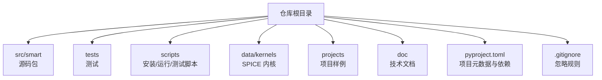
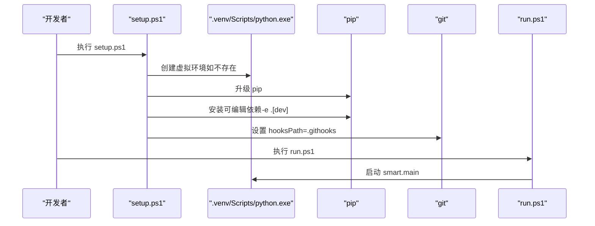
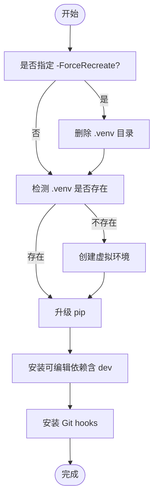
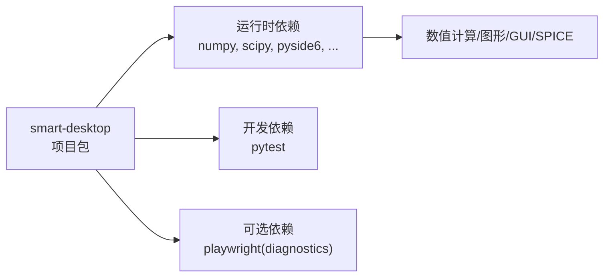

# 安装与配置

<cite>
**本文引用的文件**
- [README.md](file://README.md)
- [pyproject.toml](file://pyproject.toml)
- [scripts/setup.ps1](file://scripts/setup.ps1)
- [scripts/run.ps1](file://scripts/run.ps1)
- [scripts/test.ps1](file://scripts/test.ps1)
- [scripts/install-git-hooks.ps1](file://scripts/install-git-hooks.ps1)
- [.gitignore](file://.gitignore)
- [.codex/environments/environment.toml](file://.codex/environments/environment.toml)
- [updates.md](file://updates.md)
</cite>

## 目录
1. [简介](#简介)
2. [项目结构](#项目结构)
3. [核心组件](#核心组件)
4. [架构总览](#架构总览)
5. [详细组件分析](#详细组件分析)
6. [依赖分析](#依赖分析)
7. [性能考虑](#性能考虑)
8. [故障排查指南](#故障排查指南)
9. [结论](#结论)
10. [附录](#附录)

## 简介
本文件为 SMART 项目的安装与配置指南，面向开发者与高级用户，涵盖以下内容：
- 开发环境要求与搭建流程（Python 3.10+、虚拟环境、依赖安装）
- setup.ps1 脚本的功能、参数与错误处理机制
- 依赖类型（运行时依赖与开发依赖）与安装方式
- 环境变量与路径配置要点
- 常见安装问题排查与解决方案
- 不同操作系统平台的安装建议与注意事项

## 项目结构
SMART 是一个基于 Python 的桌面应用，采用 PySide6 作为 GUI 框架，围绕 STK 11.6 与 SPICE 生态构建任务分析工作流。项目采用标准的 Python 包布局，源码位于 src/smart 下，测试位于 tests，脚本位于 scripts。

**图表来源**
- [README.md:187-196](file://README.md#L187-L196)
- [pyproject.toml:36-41](file://pyproject.toml#L36-L41)

**章节来源**
- [README.md:187-196](file://README.md#L187-L196)
- [pyproject.toml:36-41](file://pyproject.toml#L36-L41)

## 核心组件
- Python 与包管理
  - Python 版本要求：>=3.10
  - 包管理器：pip（随 Python 3.10+ 默认提供）
  - 安装模式：可编辑安装（-e），便于开发调试
- 依赖管理
  - 运行时依赖：NumPy、SciPy、PySide6、pyqtgraph、PyOpenGL、trimesh、pycollada、spiceypy、reportlab 等
  - 开发依赖：pytest（用于测试）
  - 可选依赖：diagnostics（Playwright）
- 脚本工具
  - setup.ps1：创建虚拟环境、安装依赖、安装 Git hooks
  - run.ps1：启动桌面应用
  - test.ps1：运行测试
  - install-git-hooks.ps1：设置 Git hooks 路径
- 环境与路径
  - 虚拟环境目录：.venv
  - 源码包路径：src
  - SPICE 内核目录：data/kernels

**章节来源**
- [pyproject.toml:10-22](file://pyproject.toml#L10-L22)
- [pyproject.toml:24-31](file://pyproject.toml#L24-L31)
- [README.md:82-97](file://README.md#L82-L97)

## 架构总览
下图展示了安装与运行的关键流程：从创建虚拟环境到安装依赖，再到启动应用或运行测试。

**图表来源**
- [scripts/setup.ps1:20-47](file://scripts/setup.ps1#L20-L47)
- [scripts/run.ps1:20-38](file://scripts/run.ps1#L20-L38)
- [scripts/install-git-hooks.ps1:5-15](file://scripts/install-git-hooks.ps1#L5-L15)

## 详细组件分析

### setup.ps1 脚本详解
- 功能概述
  - 创建或重建虚拟环境（.venv）
  - 升级 pip
  - 安装项目依赖（可编辑安装，带 dev 可选组）
  - 安装 Git hooks（设置 hooksPath=.githooks）
- 关键参数
  - -ForceRecreate：强制删除并重建虚拟环境
- 错误处理
  - 使用 ErrorActionPreference=Stop，确保子进程失败时立即抛出异常
  - 封装 Invoke-Checked 函数，检查 LastExitCode 并抛出带退出码的错误信息
- 依赖安装
  - -e .[dev]：安装运行时依赖 + 开发依赖
  - 可选组 diagnostics 未在 setup.ps1 中显式安装，可通过 pip 安装

**图表来源**
- [scripts/setup.ps1:1-47](file://scripts/setup.ps1#L1-L47)

**章节来源**
- [scripts/setup.ps1:1-47](file://scripts/setup.ps1#L1-L47)

### run.ps1 与 test.ps1
- run.ps1
  - 若 .venv 不存在且未指定 -SkipSetup，则自动调用 setup.ps1
  - 启动 smart.main
- test.ps1
  - 若 .venv 不存在且未指定 -SkipSetup，则自动调用 setup.ps1
  - 运行 pytest

两者均通过封装的 Invoke-Checked 保证子进程失败时抛错，避免静默失败。

**章节来源**
- [scripts/run.ps1:1-38](file://scripts/run.ps1#L1-L38)
- [scripts/test.ps1:1-38](file://scripts/test.ps1#L1-L38)

### install-git-hooks.ps1
- 将 Git hooks 路径设置为 .githooks，便于在提交时自动维护更新记录
- 该脚本在 setup.ps1 中被调用，确保新环境自动启用 hooks

**章节来源**
- [scripts/install-git-hooks.ps1:1-15](file://scripts/install-git-hooks.ps1#L1-L15)
- [scripts/setup.ps1:40](file://scripts/setup.ps1#L40)

### 依赖安装与区分
- 运行时依赖（requirements-python）
  - NumPy、SciPy、PySide6、pyqtgraph、PyOpenGL、trimesh、pycollada、spiceypy、reportlab 等
- 开发依赖（optional-dependencies.dev）
  - pytest
- 可选依赖（optional-dependencies.diagnostics）
  - playwright
- 安装方式
  - 可编辑安装：pip install -e .[dev]
  - 如需 Playwright：pip install -e .[diagnostics]

**章节来源**
- [pyproject.toml:10-22](file://pyproject.toml#L10-L22)
- [pyproject.toml:24-31](file://pyproject.toml#L24-L31)

### 环境变量与路径配置
- Python 解释器与包路径
  - 推荐在项目根目录下创建并激活虚拟环境
  - 源码包路径为 src，可通过 PYTHONPATH 或可编辑安装实现
- SPICE 内核
  - 将内核文件放入 data/kernels/
  - 项目默认自动加载项目级与仓库级内核
- Git hooks
  - setup.ps1 会设置 hooksPath=.githooks，确保提交时自动维护更新记录
- Codex 环境
  - .codex/environments/environment.toml 中包含一键运行命令示例

**章节来源**
- [README.md:161-185](file://README.md#L161-L185)
- [scripts/install-git-hooks.ps1:5-15](file://scripts/install-git-hooks.ps1#L5-L15)
- [.codex/environments/environment.toml:5-11](file://.codex/environments/environment.toml#L5-L11)

## 依赖分析
SMART 的依赖关系可抽象如下：

**图表来源**
- [pyproject.toml:10-22](file://pyproject.toml#L10-L22)
- [pyproject.toml:24-31](file://pyproject.toml#L24-L31)

**章节来源**
- [pyproject.toml:10-31](file://pyproject.toml#L10-L31)

## 性能考虑
- 可编辑安装（-e）便于开发调试，但首次安装可能较慢，建议在稳定网络环境下进行
- 升级 pip 后再安装依赖，有助于提升安装稳定性
- Git hooks 在提交时自动维护更新记录，避免手动维护带来的开销

[本节为通用建议，无需特定文件引用]

## 故障排查指南
- PowerShell 执行策略限制
  - 现象：脚本无法运行
  - 解决：在当前会话临时放宽执行策略
  - 参考：README.md 中的 Set-ExecutionPolicy 示例
- 虚拟环境未创建或损坏
  - 现象：.venv 不存在或解释器路径不正确
  - 解决：使用 -ForceRecreate 参数强制重建，或手动删除 .venv 后重试
  - 参考：setup.ps1 对 -ForceRecreate 的处理逻辑
- pip 升级或依赖安装失败
  - 现象：安装过程中抛出异常并显示退出码
  - 解决：检查网络与代理，重试；必要时手动执行 pip 升级与安装命令
  - 参考：setup.ps1 的 Invoke-Checked 错误处理
- Git hooks 未生效
  - 现象：提交时未自动维护更新记录
  - 解决：确认 .githooks 目录存在且可访问；手动执行 install-git-hooks.ps1
  - 参考：install-git-hooks.ps1 与 setup.ps1 的调用关系
- 更新记录维护
  - 说明：更新记录由 Git hook 自动维护，若异常可手动执行 update_updates_md.py
  - 参考：README.md 中的更新记录维护说明与 scripts/update_updates_md.py

**章节来源**
- [README.md:108-123](file://README.md#L108-L123)
- [scripts/setup.ps1:1-47](file://scripts/setup.ps1#L1-L47)
- [scripts/install-git-hooks.ps1:1-15](file://scripts/install-git-hooks.ps1#L1-L15)
- [updates.md:1-20](file://updates.md#L1-L20)

## 结论
通过本指南，您可以在 Windows 平台上快速完成 SMART 的安装与配置。建议遵循以下步骤：
- 确保 Python 3.10+ 已安装
- 使用 setup.ps1 创建并激活虚拟环境，安装运行时与开发依赖
- 安装 Git hooks 以启用自动更新记录
- 如需 Playwright 诊断功能，可额外安装 diagnostics 可选组
- 如遇脚本执行策略限制，按 README 提示临时放宽策略

[本节为总结，无需特定文件引用]

## 附录

### 快速开始（Windows）
- 创建并激活虚拟环境
- 升级 pip
- 可编辑安装项目与开发依赖
- 启动应用或运行测试

**章节来源**
- [README.md:82-97](file://README.md#L82-L97)

### 不同操作系统平台的安装建议
- Windows
  - 使用 PowerShell 与提供的 .ps1 脚本
  - 若遇到执行策略限制，按 README 提示临时放宽
- Linux/macOS
  - 建议使用 Python 3.10+，创建虚拟环境并使用 pip 安装
  - 可参考 Windows 流程，将 .ps1 脚本替换为等效的 Bash/Shell 命令
  - 注意：当前仓库未提供非 Windows 的安装脚本，需自行适配

**章节来源**
- [README.md:82-113](file://README.md#L82-L113)