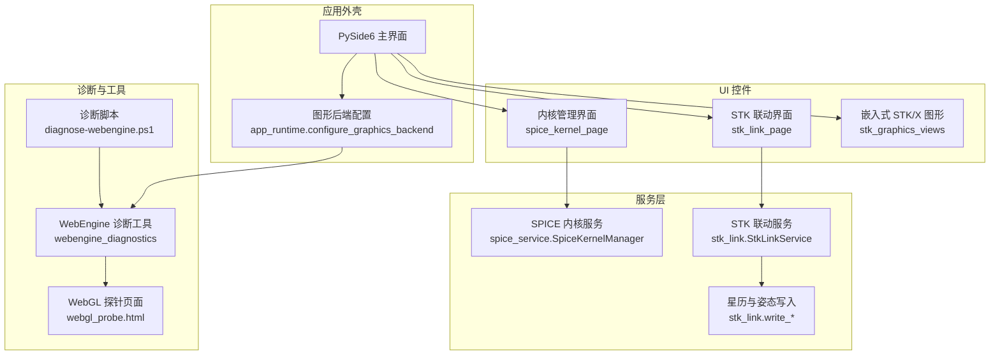
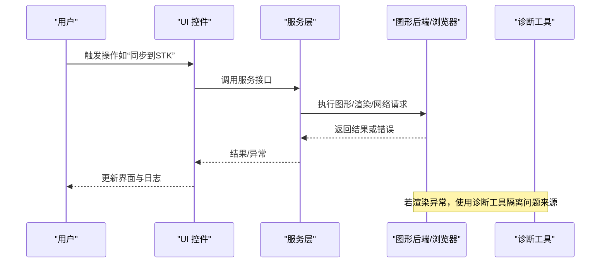
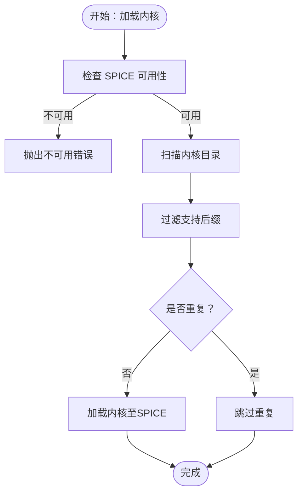
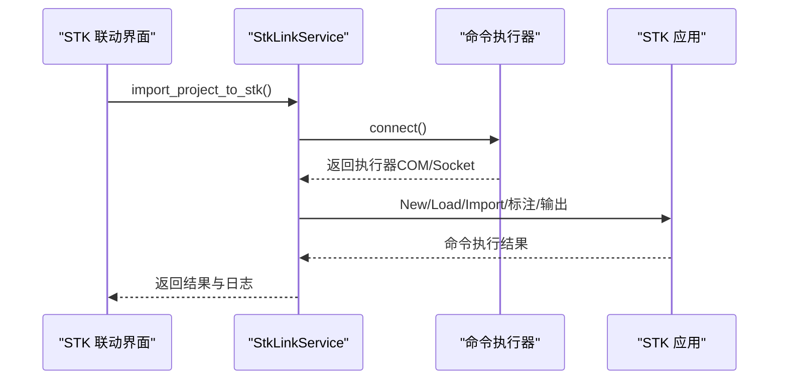
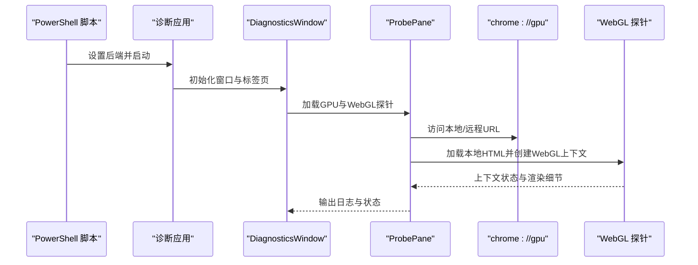
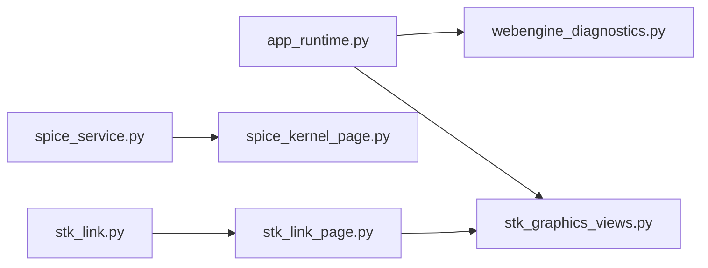

# 故障排除指南

<cite>
**本文引用的文件**
- [README.md](file://README.md)
- [app_runtime.py](file://src/smart/app_runtime.py)
- [webengine_diagnostics.py](file://src/smart/webengine_diagnostics.py)
- [diagnose-webengine.ps1](file://scripts/diagnose-webengine.ps1)
- [webgl_probe.html](file://src/smart/assets/diagnostics/webgl_probe.html)
- [spice_service.py](file://src/smart/services/spice_service.py)
- [spice_kernel_page.py](file://src/smart/ui/widgets/spice_kernel_page.py)
- [stk_link.py](file://src/smart/services/stk_link.py)
- [stk_graphics_views.py](file://src/smart/ui/widgets/stk_graphics_views.py)
- [stk_link_page.py](file://src/smart/ui/widgets/stk_link_page.py)
- [test_spice_service.py](file://tests/test_spice_service.py)
- [test_stk_link.py](file://tests/test_stk_link.py)
- [README.md](file://data/kernels/README.md)
</cite>

## 目录
1. [简介](#简介)
2. [项目结构](#项目结构)
3. [核心组件](#核心组件)
4. [架构总览](#架构总览)
5. [详细组件分析](#详细组件分析)
6. [依赖关系分析](#依赖关系分析)
7. [性能考虑](#性能考虑)
8. [故障排除指南](#故障排除指南)
9. [结论](#结论)
10. [附录](#附录)

## 简介
本指南面向SMART桌面应用的使用者与维护者，聚焦于常见问题的快速定位与修复。内容涵盖：
- STK连接失败的诊断与处理
- SPICE内核加载错误的排查与修复
- 图形渲染与WebEngine相关问题的检查与调试
- 日志分析与错误信息解读
- 性能问题的定位与优化建议
- 紧急情况下的快速恢复与降级策略
- 问题反馈与升级流程

## 项目结构
SMART围绕PySide6构建桌面应用，结合STK 11.6与SPICE实现统一的工作流。关键模块包括：
- 服务层：SPICE内核管理、STK联动、轨道与动力学计算
- UI层：项目管理、可视化、内核管理界面、STK联动界面
- 工具与诊断：WebEngine诊断工具、内核下载与校验

**图表来源**
- [app_runtime.py:31-90](file://src/smart/app_runtime.py#L31-L90)
- [webengine_diagnostics.py:112-212](file://src/smart/webengine_diagnostics.py#L112-L212)
- [spice_service.py:174-305](file://src/smart/services/spice_service.py#L174-L305)
- [stk_link.py:199-553](file://src/smart/services/stk_link.py#L199-L553)
- [spice_kernel_page.py:200-554](file://src/smart/ui/widgets/spice_kernel_page.py#L200-L554)
- [stk_link_page.py:36-324](file://src/smart/ui/widgets/stk_link_page.py#L36-L324)
- [stk_graphics_views.py:32-196](file://src/smart/ui/widgets/stk_graphics_views.py#L32-L196)
- [webgl_probe.html:70-126](file://src/smart/assets/diagnostics/webgl_probe.html#L70-L126)
- [diagnose-webengine.ps1:1-37](file://scripts/diagnose-webengine.ps1#L1-L37)

**章节来源**
- [README.md:1-204](file://README.md#L1-L204)

## 核心组件
- 图形后端与WebEngine配置：负责设置Qt Quick与WebEngine的渲染后端，确保OpenGL/D3D11兼容性与WebGL可用性。
- SPICE内核管理：提供内核发现、下载、加载、清理与查询接口，支撑时间、坐标系与天体状态查询。
- STK联动：封装COM与Socket两种连接方式，支持场景创建、对象导入、姿态与事件标注、文件输出。
- WebEngine诊断：内置chrome://gpu与WebGL探针页面，隔离渲染问题来源。

**章节来源**
- [app_runtime.py:31-90](file://src/smart/app_runtime.py#L31-L90)
- [spice_service.py:174-305](file://src/smart/services/spice_service.py#L174-L305)
- [stk_link.py:199-553](file://src/smart/services/stk_link.py#L199-L553)
- [webengine_diagnostics.py:112-212](file://src/smart/webengine_diagnostics.py#L112-L212)

## 架构总览
下图展示从用户操作到系统响应的关键路径，以及典型故障点：

**图表来源**
- [stk_link_page.py:204-252](file://src/smart/ui/widgets/stk_link_page.py#L204-L252)
- [stk_link.py:280-337](file://src/smart/services/stk_link.py#L280-L337)
- [webengine_diagnostics.py:192-212](file://src/smart/webengine_diagnostics.py#L192-L212)

## 详细组件分析

### SPICE内核管理与加载
- 关键职责：内核扫描、下载、加载、清理；时间与坐标系转换；天体状态查询。
- 常见问题：缺少必要内核、内核后缀不被支持、下载URL非法、内核重复加载。
- 诊断要点：检查内核目录结构、后缀是否受支持、下载链接是否HTTPS、是否已加载相同内核。

**图表来源**
- [spice_service.py:91-232](file://src/smart/services/spice_service.py#L91-L232)
- [spice_kernel_page.py:406-440](file://src/smart/ui/widgets/spice_kernel_page.py#L406-L440)

**章节来源**
- [spice_service.py:174-305](file://src/smart/services/spice_service.py#L174-L305)
- [spice_kernel_page.py:200-554](file://src/smart/ui/widgets/spice_kernel_page.py#L200-L554)
- [README.md:1-12](file://data/kernels/README.md#L1-L12)

### STK 联动与图形渲染
- 连接方式：优先COM，回退Socket；支持附加到现有场景或新建场景。
- 操作流程：创建场景、设置分析时间段、导入轨道/姿态/中继星、标注事件、输出文件。
- 渲染问题：Windows平台嵌入式STK/X需满足OLE/WinForms依赖与特性许可；WebEngine渲染异常可通过诊断工具分离。

**图表来源**
- [stk_link_page.py:169-202](file://src/smart/ui/widgets/stk_link_page.py#L169-L202)
- [stk_link.py:280-337](file://src/smart/services/stk_link.py#L280-L337)

**章节来源**
- [stk_link.py:199-553](file://src/smart/services/stk_link.py#L199-L553)
- [stk_graphics_views.py:32-196](file://src/smart/ui/widgets/stk_graphics_views.py#L32-L196)
- [stk_link_page.py:36-324](file://src/smart/ui/widgets/stk_link_page.py#L36-L324)

### WebEngine 与 WebGL 诊断
- 诊断目标：区分是QWebEngine本身问题还是WebGL上下文创建失败。
- 诊断手段：打开chrome://gpu与本地WebGL探针页面，捕获JS控制台消息，记录加载状态与URL变化。
- 后端切换：支持swiftshader/software、swiftshader-webgl、d3d11、desktop等后端，通过环境变量与标志位控制。

**图表来源**
- [diagnose-webengine.ps1:31-32](file://scripts/diagnose-webengine.ps1#L31-L32)
- [webengine_diagnostics.py:112-212](file://src/smart/webengine_diagnostics.py#L112-L212)
- [webgl_probe.html:70-126](file://src/smart/assets/diagnostics/webgl_probe.html#L70-L126)

**章节来源**
- [app_runtime.py:31-90](file://src/smart/app_runtime.py#L31-L90)
- [webengine_diagnostics.py:112-212](file://src/smart/webengine_diagnostics.py#L112-L212)
- [diagnose-webengine.ps1:1-37](file://scripts/diagnose-webengine.ps1#L1-L37)

## 依赖关系分析
- 图形后端耦合：app_runtime影响WebEngine与Qt Quick的渲染后端一致性，避免D3D11与桌面OpenGL组合导致黑屏。
- SPICE服务：依赖外部库与内核文件；UI层通过页面进行下载、加载、清理操作。
- STK联动：依赖Windows COM与STK进程；UI层通过异步线程执行命令，避免阻塞主线程。

**图表来源**
- [app_runtime.py:31-90](file://src/smart/app_runtime.py#L31-L90)
- [webengine_diagnostics.py:112-212](file://src/smart/webengine_diagnostics.py#L112-L212)
- [spice_service.py:174-305](file://src/smart/services/spice_service.py#L174-L305)
- [spice_kernel_page.py:200-554](file://src/smart/ui/widgets/spice_kernel_page.py#L200-L554)
- [stk_link.py:199-553](file://src/smart/services/stk_link.py#L199-L553)
- [stk_link_page.py:36-324](file://src/smart/ui/widgets/stk_link_page.py#L36-L324)
- [stk_graphics_views.py:32-196](file://src/smart/ui/widgets/stk_graphics_views.py#L32-L196)

**章节来源**
- [test_spice_service.py:1-199](file://tests/test_spice_service.py#L1-L199)
- [test_stk_link.py:1-390](file://tests/test_stk_link.py#L1-L390)

## 性能考虑
- STK联动：命令执行在独立线程中进行，完成后释放执行器，避免长时间占用。
- SPICE内核：自动加载本地内核，避免重复加载；下载内核时使用临时文件与原子替换，减少中断风险。
- WebEngine：通过后端切换与标志位提升WebGL稳定性，避免硬件驱动差异导致的黑屏。

**章节来源**
- [stk_link_page.py:204-252](file://src/smart/ui/widgets/stk_link_page.py#L204-L252)
- [spice_service.py:194-232](file://src/smart/services/spice_service.py#L194-L232)
- [app_runtime.py:47-90](file://src/smart/app_runtime.py#L47-L90)

## 故障排除指南

### 一、STK连接失败
- 症状
  - “未连接 STK”状态持续
  - 执行“同步到STK”报错，日志显示连接失败或命令返回NACK
- 原因分析
  - 未安装或未启动STK 11.6
  - pywin32不可用，无法使用COM；Socket端口未就绪
  - STK场景未建立或当前无场景
- 解决步骤
  1) 确认STK 11.6安装路径正确且可访问
  2) 尝试“启动本地 STK 11.6”，观察连接状态
  3) 若COM失败，确认系统已安装pywin32；否则等待Socket就绪
  4) 若无场景，先“建立新场景”
  5) 查看执行日志中的命令与返回，定位具体失败命令
- 相关实现参考
  - [stk_link.py:111-142](file://src/smart/services/stk_link.py#L111-L142)
  - [stk_link_page.py:169-202](file://src/smart/ui/widgets/stk_link_page.py#L169-L202)

**章节来源**
- [stk_link.py:111-142](file://src/smart/services/stk_link.py#L111-L142)
- [stk_link_page.py:169-202](file://src/smart/ui/widgets/stk_link_page.py#L169-L202)

### 二、SPICE内核加载错误
- 症状
  - “SPICE 不可用”状态
  - 加载内核时报找不到文件、后缀不受支持、下载URL非法
- 原因分析
  - 缺少SpiceyPy依赖
  - 内核目录不存在或文件名含路径分隔符
  - 下载URL非HTTP/HTTPS或目标文件名非法
- 解决步骤
  1) 安装依赖，确认SpiceyPy可用
  2) 将内核放入data/kernels或项目内核目录
  3) 使用内核管理界面扫描并加载；或使用下载对话框批量下载
  4) 检查后缀是否为*.tls/*.tpc/*.tf/*.bsp/*.bpc
  5) 如需自动加载，确保调用ensure_local_kernels_loaded后再进行转换/查询
- 相关实现参考
  - [spice_service.py:174-305](file://src/smart/services/spice_service.py#L174-L305)
  - [spice_kernel_page.py:406-511](file://src/smart/ui/widgets/spice_kernel_page.py#L406-L511)
  - [README.md:1-12](file://data/kernels/README.md#L1-L12)

**章节来源**
- [spice_service.py:174-305](file://src/smart/services/spice_service.py#L174-L305)
- [spice_kernel_page.py:406-511](file://src/smart/ui/widgets/spice_kernel_page.py#L406-L511)
- [README.md:1-12](file://data/kernels/README.md#L1-L12)

### 三、图形渲染与WebEngine问题
- 症状
  - WebEngine页面空白或黑屏
  - WebGL上下文创建失败
  - chrome://gpu显示GPU功能受限
- 原因分析
  - 图形后端不匹配（D3D11与桌面OpenGL组合）
  - 驱动问题导致硬件WebGL不可用
  - WebEngine禁用WebGL或安全策略阻止本地文件访问
- 解决步骤
  1) 使用诊断脚本启动诊断应用，设置后端为swiftshader或desktop
  2) 在诊断窗口中查看chrome://gpu与WebGL探针页面状态
  3) 确保WebGL启用、允许本地内容访问远程/文件URL
  4) 若硬件路径失败，切换到SwiftShader或D3D11后端
- 相关实现参考
  - [diagnose-webengine.ps1:31-32](file://scripts/diagnose-webengine.ps1#L31-L32)
  - [webengine_diagnostics.py:112-212](file://src/smart/webengine_diagnostics.py#L112-L212)
  - [app_runtime.py:31-90](file://src/smart/app_runtime.py#L31-L90)

**章节来源**
- [diagnose-webengine.ps1:1-37](file://scripts/diagnose-webengine.ps1#L1-L37)
- [webengine_diagnostics.py:112-212](file://src/smart/webengine_diagnostics.py#L112-L212)
- [app_runtime.py:31-90](file://src/smart/app_runtime.py#L31-L90)

### 四、嵌入式STK/X图形不可用
- 症状
  - 提示“STK/X 嵌入式图形不可用”或“STK 引擎运行时不可用”
  - WinForms面板创建失败或OLE初始化失败
- 原因分析
  - 非Windows平台
  - pythonnet缺失或.NET运行时不可用
  - STK安装目录缺失Primary Interop Assemblies
  - STK许可证/特性不满足引擎/Globe控件需求
- 解决步骤
  1) 确认运行在Windows平台
  2) 安装pythonnet与System.Windows.Forms依赖
  3) 确认STK安装路径与PIA目录存在
  4) 检查STK许可证是否包含所需特性
- 相关实现参考
  - [stk_graphics_views.py:32-196](file://src/smart/ui/widgets/stk_graphics_views.py#L32-L196)

**章节来源**
- [stk_graphics_views.py:32-196](file://src/smart/ui/widgets/stk_graphics_views.py#L32-L196)

### 五、日志分析与错误信息解读
- STK联动日志
  - 查看执行日志，关注命令行与返回文本
  - 失败时查看“失败：”前缀的错误信息
  - 可清空日志后重试，观察最新错误
- WebEngine诊断日志
  - 记录loadStarted/loadFinished、URL变更、标题变化
  - 捕获JS控制台消息，定位前端脚本报错
- SPICE内核日志
  - 下载过程显示进度与错误
  - 加载成功后刷新“已加载内核”列表

**章节来源**
- [stk_link_page.py:238-262](file://src/smart/ui/widgets/stk_link_page.py#L238-L262)
- [webengine_diagnostics.py:43-110](file://src/smart/webengine_diagnostics.py#L43-L110)
- [spice_kernel_page.py:445-511](file://src/smart/ui/widgets/spice_kernel_page.py#L445-L511)

### 六、性能问题定位与优化
- STK联动耗时
  - 将命令执行放在独立线程，完成后释放执行器
  - 减少不必要的命令与文件输出
- SPICE内核加载
  - 避免重复加载同一内核
  - 使用目录批量加载而非逐个加载
- WebEngine
  - 切换到SwiftShader或D3D11后端以规避驱动问题
  - 合理设置WebGL标志位与Chromium参数

**章节来源**
- [stk_link_page.py:204-252](file://src/smart/ui/widgets/stk_link_page.py#L204-L252)
- [spice_service.py:194-232](file://src/smart/services/spice_service.py#L194-L232)
- [app_runtime.py:47-90](file://src/smart/app_runtime.py#L47-L90)

### 七、紧急恢复与降级策略
- STK连接失败
  - 降级：仅使用Socket模式，等待端口就绪
  - 降级：关闭COM尝试，手动确认STK场景已建立
- SPICE内核缺失
  - 降级：先加载必需内核（如naif0012.tls、pck00011.tpc），再进行转换/查询
  - 降级：使用最小内核集，逐步增加
- WebEngine渲染异常
  - 降级：切换后端为swiftshader或desktop
  - 降级：禁用硬件加速，改用软件渲染

**章节来源**
- [stk_link.py:170-188](file://src/smart/services/stk_link.py#L170-L188)
- [spice_service.py:205-221](file://src/smart/services/spice_service.py#L205-L221)
- [app_runtime.py:47-90](file://src/smart/app_runtime.py#L47-L90)

### 八、问题反馈与升级流程
- 收集信息
  - 系统环境（操作系统、显卡驱动、STK版本）
  - SMART版本与依赖（Python、PySide6、SpiceyPy、pythonnet）
  - 重现步骤与日志
- 提交渠道
  - 使用项目提供的更新记录机制，遵循提交钩子流程
- 升级建议
  - 更新依赖与内核
  - 升级STK至最新稳定版
  - 使用诊断工具验证渲染与WebGL状态

**章节来源**
- [README.md:114-123](file://README.md#L114-L123)

## 结论
通过本指南，您可以在遇到STK连接、SPICE内核与WebEngine渲染问题时，快速定位原因并采取相应措施。建议在日常使用中：
- 定期检查SPICE内核完整性与加载状态
- 使用WebEngine诊断工具监控渲染健康度
- 在STK联动前后核对场景与命令执行结果
- 遇到异常时优先采用降级策略保障工作流继续

## 附录

### A. 常见错误与对应处理
- STK连接失败
  - 现象：连接超时或NACK
  - 处理：确认STK安装与COM可用性，或等待Socket就绪
- SPICE不可用
  - 现象：提示未安装SpiceyPy
  - 处理：安装依赖并重启应用
- WebGL不可用
  - 现象：探针页面无渲染或黑屏
  - 处理：切换后端为swiftshader或desktop
- 嵌入式STK/X不可用
  - 现象：OLE初始化失败或特性不可用
  - 处理：检查Windows平台、pythonnet与STK许可证

**章节来源**
- [stk_link.py:95-108](file://src/smart/services/stk_link.py#L95-L108)
- [spice_service.py:79-88](file://src/smart/services/spice_service.py#L79-L88)
- [webengine_diagnostics.py:95-100](file://src/smart/webengine_diagnostics.py#L95-L100)
- [stk_graphics_views.py:169-178](file://src/smart/ui/widgets/stk_graphics_views.py#L169-L178)