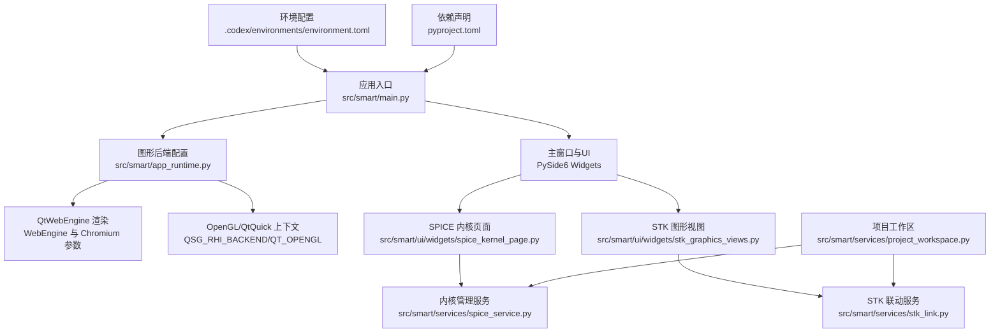
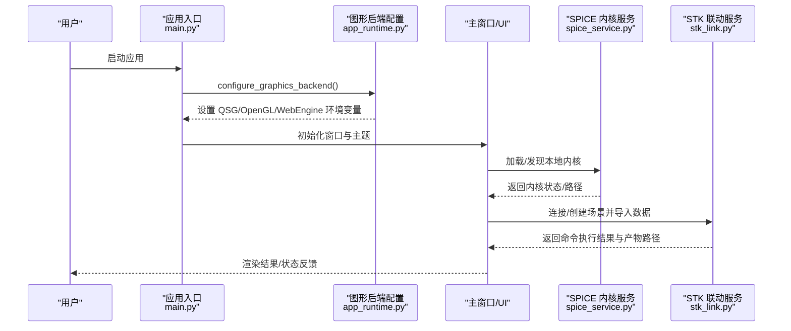
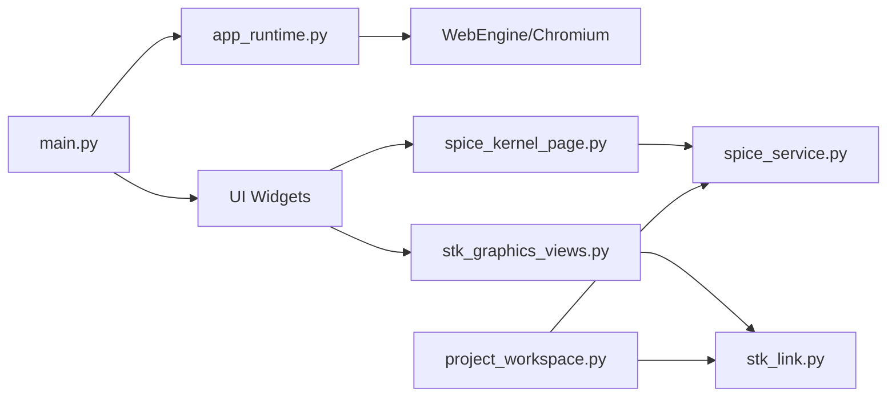

# 环境配置

<cite>
**本文引用的文件**
- [environment.toml](file://.codex/environments/environment.toml)
- [README.md](file://README.md)
- [pyproject.toml](file://pyproject.toml)
- [app_runtime.py](file://src/smart/app_runtime.py)
- [main.py](file://src/smart/main.py)
- [spice_service.py](file://src/smart/services/spice_service.py)
- [spice_kernel_page.py](file://src/smart/ui/widgets/spice_kernel_page.py)
- [stk_link.py](file://src/smart/services/stk_link.py)
- [stk_graphics_views.py](file://src/smart/ui/widgets/stk_graphics_views.py)
- [project_workspace.py](file://src/smart/services/project_workspace.py)
- [spice_usage.md](file://doc/spice_usage.md)
- [test_spice_service.py](file://tests/test_spice_service.py)
</cite>

## 目录
1. [简介](#简介)
2. [项目结构](#项目结构)
3. [核心组件](#核心组件)
4. [架构总览](#架构总览)
5. [详细组件分析](#详细组件分析)
6. [依赖关系分析](#依赖关系分析)
7. [性能考量](#性能考量)
8. [故障排查指南](#故障排查指南)
9. [结论](#结论)
10. [附录](#附录)

## 简介
本文件系统化梳理 SMART 项目的环境配置与运行时参数，涵盖以下方面：
- 应用程序运行时的配置选项与环境变量
- environment.toml 配置文件的结构与参数说明
- 不同运行环境（开发、测试、生产）的配置差异与切换方法
- SPICE 内核路径配置、STK 连接设置与图形渲染配置
- 配置验证方法与错误检查机制
- 配置最佳实践与性能优化建议
- 配置热更新与重启策略

SMART 基于 PySide6/PyQtGraph/OpenGL/SpiceyPy/STK 11.6 构建桌面应用，强调 SPICE 优先的时间与坐标系处理、本地内核自动加载、STK 联动与图形渲染一致性。

## 项目结构
SMART 的配置与运行时相关的关键位置如下：
- 环境配置：.codex/environments/environment.toml
- 依赖与入口：pyproject.toml
- 运行时图形与WebEngine后端：src/smart/app_runtime.py
- 应用入口：src/smart/main.py
- SPICE 内核管理：src/smart/services/spice_service.py 与 UI 页面 src/smart/ui/widgets/spice_kernel_page.py
- STK 联动与嵌入式图形：src/smart/services/stk_link.py 与 src/smart/ui/widgets/stk_graphics_views.py
- 项目工作区与文件组织：src/smart/services/project_workspace.py
- SPICE 使用说明：doc/spice_usage.md
- 配置验证测试：tests/test_spice_service.py

**图表来源**
- [main.py:10-31](file://src/smart/main.py#L10-L31)
- [app_runtime.py:31-90](file://src/smart/app_runtime.py#L31-L90)
- [spice_kernel_page.py:200-452](file://src/smart/ui/widgets/spice_kernel_page.py#L200-L452)
- [spice_service.py:174-305](file://src/smart/services/spice_service.py#L174-L305)
- [stk_graphics_views.py:32-196](file://src/smart/ui/widgets/stk_graphics_views.py#L32-L196)
- [stk_link.py:199-558](file://src/smart/services/stk_link.py#L199-L558)
- [project_workspace.py:64-212](file://src/smart/services/project_workspace.py#L64-L212)
- [.codex/environments/environment.toml:1-12](file://.codex/environments/environment.toml#L1-L12)
- [pyproject.toml:1-50](file://pyproject.toml#L1-L50)

**章节来源**
- [README.md:1-204](file://README.md#L1-L204)
- [.codex/environments/environment.toml:1-12](file://.codex/environments/environment.toml#L1-L12)
- [pyproject.toml:1-50](file://pyproject.toml#L1-L50)

## 核心组件
- 图形与WebEngine后端配置：通过环境变量控制 Qt Quick/Qt WebEngine 的渲染后端，确保与桌面 OpenGL 上下文兼容。
- SPICE 内核管理：自动发现、去重加载、下载与校验，提供时间转换与坐标变换接口。
- STK 联动：COM/Socket 连接、场景同步、对象导入与图形参数应用。
- 项目工作区：项目目录结构、配置/数据/图表/内核子目录与文件命名规范。

**章节来源**
- [app_runtime.py:31-90](file://src/smart/app_runtime.py#L31-L90)
- [spice_service.py:174-305](file://src/smart/services/spice_service.py#L174-L305)
- [stk_link.py:199-558](file://src/smart/services/stk_link.py#L199-L558)
- [project_workspace.py:64-212](file://src/smart/services/project_workspace.py#L64-L212)

## 架构总览
SMART 的运行时配置贯穿应用启动、图形渲染、SPICE 内核加载与 STK 联动四个层面，形成“入口配置 → 图形后端 → 数据服务 → 可视化/联动”的链路。

**图表来源**
- [main.py:10-31](file://src/smart/main.py#L10-L31)
- [app_runtime.py:31-90](file://src/smart/app_runtime.py#L31-L90)
- [spice_service.py:205-240](file://src/smart/services/spice_service.py#L205-L240)
- [stk_link.py:218-337](file://src/smart/services/stk_link.py#L218-L337)

## 详细组件分析

### environment.toml 配置文件
- 自动生成，禁止手动编辑
- 版本号与项目名称标识
- 启动脚本与动作条目用于一键运行

建议：
- 如需定制启动行为，请通过项目脚本或命令行参数调整，而非直接修改该文件。

**章节来源**
- [.codex/environments/environment.toml:1-12](file://.codex/environments/environment.toml#L1-L12)

### 图形渲染与WebEngine后端配置
- 强制 QSG_RHI_BACKEND=opengl，确保与桌面 OpenGL 上下文一致
- QT_OPENGL=desktop，启用桌面 OpenGL
- Qt Quick 使用 OpenGL API
- SMART_WEBENGINE_BACKEND 控制 WebEngine 渲染后端（swiftshader/d3d11/desktop/swiftshader-webgl），默认 swiftshader
- 通过 QTWEBENGINE_CHROMIUM_FLAGS 注入 Chromium 启动参数，如忽略 GPU 黑名单、启用 WebGL

最佳实践：
- 在驱动异常导致 WebGL 黑屏时，显式设置 SMART_WEBENGINE_BACKEND=d3d11 或 desktop
- 开发调试阶段可使用 swiftshader 保证稳定性

**章节来源**
- [app_runtime.py:31-90](file://src/smart/app_runtime.py#L31-L90)
- [main.py:10-31](file://src/smart/main.py#L10-L31)

### SPICE 内核路径与加载
- 默认本地内核根目录：项目 data/kernels 与仓库级 data/kernels
- 自动扫描支持的内核后缀（*.tls, *.tpc, *.tf, *.bsp, *.bpc, *.bc）
- 去重加载：同一文件名（大小写不敏感）仅加载一次
- 支持单文件/目录批量加载、清理、时间转换、坐标变换、天体状态查询
- 提供内核下载预设与校验（URL 协议、文件名后缀）

UI 页面职责：
- 展示运行时状态、已加载内核列表
- 提供选择/加载/清空/打开目录/下载内核等操作

验证与错误检查：
- 文件不存在、重复加载、下载目标越界、不支持的后缀均抛出明确异常
- 测试覆盖了发现顺序、去重、自动加载本地内核、下载流程等

**章节来源**
- [spice_service.py:19-76](file://src/smart/services/spice_service.py#L19-L76)
- [spice_service.py:91-117](file://src/smart/services/spice_service.py#L91-L117)
- [spice_service.py:205-240](file://src/smart/services/spice_service.py#L205-L240)
- [spice_service.py:133-171](file://src/smart/services/spice_service.py#L133-L171)
- [spice_kernel_page.py:379-452](file://src/smart/ui/widgets/spice_kernel_page.py#L379-L452)
- [spice_usage.md:71-96](file://doc/spice_usage.md#L71-L96)
- [test_spice_service.py:20-54](file://tests/test_spice_service.py#L20-L54)

### STK 连接与图形渲染
- 连接方式：
  - 优先通过 win32com 连接已运行的 STK 11.6 应用
  - 若不可用则尝试 Socket 接口（默认 127.0.0.1:5001）
  - 无法连接时启动 STK 应用并等待就绪
- 场景同步：
  - 创建/切换场景，设置分析时间段与动画起止时间
  - 导入轨道星历、姿态文件、地面站与中继星
  - 应用图形样式（颜色、标签、轨迹等）
- 嵌入式 STK 图形：
  - Windows 下通过 pythonnet/Interop 加载 STKX 控件
  - 支持 2D/3D 视图容器、场景创建、对象导入与渲染
  - 提供可用性检测与错误提示

**章节来源**
- [stk_link.py:111-141](file://src/smart/services/stk_link.py#L111-L141)
- [stk_link.py:144-167](file://src/smart/services/stk_link.py#L144-L167)
- [stk_link.py:280-337](file://src/smart/services/stk_link.py#L280-L337)
- [stk_graphics_views.py:32-196](file://src/smart/ui/widgets/stk_graphics_views.py#L32-L196)

### 项目工作区与配置文件组织
- 项目目录结构：projects/<project>/ 下的 config/data/charts/kernels 子目录
- 关键配置/数据文件命名规范：如 maneuver_strategy.json、launch_window.json、full_orbit_history.csv 等
- 工作区提供读写配置与数据的统一接口，含校验与哈希比对，确保结果与配置一致性

**章节来源**
- [project_workspace.py:33-53](file://src/smart/services/project_workspace.py#L33-L53)
- [project_workspace.py:156-212](file://src/smart/services/project_workspace.py#L156-L212)
- [README.md:125-151](file://README.md#L125-L151)

## 依赖关系分析
- 应用入口依赖图形后端配置；图形后端配置依赖环境变量与系统驱动
- SPICE 服务依赖可选的 SpiceyPy；UI 页面依赖 SPICE 服务
- STK 联动依赖 STK 11.6 安装与 COM/Socket；嵌入式图形依赖 pythonnet 与 STK Interop
- 项目工作区为配置/数据文件提供统一路径与读写接口

**图表来源**
- [main.py:10-31](file://src/smart/main.py#L10-L31)
- [app_runtime.py:31-90](file://src/smart/app_runtime.py#L31-L90)
- [spice_kernel_page.py:200-452](file://src/smart/ui/widgets/spice_kernel_page.py#L200-L452)
- [spice_service.py:174-305](file://src/smart/services/spice_service.py#L174-L305)
- [stk_graphics_views.py:32-196](file://src/smart/ui/widgets/stk_graphics_views.py#L32-L196)
- [stk_link.py:199-558](file://src/smart/services/stk_link.py#L199-L558)
- [project_workspace.py:64-212](file://src/smart/services/project_workspace.py#L64-L212)

**章节来源**
- [pyproject.toml:11-22](file://pyproject.toml#L11-L22)
- [README.md:48-54](file://README.md#L48-L54)

## 性能考量
- 图形渲染
  - 在硬件 WebGL 黑屏场景下使用 SMART_WEBENGINE_BACKEND=swiftshader，牺牲部分性能换取稳定性
  - 将 QSG_RHI_BACKEND=opengl 与 QT_OPENGL=desktop 保持一致，避免上下文不匹配导致的重绘开销
- SPICE
  - 利用去重加载避免重复 furnsh，减少内核切换成本
  - 在时间转换与坐标变换前确保本地内核已加载，避免重复扫描
- STK
  - 优先复用已运行实例，减少启动延迟
  - 批量导入数据时一次性设置分析时间段与动画边界，避免频繁刷新

[本节为通用指导，无需特定文件引用]

## 故障排查指南
- SPICE 内核相关
  - 症状：内核未加载、时间转换失败
  - 排查：确认 data/kernels 目录存在且包含受支持后缀文件；检查去重逻辑是否命中同名文件；查看下载与加载错误信息
  - 参考：内核发现顺序、去重、自动加载、下载流程的测试用例
- WebEngine 渲染问题
  - 症状：WebGL 黑屏
  - 排查：设置 SMART_WEBENGINE_BACKEND=d3d11 或 desktop；检查 QTWEBENGINE_CHROMIUM_FLAGS 是否包含 --ignore-gpu-blocklist/--enable-webgl
- STK 联动问题
  - 症状：无法连接 COM/Socket、场景未创建
  - 排查：确认 STK 11.6 已安装并可启动；检查默认端口 5001 是否被占用；查看连接超时与返回消息
- 项目配置不一致
  - 症状：结果文件与配置不匹配
  - 排查：利用工作区的哈希校验机制，确认配置变更导致的结果失效

**章节来源**
- [test_spice_service.py:20-54](file://tests/test_spice_service.py#L20-L54)
- [test_spice_service.py:150-167](file://tests/test_spice_service.py#L150-L167)
- [spice_service.py:133-171](file://src/smart/services/spice_service.py#L133-L171)
- [app_runtime.py:44-90](file://src/smart/app_runtime.py#L44-L90)
- [stk_link.py:191-196](file://src/smart/services/stk_link.py#L191-L196)
- [project_workspace.py:287-298](file://src/smart/services/project_workspace.py#L287-L298)

## 结论
SMART 的环境配置围绕“图形渲染一致性、SPICE 内核可发现性、STK 联动稳定性”三大支柱展开。通过合理的环境变量与配置文件组织，结合完善的错误检查与测试覆盖，可在不同运行环境下获得稳定一致的用户体验。建议在部署与迁移过程中重点关注 WebEngine 后端选择、内核路径与 STK 连接参数，并建立自动化验证流程以保障配置正确性。

[本节为总结，无需特定文件引用]

## 附录

### 环境变量与配置项清单
- SMART_WEBENGINE_BACKEND：WebEngine 渲染后端选择（swiftshader/d3d11/desktop/swiftshader-webgl）
- QTWEBENGINE_CHROMIUM_FLAGS：传递给 Chromium 的启动参数集合
- QSG_RHI_BACKEND：Qt Quick RHI 后端（建议 opengl）
- QT_OPENGL：OpenGL 启用模式（desktop）
- SMART_STKHELP_COMMAND / SMART_STK_HELP_KB / SMART_STK_HELP_CONFIG：STK 帮助工具相关（示例环境变量，用于工具解析逻辑）
- PYTHONPATH：模块运行时的 Python 包路径（示例：src）

**章节来源**
- [app_runtime.py:44-90](file://src/smart/app_runtime.py#L44-L90)
- [stk_link.py:28-32](file://src/smart/services/stk_link.py#L28-L32)
- [README.md:94-96](file://README.md#L94-L96)
- [README.md:200-203](file://README.md#L200-L203)

### 不同运行环境的配置差异与切换
- 开发环境
  - 使用默认 swiftshader 渲染后端，便于在多种驱动环境下快速启动
  - 本地内核目录指向项目 data/kernels，便于增量更新
- 测试环境
  - 可通过环境变量覆盖默认后端与内核路径，确保测试一致性
  - 使用测试脚本统一安装依赖与运行
- 生产环境
  - 固定 WebEngine 后端（如 desktop），减少运行时不确定性
  - 预置内核目录与 STK 安装路径，避免运行时查找失败

**章节来源**
- [README.md:99-106](file://README.md#L99-L106)
- [pyproject.toml:24-30](file://pyproject.toml#L24-L30)
- [app_runtime.py:44-90](file://src/smart/app_runtime.py#L44-L90)

### 配置验证与热更新策略
- 配置验证
  - SPICE：内核发现顺序、去重、下载校验、加载异常抛出
  - WebEngine：后端选择与标志位注入
  - STK：连接可用性检测、命令执行结果校验
- 热更新
  - SPICE：重新加载内核目录或单个文件，内部去重避免重复加载
  - STK：切换场景或更新对象属性时，先卸载再重新导入
  - 图形：WebEngine 后端切换需重启相关组件或进程

**章节来源**
- [test_spice_service.py:20-54](file://tests/test_spice_service.py#L20-L54)
- [spice_service.py:205-240](file://src/smart/services/spice_service.py#L205-L240)
- [stk_link.py:280-337](file://src/smart/services/stk_link.py#L280-L337)
- [app_runtime.py:44-90](file://src/smart/app_runtime.py#L44-L90)