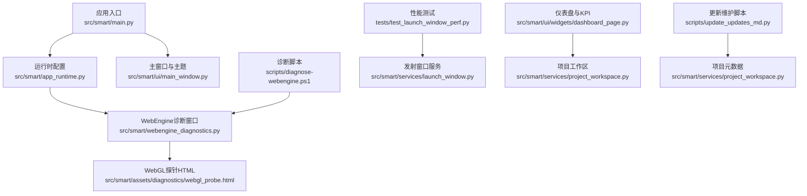
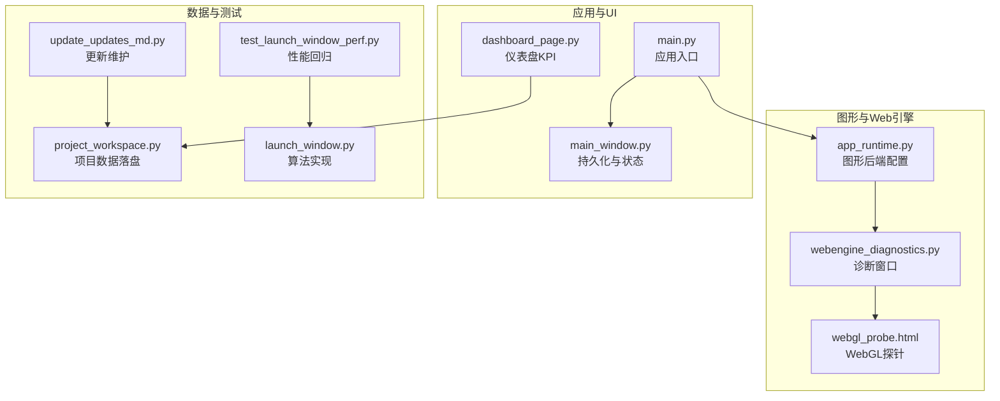
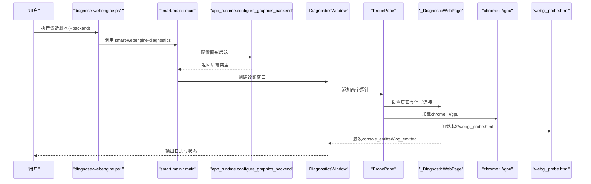
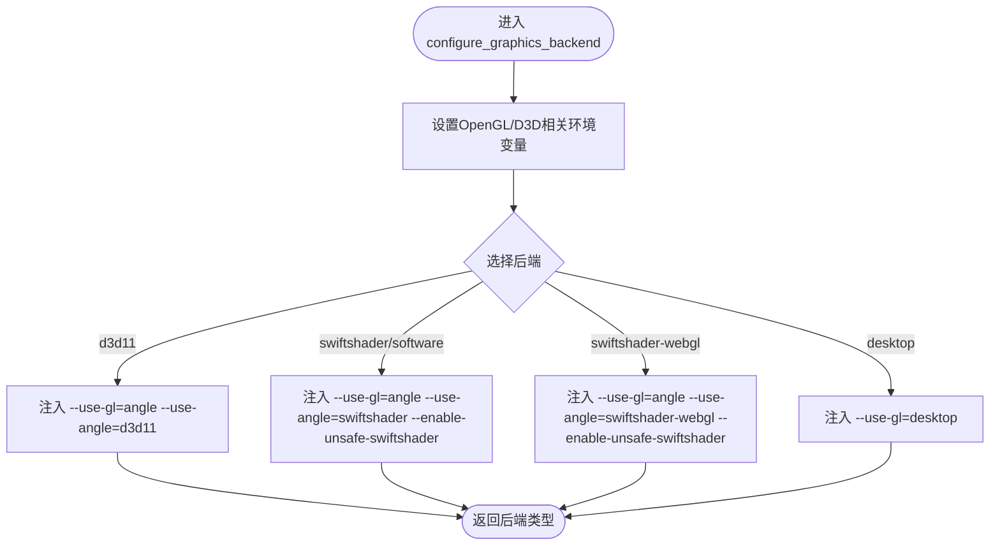
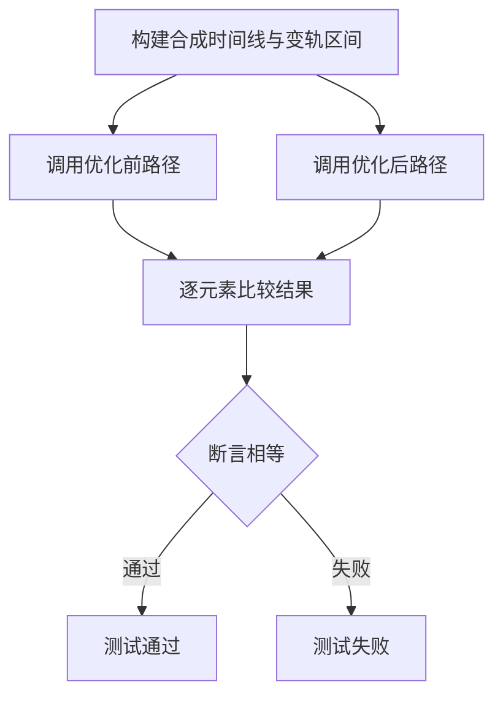
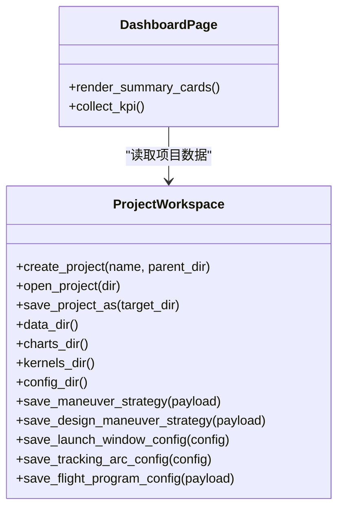
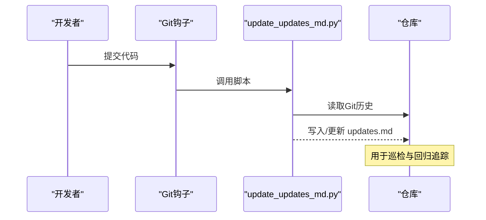
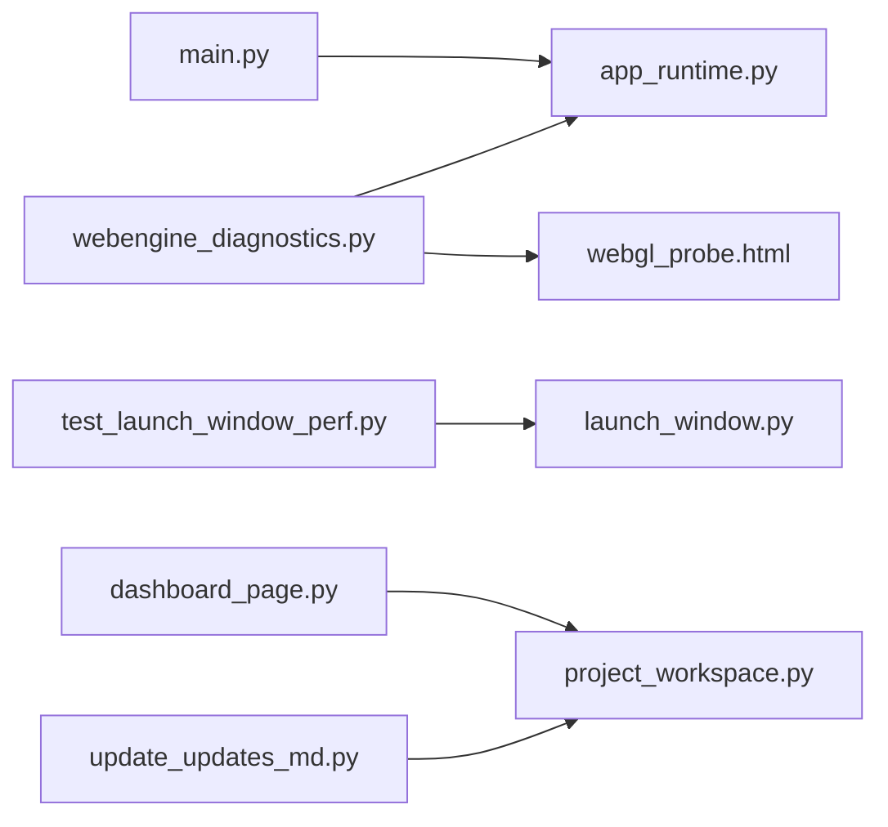

# 监控与维护

<cite>
**本文引用的文件**
- [src/smart/webengine_diagnostics.py](file://src/smart/webengine_diagnostics.py)
- [src/smart/app_runtime.py](file://src/smart/app_runtime.py)
- [src/smart/main.py](file://src/smart/main.py)
- [src/smart/assets/diagnostics/webgl_probe.html](file://src/smart/assets/diagnostics/webgl_probe.html)
- [scripts/diagnose-webengine.ps1](file://scripts/diagnose-webengine.ps1)
- [pyproject.toml](file://pyproject.toml)
- [README.md](file://README.md)
- [tests/test_launch_window_perf.py](file://tests/test_launch_window_perf.py)
- [src/smart/services/launch_window.py](file://src/smart/services/launch_window.py)
- [src/smart/ui/widgets/dashboard_page.py](file://src/smart/ui/widgets/dashboard_page.py)
- [src/smart/services/project_workspace.py](file://src/smart/services/project_workspace.py)
- [scripts/update_updates_md.py](file://scripts/update_updates_md.py)
- [src/smart/ui/main_window.py](file://src/smart/ui/main_window.py)
</cite>

## 目录
1. [简介](#简介)
2. [项目结构](#项目结构)
3. [核心组件](#核心组件)
4. [架构总览](#架构总览)
5. [详细组件分析](#详细组件分析)
6. [依赖分析](#依赖分析)
7. [性能考虑](#性能考虑)
8. [故障排查指南](#故障排查指南)
9. [结论](#结论)
10. [附录](#附录)

## 简介
本文件面向SMART桌面应用的监控与维护，聚焦以下主题：
- 健康检查机制与性能监控指标
- WebEngine诊断工具的使用与WebGL探针作用
- 日志系统与日志级别配置建议
- 内存使用监控、CPU占用分析与图形渲染性能评估
- 定期维护任务与自动化脚本
- 故障预警与异常检测策略
- 数据备份与恢复流程
- 系统巡检清单

SMART以PySide6为UI框架，结合pyqtgraph与OpenGL进行2D/3D图形渲染，同时集成Qt WebEngine用于部分可视化与诊断场景。项目通过脚本与测试保障运行稳定性与性能回归。

## 项目结构
SMART的监控与维护相关能力主要分布在如下区域：
- 应用入口与运行时配置：main.py、app_runtime.py
- WebEngine诊断与WebGL探针：webengine_diagnostics.py、webgl_probe.html
- 诊断脚本：scripts/diagnose-webengine.ps1
- 性能测试与回归：tests/test_launch_window_perf.py、launch_window.py
- 仪表盘与项目数据落盘：dashboard_page.py、project_workspace.py
- 更新与巡检：update_updates_md.py
- 主窗口持久化：main_window.py

**图表来源**
- [src/smart/main.py:10-31](file://src/smart/main.py#L10-L31)
- [src/smart/app_runtime.py:31-90](file://src/smart/app_runtime.py#L31-L90)
- [src/smart/webengine_diagnostics.py:112-208](file://src/smart/webengine_diagnostics.py#L112-L208)
- [src/smart/assets/diagnostics/webgl_probe.html:70-126](file://src/smart/assets/diagnostics/webgl_probe.html#L70-L126)
- [scripts/diagnose-webengine.ps1:21-36](file://scripts/diagnose-webengine.ps1#L21-L36)
- [tests/test_launch_window_perf.py:108-126](file://tests/test_launch_window_perf.py#L108-L126)
- [src/smart/services/launch_window.py:460-502](file://src/smart/services/launch_window.py#L460-L502)
- [src/smart/ui/widgets/dashboard_page.py:127-820](file://src/smart/ui/widgets/dashboard_page.py#L127-L820)
- [src/smart/services/project_workspace.py:64-200](file://src/smart/services/project_workspace.py#L64-L200)
- [scripts/update_updates_md.py:48-66](file://scripts/update_updates_md.py#L48-L66)

**章节来源**
- [README.md:99-130](file://README.md#L99-L130)
- [pyproject.toml:32-34](file://pyproject.toml#L32-L34)

## 核心组件
- 应用运行时与图形后端配置：负责设置OpenGL/Direct3D、SwiftShader、ANGLE等后端参数，确保WebEngine与桌面图形一致性。
- WebEngine诊断工具：提供“Chrome GPU”与“WebGL Probe”双面板，隔离渲染问题来源。
- WebGL探针：检测WebGL上下文创建、渲染器信息与画布是否正确绘制。
- 性能测试与回归：针对发射窗口算法的关键路径进行向量化优化前后的一致性与性能对比。
- 仪表盘与项目数据落盘：汇总项目状态、文件数量与大小等KPI，支撑日常巡检与备份。
- 更新与巡检：自动生成/维护更新记录，辅助变更审计与回归追踪。

**章节来源**
- [src/smart/app_runtime.py:31-90](file://src/smart/app_runtime.py#L31-L90)
- [src/smart/webengine_diagnostics.py:112-208](file://src/smart/webengine_diagnostics.py#L112-L208)
- [src/smart/assets/diagnostics/webgl_probe.html:70-126](file://src/smart/assets/diagnostics/webgl_probe.html#L70-L126)
- [tests/test_launch_window_perf.py:108-126](file://tests/test_launch_window_perf.py#L108-L126)
- [src/smart/ui/widgets/dashboard_page.py:783-820](file://src/smart/ui/widgets/dashboard_page.py#L783-L820)
- [src/smart/services/project_workspace.py:64-200](file://src/smart/services/project_workspace.py#L64-L200)
- [scripts/update_updates_md.py:48-66](file://scripts/update_updates_md.py#L48-L66)

## 架构总览
下图展示监控与维护相关模块的交互关系，强调WebEngine诊断、图形后端配置、性能测试与项目数据落盘之间的协作。

**图表来源**
- [src/smart/main.py:10-31](file://src/smart/main.py#L10-L31)
- [src/smart/app_runtime.py:31-90](file://src/smart/app_runtime.py#L31-L90)
- [src/smart/webengine_diagnostics.py:112-208](file://src/smart/webengine_diagnostics.py#L112-L208)
- [src/smart/assets/diagnostics/webgl_probe.html:70-126](file://src/smart/assets/diagnostics/webgl_probe.html#L70-L126)
- [src/smart/ui/main_window.py:626-661](file://src/smart/ui/main_window.py#L626-L661)
- [src/smart/ui/widgets/dashboard_page.py:783-820](file://src/smart/ui/widgets/dashboard_page.py#L783-L820)
- [src/smart/services/project_workspace.py:64-200](file://src/smart/services/project_workspace.py#L64-L200)
- [tests/test_launch_window_perf.py:108-126](file://tests/test_launch_window_perf.py#L108-L126)
- [src/smart/services/launch_window.py:460-502](file://src/smart/services/launch_window.py#L460-L502)
- [scripts/update_updates_md.py:48-66](file://scripts/update_updates_md.py#L48-L66)

## 详细组件分析

### WebEngine诊断工具与WebGL探针
- 诊断窗口包含两个标签页：
  - Chrome GPU：用于检查GPU特性与驱动状态。
  - WebGL Probe：用于检测WebGL上下文创建与渲染器信息。
- 探针HTML通过WebGL2/WebGL/实验性WebGL尝试创建上下文，若成功则清屏为青绿色，并输出版本、着色语言、厂商、渲染器、未掩码厂商与渲染器、设备像素比等信息。
- 诊断窗口支持“全部重载”“清空日志”，并实时记录加载状态、URL变化、标题变化与JS控制台消息。

**图表来源**
- [scripts/diagnose-webengine.ps1:21-36](file://scripts/diagnose-webengine.ps1#L21-L36)
- [src/smart/main.py:10-31](file://src/smart/main.py#L10-L31)
- [src/smart/app_runtime.py:31-90](file://src/smart/app_runtime.py#L31-L90)
- [src/smart/webengine_diagnostics.py:112-208](file://src/smart/webengine_diagnostics.py#L112-L208)
- [src/smart/webengine_diagnostics.py:167-176](file://src/smart/webengine_diagnostics.py#L167-L176)
- [src/smart/assets/diagnostics/webgl_probe.html:70-126](file://src/smart/assets/diagnostics/webgl_probe.html#L70-L126)

**章节来源**
- [src/smart/webengine_diagnostics.py:23-110](file://src/smart/webengine_diagnostics.py#L23-L110)
- [src/smart/webengine_diagnostics.py:112-189](file://src/smart/webengine_diagnostics.py#L112-L189)
- [src/smart/assets/diagnostics/webgl_probe.html:70-126](file://src/smart/assets/diagnostics/webgl_probe.html#L70-L126)
- [scripts/diagnose-webengine.ps1:1-37](file://scripts/diagnose-webengine.ps1#L1-L37)

### 图形后端配置与WebEngine标志位
- 默认启用OpenGL桌面与SwiftShader路径，兼容Windows常见驱动栈的黑屏问题。
- 支持D3D11、SwiftShader、SwiftShader-WebGL、Desktop等后端选择，并注入相应Chromium标志位。
- 通过环境变量传递后端与标志位，保证Qt Quick与WebEngine使用一致的图形API。

**图表来源**
- [src/smart/app_runtime.py:31-90](file://src/smart/app_runtime.py#L31-L90)

**章节来源**
- [src/smart/app_runtime.py:31-90](file://src/smart/app_runtime.py#L31-L90)

### 性能监控与回归测试
- 针对发射窗口算法中的关键函数进行等价性与性能回归测试，确保向量化优化前后结果一致且性能提升。
- 测试通过构造合成时间线与变轨区间，分别调用优化前与优化后的路径，断言逐元素一致。

**图表来源**
- [tests/test_launch_window_perf.py:69-105](file://tests/test_launch_window_perf.py#L69-L105)
- [tests/test_launch_window_perf.py:108-126](file://tests/test_launch_window_perf.py#L108-L126)

**章节来源**
- [tests/test_launch_window_perf.py:108-126](file://tests/test_launch_window_perf.py#L108-L126)
- [src/smart/services/launch_window.py:460-502](file://src/smart/services/launch_window.py#L460-L502)

### 仪表盘与项目数据落盘
- 仪表盘卡片汇总项目状态、文件数量与大小等KPI，便于快速巡检。
- 工作区模块负责项目目录结构、配置与数据文件的读写，支撑自动化备份与恢复。

**图表来源**
- [src/smart/services/project_workspace.py:64-200](file://src/smart/services/project_workspace.py#L64-L200)
- [src/smart/ui/widgets/dashboard_page.py:783-820](file://src/smart/ui/widgets/dashboard_page.py#L783-L820)

**章节来源**
- [src/smart/ui/widgets/dashboard_page.py:783-820](file://src/smart/ui/widgets/dashboard_page.py#L783-L820)
- [src/smart/services/project_workspace.py:64-200](file://src/smart/services/project_workspace.py#L64-L200)

### 更新与巡检自动化
- 更新记录脚本根据Git历史生成/维护更新说明，便于变更审计与回归追踪。
- 主窗口在关键操作后持久化项目配置，保障数据安全。

**图表来源**
- [scripts/update_updates_md.py:48-66](file://scripts/update_updates_md.py#L48-L66)

**章节来源**
- [scripts/update_updates_md.py:48-66](file://scripts/update_updates_md.py#L48-L66)
- [src/smart/ui/main_window.py:626-661](file://src/smart/ui/main_window.py#L626-L661)

## 依赖分析
- 应用入口依赖运行时配置以设置图形后端与WebEngine标志位。
- 诊断工具依赖运行时配置与资源文件（webgl_probe.html）。
- 性能测试依赖服务层算法实现。
- 仪表盘依赖工作区模块读取项目数据。
- 更新脚本与工作区共同维护项目元数据与文件结构。

**图表来源**
- [src/smart/main.py:10-31](file://src/smart/main.py#L10-L31)
- [src/smart/app_runtime.py:31-90](file://src/smart/app_runtime.py#L31-L90)
- [src/smart/webengine_diagnostics.py:112-208](file://src/smart/webengine_diagnostics.py#L112-L208)
- [src/smart/assets/diagnostics/webgl_probe.html:70-126](file://src/smart/assets/diagnostics/webgl_probe.html#L70-L126)
- [tests/test_launch_window_perf.py:108-126](file://tests/test_launch_window_perf.py#L108-L126)
- [src/smart/services/launch_window.py:460-502](file://src/smart/services/launch_window.py#L460-L502)
- [src/smart/ui/widgets/dashboard_page.py:783-820](file://src/smart/ui/widgets/dashboard_page.py#L783-L820)
- [src/smart/services/project_workspace.py:64-200](file://src/smart/services/project_workspace.py#L64-L200)
- [scripts/update_updates_md.py:48-66](file://scripts/update_updates_md.py#L48-L66)

**章节来源**
- [pyproject.toml:32-34](file://pyproject.toml#L32-L34)

## 性能考虑
- 图形后端选择：在Windows驱动不稳定时优先SwiftShader，必要时切换D3D11或Desktop模式，避免黑屏与渲染失败。
- WebEngine标志位：启用WebGL并忽略GPU黑名单，确保WebGL探针可用。
- 算法向量化：对发射窗口关键路径进行向量化重构，显著降低CPU耗时，同时保持数值精度。
- UI与数据落盘：仪表盘聚合KPI，减少频繁IO；主窗口在后台持久化关键配置，避免数据丢失。

**章节来源**
- [src/smart/app_runtime.py:31-90](file://src/smart/app_runtime.py#L31-L90)
- [tests/test_launch_window_perf.py:108-126](file://tests/test_launch_window_perf.py#L108-L126)
- [src/smart/ui/widgets/dashboard_page.py:783-820](file://src/smart/ui/widgets/dashboard_page.py#L783-L820)
- [src/smart/ui/main_window.py:626-661](file://src/smart/ui/main_window.py#L626-L661)

## 故障排查指南
- WebEngine渲染问题隔离
  - 使用诊断脚本指定后端（swiftshader、software、swiftshader-webgl、d3d11、desktop），观察“Chrome GPU”与“WebGL Probe”的输出。
  - 若WebGL不可用，确认已启用WebGL并忽略GPU黑名单；若SwiftShader失败，尝试d3d11或desktop。
- 日志采集
  - 诊断窗口实时输出加载状态、URL变化、标题变化与JS控制台消息；支持清空日志以便复现问题。
- 性能退化排查
  - 对关键算法运行cProfile或对比测试用例，确认向量化优化是否生效。
- 数据一致性
  - 通过仪表盘查看项目文件数量与大小，结合工作区路径核对缺失或异常文件。
- 更新与巡检
  - 使用更新脚本生成/维护更新记录，定位最近变更引发的问题。

**章节来源**
- [scripts/diagnose-webengine.ps1:1-37](file://scripts/diagnose-webengine.ps1#L1-L37)
- [src/smart/webengine_diagnostics.py:112-189](file://src/smart/webengine_diagnostics.py#L112-L189)
- [tests/test_launch_window_perf.py:108-126](file://tests/test_launch_window_perf.py#L108-L126)
- [src/smart/ui/widgets/dashboard_page.py:783-820](file://src/smart/ui/widgets/dashboard_page.py#L783-L820)
- [scripts/update_updates_md.py:48-66](file://scripts/update_updates_md.py#L48-L66)

## 结论
SMART的监控与维护体系以图形后端配置为基础，辅以WebEngine诊断与WebGL探针进行渲染问题隔离；通过性能测试与回归保障算法稳定性；仪表盘与项目数据落盘支撑日常巡检与备份；更新脚本与主窗口持久化确保变更可追踪与数据安全。建议在生产环境中定期执行诊断与性能回归，结合仪表盘KPI与更新记录进行巡检与预警。

## 附录

### WebEngine诊断工具使用步骤
- 选择后端：在脚本中传入后端参数（swiftshader、software、swiftshader-webgl、d3d11、desktop）。
- 运行诊断：在项目根目录执行脚本，自动创建诊断窗口并加载“Chrome GPU”与“WebGL Probe”。
- 解释输出：
  - “Chrome GPU”显示GPU特性与驱动状态。
  - “WebGL Probe”若成功创建上下文并渲染青绿色画布，则表示WebGL可用；失败则检查WebGL启用与驱动兼容性。

**章节来源**
- [scripts/diagnose-webengine.ps1:1-37](file://scripts/diagnose-webengine.ps1#L1-L37)
- [src/smart/webengine_diagnostics.py:112-189](file://src/smart/webengine_diagnostics.py#L112-L189)
- [src/smart/assets/diagnostics/webgl_probe.html:70-126](file://src/smart/assets/diagnostics/webgl_probe.html#L70-L126)

### 日志系统与日志级别
- 控制台日志：WebEngine诊断窗口通过信号发射JS控制台消息与页面事件，便于实时观测。
- 文件日志：项目采用JSON与CSV等结构化数据落盘，结合仪表盘KPI进行离线分析。
- 建议：在开发阶段开启更详细的控制台输出，在生产阶段通过仪表盘与更新记录进行问题定位。

**章节来源**
- [src/smart/webengine_diagnostics.py:23-41](file://src/smart/webengine_diagnostics.py#L23-L41)
- [src/smart/ui/widgets/dashboard_page.py:783-820](file://src/smart/ui/widgets/dashboard_page.py#L783-L820)
- [scripts/update_updates_md.py:48-66](file://scripts/update_updates_md.py#L48-L66)

### 内存使用监控、CPU占用分析与图形渲染性能评估
- 内存使用：通过系统任务管理器或Python内存分析工具观察进程峰值与持续占用。
- CPU占用：使用cProfile对关键算法（如发射窗口）进行采样，识别热点路径。
- 图形渲染：结合WebGL探针与不同图形后端，评估渲染稳定性与帧率表现。

**章节来源**
- [tests/test_launch_window_perf.py:108-126](file://tests/test_launch_window_perf.py#L108-L126)
- [src/smart/app_runtime.py:31-90](file://src/smart/app_runtime.py#L31-L90)
- [src/smart/assets/diagnostics/webgl_probe.html:70-126](file://src/smart/assets/diagnostics/webgl_probe.html#L70-L126)

### 定期维护任务与自动化脚本
- 运行诊断：定期执行诊断脚本，切换后端验证渲染稳定性。
- 性能回归：在关键算法更新后运行性能测试，确保优化效果。
- 巡检与备份：通过仪表盘核对项目文件数量与大小，结合工作区路径进行备份与恢复演练。
- 更新记录：使用更新脚本维护变更历史，辅助问题回溯。

**章节来源**
- [scripts/diagnose-webengine.ps1:1-37](file://scripts/diagnose-webengine.ps1#L1-L37)
- [tests/test_launch_window_perf.py:108-126](file://tests/test_launch_window_perf.py#L108-L126)
- [src/smart/ui/widgets/dashboard_page.py:783-820](file://src/smart/ui/widgets/dashboard_page.py#L783-L820)
- [src/smart/services/project_workspace.py:64-200](file://src/smart/services/project_workspace.py#L64-L200)
- [scripts/update_updates_md.py:48-66](file://scripts/update_updates_md.py#L48-L66)

### 故障预警机制与异常检测策略
- 渲染异常：WebGL探针失败或“Chrome GPU”显示GPU禁用/驱动异常时，立即切换后端并上报。
- 性能异常：性能测试结果显著劣化时，触发回归分析与热点定位。
- 数据异常：仪表盘KPI异常（文件数量/大小突变）时，检查工作区路径与持久化逻辑。

**章节来源**
- [src/smart/webengine_diagnostics.py:112-189](file://src/smart/webengine_diagnostics.py#L112-L189)
- [tests/test_launch_window_perf.py:108-126](file://tests/test_launch_window_perf.py#L108-L126)
- [src/smart/ui/widgets/dashboard_page.py:783-820](file://src/smart/ui/widgets/dashboard_page.py#L783-L820)

### 数据备份与恢复流程
- 备份：使用工作区的“另存为”功能复制项目目录，更新元数据时间戳。
- 恢复：打开备份项目目录，核对配置与数据文件完整性。
- 巡检：通过仪表盘统计文件数量与大小，确认备份一致性。

**章节来源**
- [src/smart/services/project_workspace.py:132-154](file://src/smart/services/project_workspace.py#L132-L154)
- [src/smart/ui/widgets/dashboard_page.py:783-820](file://src/smart/ui/widgets/dashboard_page.py#L783-L820)

### 系统巡检清单
- 图形后端与WebEngine标志位
  - 检查后端类型与Chromium标志位是否符合预期
  - 验证WebGL探针是否成功渲染
- 性能回归
  - 运行性能测试，确认关键算法耗时与结果一致性
- 项目数据
  - 通过仪表盘核对配置与数据文件数量/大小
  - 检查持久化逻辑是否正常
- 更新记录
  - 生成/维护更新记录，定位最近变更

**章节来源**
- [src/smart/app_runtime.py:31-90](file://src/smart/app_runtime.py#L31-L90)
- [src/smart/webengine_diagnostics.py:112-189](file://src/smart/webengine_diagnostics.py#L112-L189)
- [tests/test_launch_window_perf.py:108-126](file://tests/test_launch_window_perf.py#L108-L126)
- [src/smart/ui/widgets/dashboard_page.py:783-820](file://src/smart/ui/widgets/dashboard_page.py#L783-L820)
- [scripts/update_updates_md.py:48-66](file://scripts/update_updates_md.py#L48-L66)