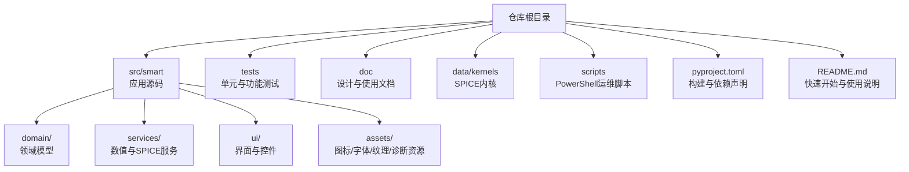
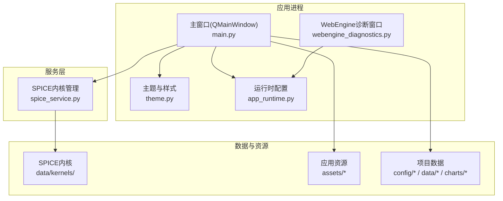
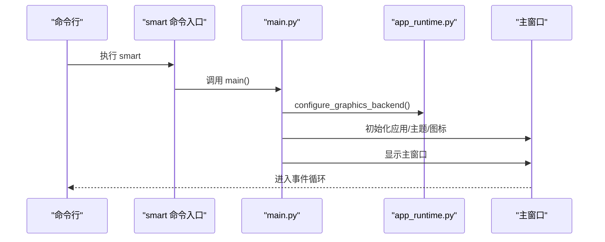
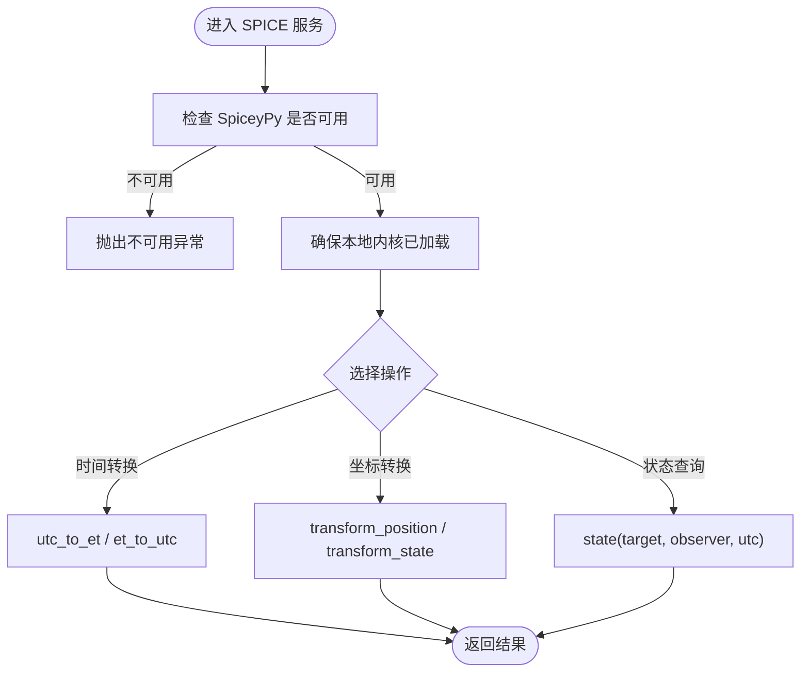
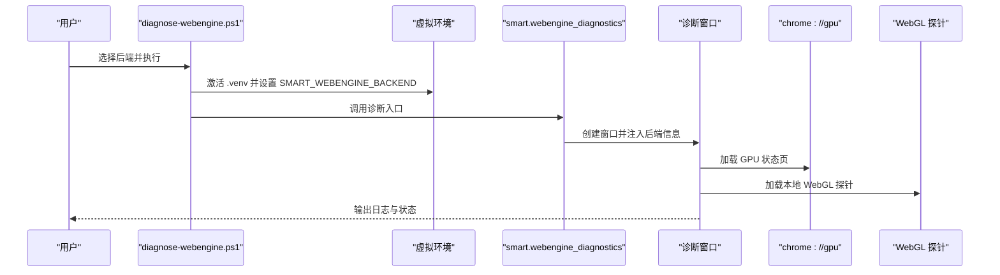
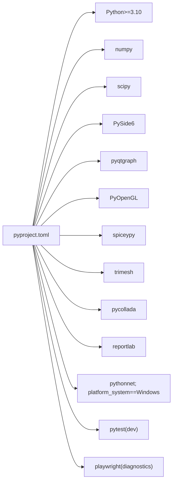

# 部署与运维

<cite>
**本文引用的文件**
- [README.md](file://README.md)
- [pyproject.toml](file://pyproject.toml)
- [setup.ps1](file://scripts/setup.ps1)
- [run.ps1](file://scripts/run.ps1)
- [test.ps1](file://scripts/test.ps1)
- [install-git-hooks.ps1](file://scripts/install-git-hooks.ps1)
- [diagnose-webengine.ps1](file://scripts/diagnose-webengine.ps1)
- [init-planning-session.ps1](file://scripts/init-planning-session.ps1)
- [main.py](file://src/smart/main.py)
- [app_runtime.py](file://src/smart/app_runtime.py)
- [webengine_diagnostics.py](file://src/smart/webengine_diagnostics.py)
- [spice_usage.md](file://doc/spice_usage.md)
- [spice_service.py](file://src/smart/services/spice_service.py)
- [updates.md](file://updates.md)
- [data/kernels/README.md](file://data/kernels/README.md)
</cite>

## 目录
1. [简介](#简介)
2. [项目结构](#项目结构)
3. [核心组件](#核心组件)
4. [架构总览](#架构总览)
5. [详细组件分析](#详细组件分析)
6. [依赖关系分析](#依赖关系分析)
7. [性能考虑](#性能考虑)
8. [故障排除指南](#故障排除指南)
9. [结论](#结论)
10. [附录](#附录)

## 简介
本文件面向SMART桌面应用的部署与运维，覆盖打包、分发、安装、平台差异、依赖与环境配置、生产配置、性能调优、监控、故障排除、日志与错误追踪、备份恢复与数据迁移、安全与合规、以及版本升级与回滚策略。SMART以PySide6为核心GUI框架，结合SPICE/SpiceyPy进行轨道与时间处理，配合STK 11.6与本地内核实现工程化任务分析。

## 项目结构
SMART采用源码分离与包内资源组织方式：
- 源码位于 src/smart，按领域与服务分层组织
- 测试位于 tests
- 文档位于 doc
- SPICE内核位于 data/kernels
- 脚本位于 scripts，提供环境搭建、运行、测试、诊断与规划会话初始化

**章节来源**
- [README.md:187-196](file://README.md#L187-L196)
- [pyproject.toml:36-49](file://pyproject.toml#L36-L49)

## 核心组件
- 应用入口与运行时
  - 应用入口：通过命令入口 smart 或直接运行模块入口 main.py 启动
  - 运行时配置：app_runtime.py 负责图形后端与WebEngine参数设置
- 服务层
  - SPICE内核管理：spice_service.py 提供内核发现、下载、加载与时间/坐标转换接口
- UI层
  - PySide6主窗口与主题、控件、导航与视图
- 资源与诊断
  - assets与诊断页面：webengine_diagnostics.py 提供WebEngine/WebGL诊断窗口

**章节来源**
- [pyproject.toml:32-34](file://pyproject.toml#L32-L34)
- [main.py:10-31](file://src/smart/main.py#L10-L31)
- [app_runtime.py:31-90](file://src/smart/app_runtime.py#L31-L90)
- [spice_service.py:174-305](file://src/smart/services/spice_service.py#L174-L305)
- [webengine_diagnostics.py:192-208](file://src/smart/webengine_diagnostics.py#L192-L208)

## 架构总览
SMART桌面应用的运行时架构围绕PySide6 GUI与SPICE服务展开，WebEngine承载部分可视化与诊断功能，项目数据以配置/数据/图表三类落盘。

**图示来源**
- [main.py:10-31](file://src/smart/main.py#L10-L31)
- [app_runtime.py:31-90](file://src/smart/app_runtime.py#L31-L90)
- [spice_service.py:174-305](file://src/smart/services/spice_service.py#L174-L305)
- [webengine_diagnostics.py:112-190](file://src/smart/webengine_diagnostics.py#L112-L190)

## 详细组件分析

### 组件A：应用入口与运行时
- 入口
  - 命令入口 smart 调用 main.py 的 main 函数
  - main 函数初始化图形后端、主题、图标与主窗口
- 运行时配置
  - app_runtime.py 设置Qt Quick渲染后端、OpenGL共享、WebEngine Chromium标志
  - 支持通过环境变量 SMART_WEBENGINE_BACKEND 切换后端（swiftshader/software/d3d11/desktop）
- 诊断工具
  - webengine_diagnostics.py 提供诊断窗口，展示 chrome://gpu 与 WebGL 探针页面日志

**图示来源**
- [pyproject.toml:32-34](file://pyproject.toml#L32-L34)
- [main.py:10-31](file://src/smart/main.py#L10-L31)
- [app_runtime.py:31-90](file://src/smart/app_runtime.py#L31-L90)

**章节来源**
- [pyproject.toml:32-34](file://pyproject.toml#L32-L34)
- [main.py:10-31](file://src/smart/main.py#L10-L31)
- [app_runtime.py:31-90](file://src/smart/app_runtime.py#L31-L90)
- [webengine_diagnostics.py:192-208](file://src/smart/webengine_diagnostics.py#L192-L208)

### 组件B：SPICE内核管理与使用
- 内核管理
  - SpiceKernelManager 提供内核目录发现、加载、清理与去重
  - 默认本地内核根目录：项目 data/kernels 与仓库 data/kernels
  - 支持下载预设内核（naif0012.tls、pck00011.tpc、earth_assoc_itrf93.tf、earth_latest_high_prec.bpc、de440s.bsp）
- 时间与坐标转换
  - utc_to_et / et_to_utc
  - transform_position / transform_state
  - state 查询目标-观测体状态向量
- 使用建议
  - 优先使用SPICE接口，必要时保留手工兜底并明确降级路径
  - 新增功能需补充覆盖SPICE可用与不可用两种路径的测试

**图示来源**
- [spice_service.py:188-192](file://src/smart/services/spice_service.py#L188-L192)
- [spice_service.py:205-221](file://src/smart/services/spice_service.py#L205-L221)
- [spice_service.py:241-249](file://src/smart/services/spice_service.py#L241-L249)
- [spice_service.py:251-285](file://src/smart/services/spice_service.py#L251-L285)
- [spice_service.py:287-304](file://src/smart/services/spice_service.py#L287-L304)

**章节来源**
- [spice_usage.md:54-71](file://doc/spice_usage.md#L54-L71)
- [spice_usage.md:77-96](file://doc/spice_usage.md#L77-L96)
- [spice_service.py:102-117](file://src/smart/services/spice_service.py#L102-L117)
- [spice_service.py:133-172](file://src/smart/services/spice_service.py#L133-L172)
- [spice_service.py:205-221](file://src/smart/services/spice_service.py#L205-L221)
- [spice_service.py:241-304](file://src/smart/services/spice_service.py#L241-L304)

### 组件C：WebEngine诊断与图形后端
- 诊断窗口
  - 展示 chrome://gpu 与本地 WebGL 探针页面
  - 记录加载状态、URL变更、JavaScript控制台消息
- 图形后端
  - 统一 Qt Quick 与 QWidget 的OpenGL上下文
  - 支持 D3D11、SwiftShader、SwiftShader-WebGL、Desktop 等后端
  - 通过 QTWEBENGINE_CHROMIUM_FLAGS 注入参数

**图示来源**
- [diagnose-webengine.ps1:31-32](file://scripts/diagnose-webengine.ps1#L31-L32)
- [webengine_diagnostics.py:112-190](file://src/smart/webengine_diagnostics.py#L112-L190)
- [webengine_diagnostics.py:192-208](file://src/smart/webengine_diagnostics.py#L192-L208)
- [app_runtime.py:47-90](file://src/smart/app_runtime.py#L47-L90)

**章节来源**
- [diagnose-webengine.ps1:1-37](file://scripts/diagnose-webengine.ps1#L1-L37)
- [webengine_diagnostics.py:112-190](file://src/smart/webengine_diagnostics.py#L112-L190)
- [app_runtime.py:31-90](file://src/smart/app_runtime.py#L31-L90)

## 依赖关系分析
- 构建与运行
  - Python 版本要求 >= 3.10
  - 关键依赖：numpy、scipy、PySide6、pyqtgraph、PyOpenGL、spiceypy、trimesh、pycollada、reportlab
  - Windows 平台额外依赖 pythonnet
- 可选依赖
  - dev：pytest
  - diagnostics：playwright
- 包与脚本
  - setuptools 构建后端
  - package-dir 与 packages.find 指向 src
  - package-data 包含 assets 与 agents 文档

**图示来源**
- [pyproject.toml:10-22](file://pyproject.toml#L10-L22)
- [pyproject.toml:24-30](file://pyproject.toml#L24-L30)

**章节来源**
- [pyproject.toml:10-22](file://pyproject.toml#L10-L22)
- [pyproject.toml:24-30](file://pyproject.toml#L24-L30)

## 性能考虑
- 图形后端与WebEngine
  - 在Windows上默认使用 SwiftShader，避免与OpenGL合成窗口不兼容
  - 可通过 SMART_WEBENGINE_BACKEND 切换后端，必要时启用 desktop 或 d3d11
- SPICE内核加载
  - 本地内核按目录顺序去重加载，优先项目级覆盖仓库级
  - 首次请求自动加载，避免重复加载
- 数值计算
  - 使用 numpy/scipy 优化向量化与数值稳定性
  - 对于连续推力优化等热点路径，建议在服务层保持SPICE优先与缓存策略

**章节来源**
- [app_runtime.py:31-90](file://src/smart/app_runtime.py#L31-L90)
- [spice_service.py:205-221](file://src/smart/services/spice_service.py#L205-L221)
- [spice_usage.md:54-71](file://doc/spice_usage.md#L54-L71)

## 故障排除指南
- 环境与依赖
  - 确认 Python 版本满足要求，使用虚拟环境安装依赖
  - 如需安装 Git hooks，执行 install-git-hooks.ps1
- WebEngine/WebGL 问题
  - 使用 diagnose-webengine.ps1 指定后端运行诊断，查看 chrome://gpu 与 WebGL 探针输出
  - 若黑屏或渲染异常，尝试切换后端（swiftshader/software/d3d11/desktop）
- SPICE 内核
  - 确保 data/kernels 下存在必需内核（naif0012.tls、pck00011.tpc、earth_assoc_itrf93.tf、earth_latest_high_prec.bpc、de440s.bsp）
  - 若内核缺失，使用下载预设或手动放置内核
- 运行与测试
  - 使用 run.ps1 启动应用；如未创建虚拟环境则自动创建并安装依赖
  - 使用 test.ps1 运行测试套件

**章节来源**
- [setup.ps1:24-44](file://scripts/setup.ps1#L24-L44)
- [run.ps1:20-37](file://scripts/run.ps1#L20-L37)
- [test.ps1:20-37](file://scripts/test.ps1#L20-L37)
- [install-git-hooks.ps1:7-14](file://scripts/install-git-hooks.ps1#L7-L14)
- [diagnose-webengine.ps1:1-37](file://scripts/diagnose-webengine.ps1#L1-L37)
- [data/kernels/README.md:1-12](file://data/kernels/README.md#L1-L12)

## 结论
SMART的部署与运维围绕Python虚拟环境、PySide6图形栈与SPICE服务展开。通过脚本化的安装、运行与诊断流程，结合明确的依赖与环境配置，可在Windows、macOS与Linux平台上稳定运行。生产环境建议固定内核版本、启用缓存与后端调优，并建立完善的日志与监控体系以保障长期可维护性。

## 附录

### A. 打包与分发
- 构建
  - 使用 setuptools 构建后端，package-dir 指向 src，packages.find 限定源码范围
- 安装
  - 开发安装：pip install -e .
  - 可选安装：pip install -e .[dev] 或 .[diagnostics]
- 分发
  - 建议提供 Windows 安装包（含VC运行库）与便携版，附带最小内核集
  - Linux/macOS 提供便携包，附带内核与依赖说明

**章节来源**
- [pyproject.toml:1-3](file://pyproject.toml#L1-L3)
- [pyproject.toml:36-49](file://pyproject.toml#L36-L49)

### B. 平台部署策略
- Windows
  - 额外依赖 pythonnet；图形后端默认 swiftshader
  - 建议提供 .bat/.ps1 启动脚本与快捷方式
- macOS/Linux
  - 无需额外平台依赖；注意OpenGL驱动与WebEngine兼容性
  - 可通过包管理器或便携包分发

**章节来源**
- [pyproject.toml:20](file://pyproject.toml#L20)
- [app_runtime.py:31-90](file://src/smart/app_runtime.py#L31-L90)

### C. 依赖管理与环境配置
- Python >= 3.10
- 关键依赖：numpy、scipy、PySide6、pyqtgraph、PyOpenGL、spiceypy、trimesh、pycollada、reportlab
- 可选：pytest（开发）、playwright（诊断）

**章节来源**
- [pyproject.toml:10-22](file://pyproject.toml#L10-L22)
- [pyproject.toml:24-30](file://pyproject.toml#L24-L30)

### D. 生产环境配置与性能调优
- 图形后端
  - SMART_WEBENGINE_BACKEND：swiftshader/software/d3d11/desktop
  - QTWEBENGINE_CHROMIUM_FLAGS：注入 --ignore-gpu-blocklist、--enable-webgl 等
- SPICE
  - 固定内核版本与命名，启用自动加载与去重
  - 在服务层集中处理时间与坐标转换，避免重复计算
- 性能
  - 对热点路径（如连续推力优化）启用缓存与向量化
  - 合理设置WebEngine后端以平衡性能与兼容性

**章节来源**
- [app_runtime.py:47-90](file://src/smart/app_runtime.py#L47-L90)
- [spice_service.py:205-221](file://src/smart/services/spice_service.py#L205-L221)
- [spice_usage.md:54-71](file://doc/spice_usage.md#L54-L71)

### E. 监控与日志
- 日志
  - WebEngine诊断窗口输出加载状态、URL变化与JS控制台消息
  - 建议在应用中增加统一日志记录器，区分级别并持久化
- 错误追踪
  - 对SPICE不可用、内核加载失败、WebGL初始化异常等场景捕获并上报
- 性能分析
  - 使用Python性能分析工具定位热点函数
  - 对SPICE调用与UI渲染分别采样

**章节来源**
- [webengine_diagnostics.py:162-189](file://src/smart/webengine_diagnostics.py#L162-L189)
- [spice_service.py:188-192](file://src/smart/services/spice_service.py#L188-L192)

### F. 备份恢复与数据迁移
- 数据落盘
  - 项目配置、数据与图表按 config/data/charts 结构保存
  - SPICE内核置于 data/kernels
- 备份
  - 建议定期备份 projects/*/config 与 data/kernels
- 迁移
  - 新版本发布时，先在测试环境验证内核与依赖兼容性
  - 逐步迁移项目目录，核对 config 与 data 文件结构一致性

**章节来源**
- [README.md:125-151](file://README.md#L125-L151)
- [data/kernels/README.md:1-12](file://data/kernels/README.md#L1-L12)

### G. 安全与合规
- LLM隐私边界
  - 严格限制AI分析页的数据发送范围，提供隐私边界测试
- Git钩子与更新记录
  - 安装 hooksPath=.githooks，自动维护 updates.md
- 权限管理
  - 仅授予必要的文件系统访问权限（内核、项目目录）
  - WebEngine加载本地文件时启用 LocalContentCanAccessRemoteUrls/LocalContentCanAccessFileUrls

**章节来源**
- [updates.md:1-20](file://updates.md#L1-L20)
- [install-git-hooks.ps1:7-14](file://scripts/install-git-hooks.ps1#L7-L14)
- [webengine_diagnostics.py:60-73](file://src/smart/webengine_diagnostics.py#L60-L73)

### H. 版本升级与回滚
- 升级流程
  - 更新依赖：pip install --upgrade
  - 验证SPICE内核与WebEngine后端
  - 运行测试集确保功能稳定
- 回滚策略
  - 保留旧版本安装包与内核
  - 通过版本标签与更新记录定位问题版本
  - 回退至上一稳定版本并恢复内核

**章节来源**
- [updates.md:1-736](file://updates.md#L1-L736)
- [README.md:114-123](file://README.md#L114-L123)