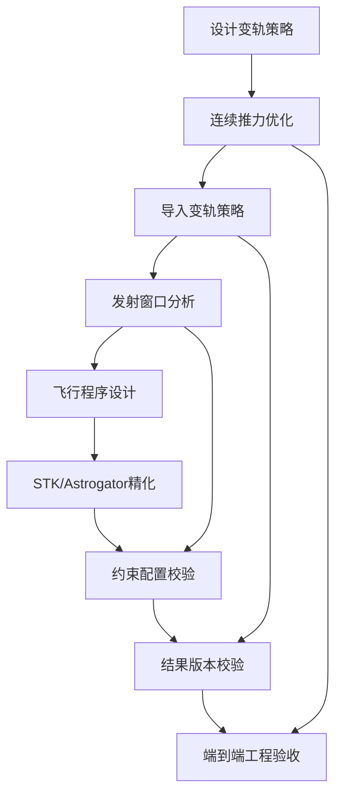
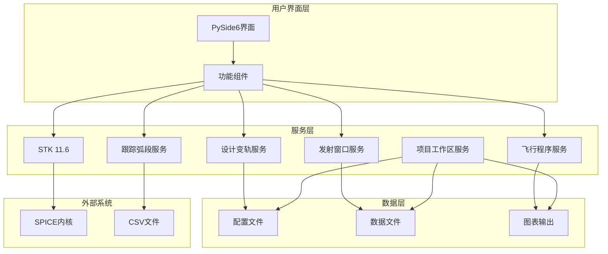
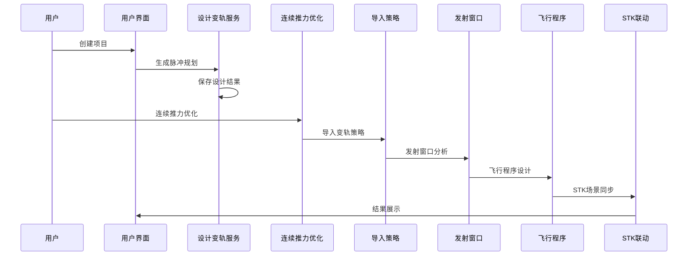
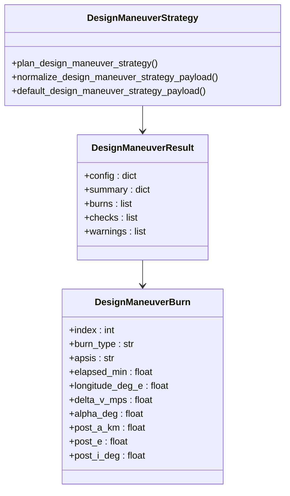
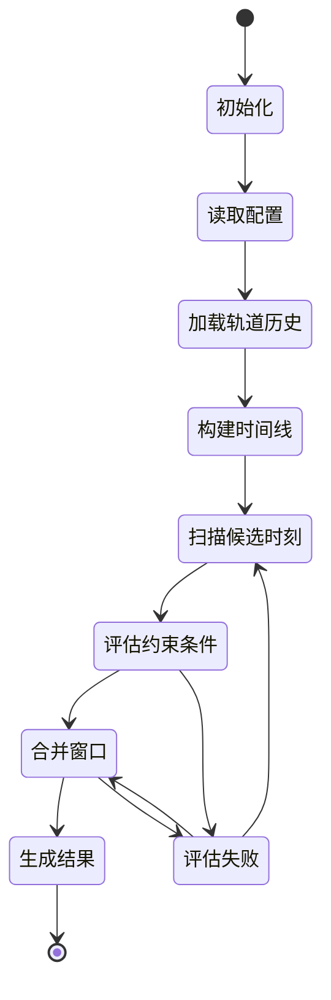
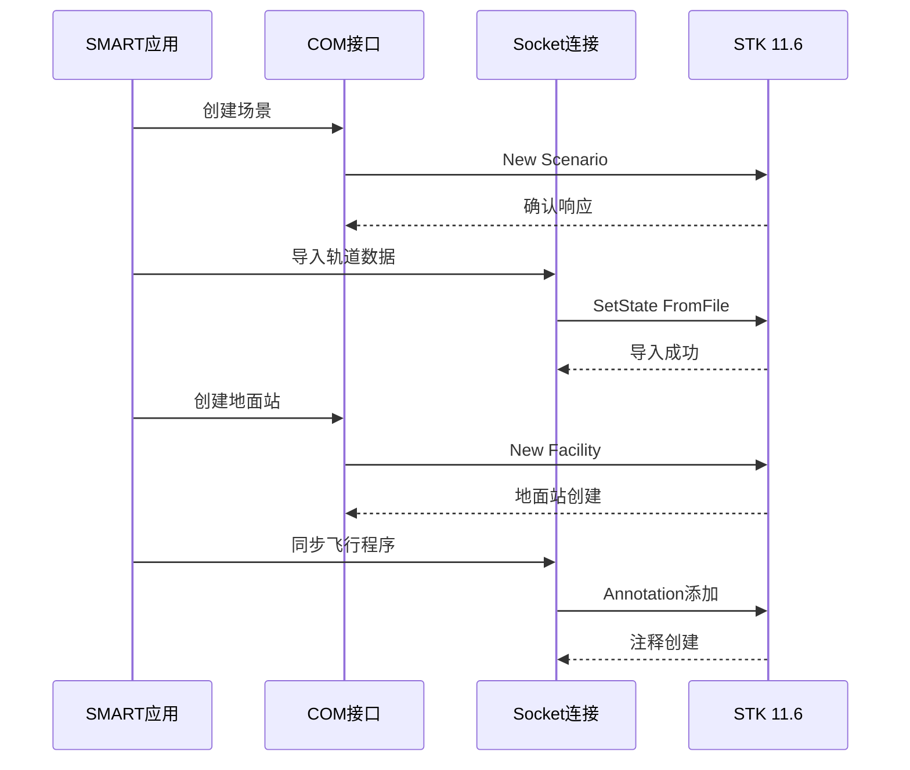
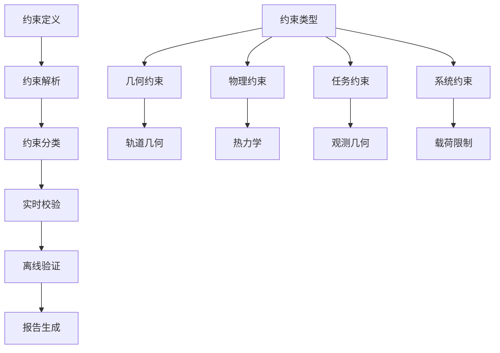
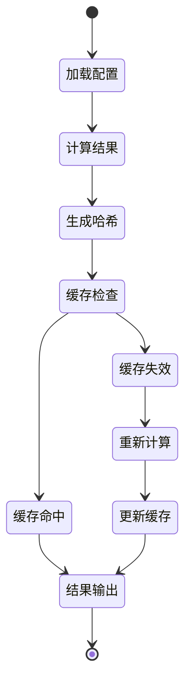
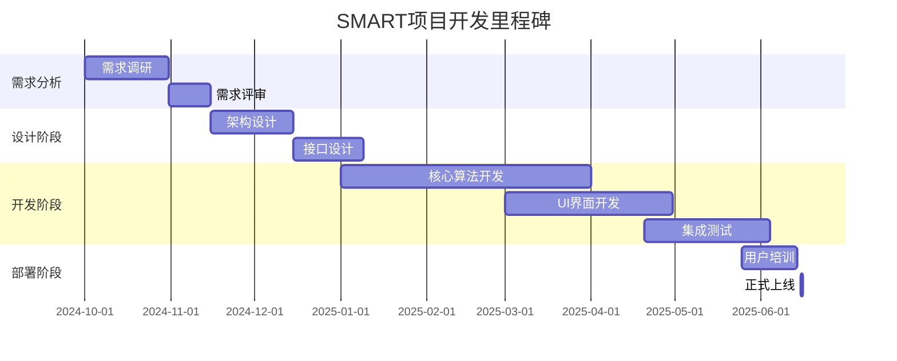

# 开发路线图

<cite>
**本文档引用的文件**
- [README.md](file://README.md)
- [design_maneuver_pulse_planning_algorithm.md](file://doc/design_maneuver_pulse_planning_algorithm.md)
- [design_continuous_thrust_parameter_optimization_algorithm.md](file://doc/design_continuous_thrust_parameter_optimization_algorithm.md)
- [launch_window_workflow.md](file://doc/launch_window_workflow.md)
- [planning_workflow.md](file://doc/planning_workflow.md)
- [ai_project_analysis.md](file://doc/ai_project_analysis.md)
- [design_maneuver_strategy.py](file://src/smart/services/design_maneuver_strategy.py)
- [design_continuous_thrust_optimizer.py](file://src/smart/services/design_continuous_thrust_optimizer.py)
- [launch_window.py](file://src/smart/services/launch_window.py)
- [flight_program.py](file://src/smart/services/flight_program.py)
- [project_workspace.py](file://src/smart/services/project_workspace.py)
- [stk_link.py](file://src/smart/services/stk_link.py)
- [tracking_arc.py](file://src/smart/services/tracking_arc.py)
- [pyproject.toml](file://pyproject.toml)
</cite>

## 目录
1. [项目概述](#项目概述)
2. [当前开发阶段与重点](#当前开发阶段与重点)
3. [系统架构与数据流](#系统架构与数据流)
4. [详细组件分析](#详细组件分析)
5. [后续开发计划](#后续开发计划)
6. [版本规划与优先级](#版本规划与优先级)
7. [成熟度评估与发展方向](#成熟度评估与发展方向)
8. [故障排除指南](#故障排除指南)
9. [结论](#结论)

## 项目概述

SMART项目是一个面向航天任务设计与工程分析的桌面软件，围绕"STK 11.6 + SPICE + PySide6"构建统一工作流。项目旨在解决传统任务分析中多工具切换、时间与坐标系转换易错、结果留痕分散等问题。

### 核心能力矩阵

| 能力类别 | 具体功能 | 技术实现 |
|---------|----------|----------|
| 任务管理 | 项目创建、打开、保存 | JSON配置文件 + 文件系统 |
| 轨道分析 | 轨道初始化、SPICE内核管理 | SpiceyPy + 二体/三体动力学 |
| 变轨策略 | 脉冲规划、连续推力优化 | 多目标优化 + 数值积分 |
| 发射窗口 | 约束扫描、窗口分析 | 向量化计算 + 缓存机制 |
| 跟踪弧段 | 测控可见性分析 | 角度计算 + 可视化 |
| 飞行程序 | 事件时间线、姿态控制 | 时间序列 + 轨迹插值 |
| STK联动 | 场景同步、数据导出 | COM接口 + Connect协议 |

**章节来源**
- [README.md:32-71](file://README.md#L32-L71)
- [pyproject.toml:11-22](file://pyproject.toml#L11-L22)

## 当前开发阶段与重点

### 已完成的核心功能

SMART项目当前已完成以下关键功能模块：

1. **设计变轨策略** - 基于V5.1硬约束脉冲规划，支持q序列搜索和相位控制
2. **连续推力优化** - 从脉冲规划生成5次连续推力参数，包含MV4/MV5联合优化
3. **导入变轨策略** - 将设计结果引入工程变轨页面，生成完整轨道历史
4. **发射窗口分析** - 复用变轨输出进行约束扫描和窗口结果生成
5. **跟踪弧段分析** - 围绕测控可见性、发射窗口生成可跟踪弧段
6. **飞行程序设计** - 基于变轨结果和STK数据形成飞行程序参考段

### 当前开发重点

根据项目文档，当前开发重点集中在以下五个方面：

**图表来源**
- [README.md:71-71](file://README.md#L71-L71)
- [design_maneuver_pulse_planning_algorithm.md:10-17](file://doc/design_maneuver_pulse_planning_algorithm.md#L10-L17)
- [design_continuous_thrust_parameter_optimization_algorithm.md:3-5](file://doc/design_continuous_thrust_parameter_optimization_algorithm.md#L3-L5)

**章节来源**
- [README.md:32-71](file://README.md#L32-L71)
- [design_maneuver_pulse_planning_algorithm.md:1-10](file://doc/design_maneuver_pulse_planning_algorithm.md#L1-L10)

## 系统架构与数据流

### 整体架构设计

SMART采用分层架构设计，将业务逻辑、数据处理和用户界面清晰分离：

**图表来源**
- [project_workspace.py:64-116](file://src/smart/services/project_workspace.py#L64-L116)
- [stk_link.py:199-240](file://src/smart/services/stk_link.py#L199-L240)

### 数据流架构

项目实现了完整的数据闭环，确保各模块间的数据一致性：

**图表来源**
- [project_workspace.py:277-331](file://src/smart/services/project_workspace.py#L277-L331)
- [launch_window_workflow.md:5-17](file://doc/launch_window_workflow.md#L5-L17)

**章节来源**
- [project_workspace.py:1-800](file://src/smart/services/project_workspace.py#L1-L800)
- [launch_window_workflow.md:1-117](file://doc/launch_window_workflow.md#L1-L117)

## 详细组件分析

### 设计变轨策略组件

设计变轨策略是SMART的核心算法模块，实现了从脉冲规划到连续推力优化的完整流程。

#### 脉冲规划算法架构

**图表来源**
- [design_maneuver_strategy.py:39-147](file://src/smart/services/design_maneuver_strategy.py#L39-L147)

#### 连续推力优化算法

连续推力优化模块实现了MV1-MV5的联合优化策略：

**图表来源**
- [design_continuous_thrust_optimizer.py:44-200](file://src/smart/services/design_continuous_thrust_optimizer.py#L44-L200)

**章节来源**
- [design_maneuver_strategy.py:1-800](file://src/smart/services/design_maneuver_strategy.py#L1-L800)
- [design_continuous_thrust_optimizer.py:1-607](file://src/smart/services/design_continuous_thrust_optimizer.py#L1-L607)

### 发射窗口分析组件

发射窗口分析模块实现了基于约束扫描的窗口生成算法：

**图表来源**
- [launch_window.py:565-620](file://src/smart/services/launch_window.py#L565-L620)

#### 约束类型与处理流程

| 约束类型 | 描述 | 处理算法 | 性能特征 |
|---------|------|----------|----------|
| 无地影约束 | 卫星进入地球阴影区域 | 阴影标志计算 | O(n) 向量化 |
| 地面站可见性 | 地面站仰角和太阳角 | 角度计算 + 逻辑判断 | O(n×m) |
| 中继星可见性 | 中继星相对角度限制 | 三角函数计算 | O(n×k) |
| 点火期间太阳角 | 变轨点火时太阳角限制 | 余弦定理计算 | O(n) |
| 倾角限制 | 轨道倾角上限约束 | 直接比较 | O(n) |

**章节来源**
- [launch_window.py:1-800](file://src/smart/services/launch_window.py#L1-L800)
- [launch_window_workflow.md:88-106](file://doc/launch_window_workflow.md#L88-L106)

### STK联动组件

STK联动模块实现了SMART与STK 11.6的双向数据交换：

**图表来源**
- [stk_link.py:280-337](file://src/smart/services/stk_link.py#L280-L337)

**章节来源**
- [stk_link.py:1-755](file://src/smart/services/stk_link.py#L1-L755)

## 后续开发计划

### STK/Astrogator精化

#### 精化目标
- 实现与STK Astrogator的深度集成
- 支持精确轨道优化和制导算法
- 提供Astrodynamics计算结果的可视化对比

#### 关键技术路径
1. **接口标准化**：建立统一的STK/Astrogator交互协议
2. **数据格式转换**：实现SMART内部数据格式与STK/Astrogator格式的双向转换
3. **算法桥接**：将SMART优化算法与STK/Astrogator求解器对接

### 更多约束配置校验

#### 约束体系扩展
- **热控约束**：卫星温度控制范围和热平衡分析
- **通信约束**：链路预算、数据传输速率和延迟限制
- **结构约束**：载荷限制、振动和冲击分析
- **任务约束**：观测几何、目标跟踪和科学数据收集

#### 校验机制

### 结果版本校验

#### 版本控制策略
- **配置文件哈希**：基于SHA-256的配置文件完整性校验
- **结果缓存机制**：智能缓存失效和重建策略
- **回归测试框架**：自动化结果一致性验证

#### 校验流程

### 端到端工程验收

#### 验收标准
- **功能完整性**：覆盖所有核心功能模块
- **性能指标**：计算时间、内存使用和并发处理能力
- **稳定性测试**：长时间运行和异常处理能力
- **兼容性验证**：不同操作系统和硬件配置下的表现

#### 验收流程
1. **单元测试**：模块级功能和边界条件测试
2. **集成测试**：模块间接口和数据流测试
3. **系统测试**：完整工作流和端到端功能测试
4. **性能测试**：负载测试和压力测试
5. **验收测试**：最终用户验收和回归测试

**章节来源**
- [planning_workflow.md:1-127](file://doc/planning_workflow.md#L1-L127)
- [project_workspace.py:673-675](file://src/smart/services/project_workspace.py#L673-L675)

## 版本规划与优先级

### 版本规划矩阵

| 版本 | 时间范围 | 主要目标 | 功能特性 | 优先级 |
|------|----------|----------|----------|--------|
| V0.1 | 2024 Q4 | 原型验证 | 基础变轨、发射窗口 | P0 |
| V0.2 | 2025 Q1 | 核心功能 | 连续推力、跟踪弧段 | P0 |
| V0.3 | 2025 Q2 | 系统集成 | STK联动、飞行程序 | P1 |
| V0.4 | 2025 Q3 | 性能优化 | 缓存机制、并行计算 | P1 |
| V0.5 | 2025 Q4 | 精化完善 | STK/Astrogator精化 | P1 |
| V1.0 | 2026 Q1 | 工程化 | 端到端验收、部署 | P0 |

### 功能优先级排序

#### P0级（必须完成）
1. **设计变轨策略** - 核心算法稳定性
2. **连续推力优化** - 算法收敛性保证
3. **发射窗口分析** - 约束扫描准确性
4. **项目数据管理** - 配置文件完整性

#### P1级（重要但非紧急）
1. **STK联动** - 接口稳定性
2. **飞行程序设计** - 事件时间线准确性
3. **跟踪弧段分析** - 可见性计算精度
4. **AI项目分析** - 报告生成质量

#### P2级（后续完善）
1. **性能优化** - 计算效率提升
2. **用户界面** - 交互体验改进
3. **文档完善** - 使用指南更新
4. **测试覆盖** - 回归测试完善

### 预期交付时间

**章节来源**
- [planning_workflow.md:39-47](file://doc/planning_workflow.md#L39-L47)
- [README.md:114-123](file://README.md#L114-L123)

## 成熟度评估与发展方向

### 当前成熟度评估

SMART项目当前处于原型验证阶段，具备以下特征：

#### 技术成熟度
- **算法稳定性**：核心变轨算法经过多次验证，结果可复现
- **系统可靠性**：模块间接口清晰，错误处理机制完善
- **数据完整性**：配置文件和结果数据的版本控制机制健全

#### 业务成熟度
- **功能覆盖度**：核心航天任务分析功能基本完备
- **用户体验**：界面友好，操作流程符合工程师习惯
- **工具集成**：与STK、SPICE等专业工具无缝对接

### 未来发展方向

#### 短期目标（6个月内）
1. **算法精化**：提升连续推力优化的收敛性和精度
2. **性能优化**：实现大规模并行计算和智能缓存
3. **界面改进**：增强可视化能力和交互体验

#### 中期目标（12个月内）
1. **功能扩展**：增加更多约束类型和分析维度
2. **平台化**：支持云端部署和分布式计算
3. **生态建设**：建立开发者社区和第三方插件支持

#### 长期愿景（24个月以上）
1. **智能化**：集成机器学习算法，实现智能任务规划
2. **标准化**：成为行业标准的航天任务分析平台
3. **国际化**：支持多语言和国际标准规范

### 风险评估与应对

#### 技术风险
- **算法收敛性**：通过增加约束检查和回退机制降低风险
- **性能瓶颈**：采用并行计算和缓存策略缓解压力
- **系统稳定性**：建立完善的监控和告警机制

#### 业务风险
- **需求变更**：采用敏捷开发方法快速响应变化
- **市场竞争**：持续技术创新保持竞争优势
- **人才流失**：建立知识传承和团队培养机制

**章节来源**
- [README.md:22-47](file://README.md#L22-L47)
- [design_maneuver_pulse_planning_algorithm.md:720-741](file://doc/design_maneuver_pulse_planning_algorithm.md#L720-L741)

## 故障排除指南

### 常见问题诊断

#### 算法收敛问题
**症状**：连续推力优化结果不稳定或不收敛
**诊断步骤**：
1. 检查脉冲规划结果的可行性
2. 验证目标轨道参数设置
3. 确认发动机参数配置
4. 分析约束条件的合理性

**解决方案**：
- 调整优化参数和搜索范围
- 增加约束宽松度
- 重新设置初始种子值

#### 性能问题
**症状**：计算时间过长或内存占用过高
**诊断步骤**：
1. 分析计算复杂度和数据规模
2. 检查算法实现效率
3. 评估硬件资源配置
4. 监控系统资源使用情况

**解决方案**：
- 实现并行计算和缓存机制
- 优化算法复杂度
- 升级硬件配置

#### 数据一致性问题
**症状**：不同模块间数据不一致或丢失
**诊断步骤**：
1. 检查文件系统权限和路径
2. 验证JSON配置文件格式
3. 确认数据序列化/反序列化过程
4. 分析异常中断的影响

**解决方案**：
- 实现数据完整性校验
- 建立自动备份机制
- 完善错误恢复策略

### 调试工具与技巧

#### 开发调试
- **日志系统**：详细的执行日志和错误追踪
- **断点调试**：支持Python和JavaScript调试
- **性能分析**：CPU和内存使用情况监控
- **单元测试**：覆盖率和回归测试

#### 生产环境监控
- **健康检查**：系统状态实时监控
- **告警机制**：异常情况自动通知
- **性能指标**：关键指标统计和报表
- **用户反馈**：问题报告和建议收集

**章节来源**
- [planning_workflow.md:67-75](file://doc/planning_workflow.md#L67-L75)
- [project_workspace.py:654-660](file://src/smart/services/project_workspace.py#L654-L660)

## 结论

SMART项目作为航天任务分析的综合性平台，已经建立了坚实的技术基础和清晰的发展方向。通过当前的开发重点和后续规划，项目将在以下几个方面取得突破：

### 核心成就
1. **算法完整性**：实现了从脉冲规划到连续推力优化的完整变轨策略
2. **系统集成度**：成功整合了STK、SPICE等专业工具
3. **工程实用性**：提供了可复用、可追溯的桌面分析环境

### 发展机遇
1. **技术升级**：STK/Astrogator精化将大幅提升分析精度
2. **功能扩展**：更多约束配置校验满足复杂任务需求
3. **平台化发展**：为未来的智能化和标准化奠定基础

### 风险控制
通过建立完善的测试体系、版本管理和故障排除机制，SMART项目能够有效控制开发风险，确保按时高质量交付。

对于项目贡献者和使用者而言，SMART项目提供了清晰的发展预期和技术路线，既保证了当前功能的稳定性，又为未来创新预留了充足空间。随着后续版本的发布，SMART将成为航天任务分析领域的重要工具平台。