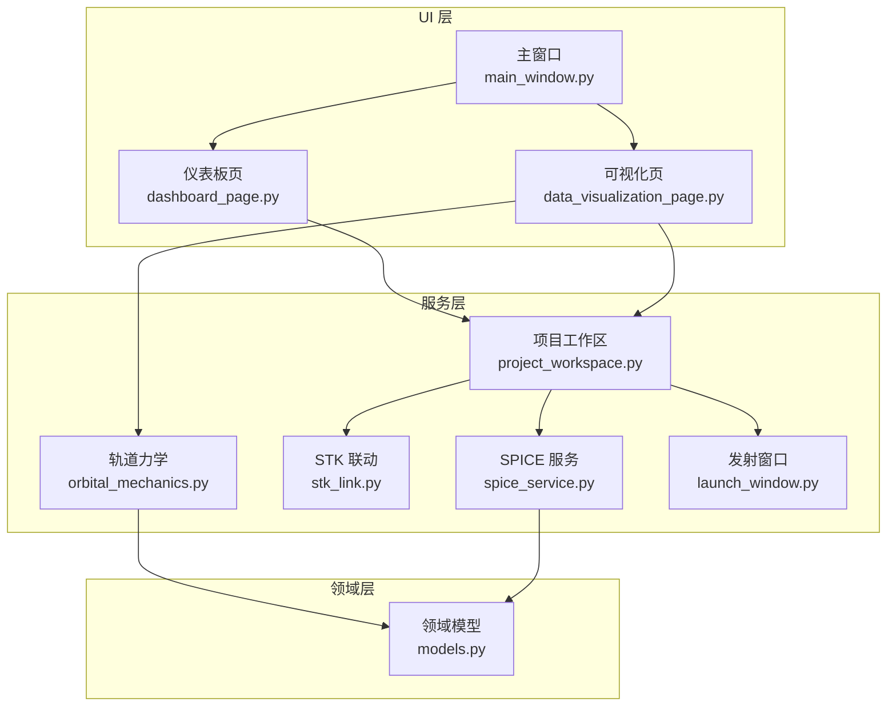
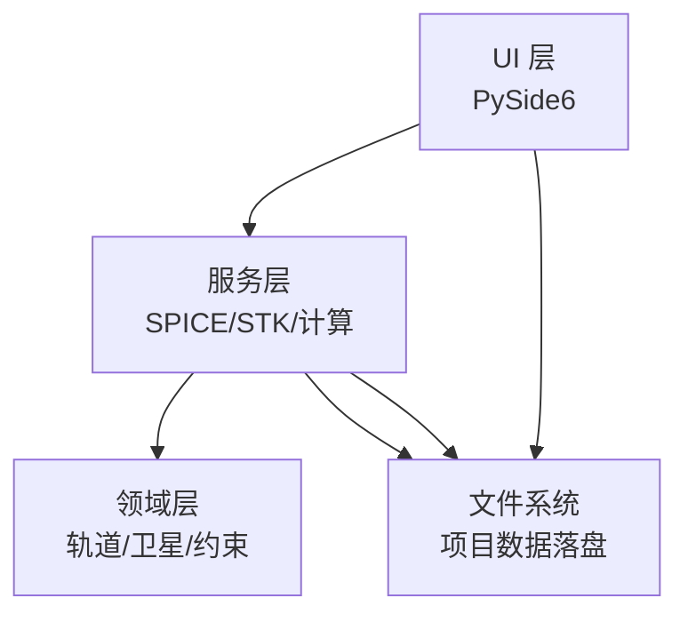
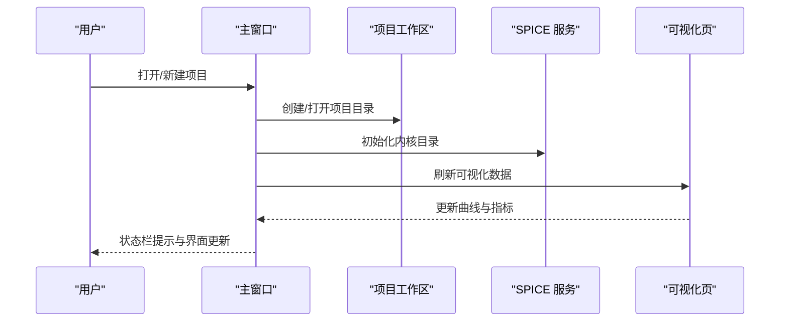
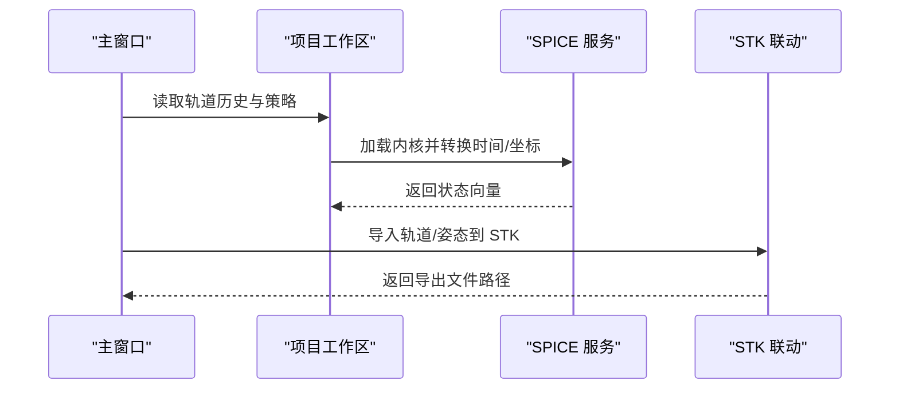
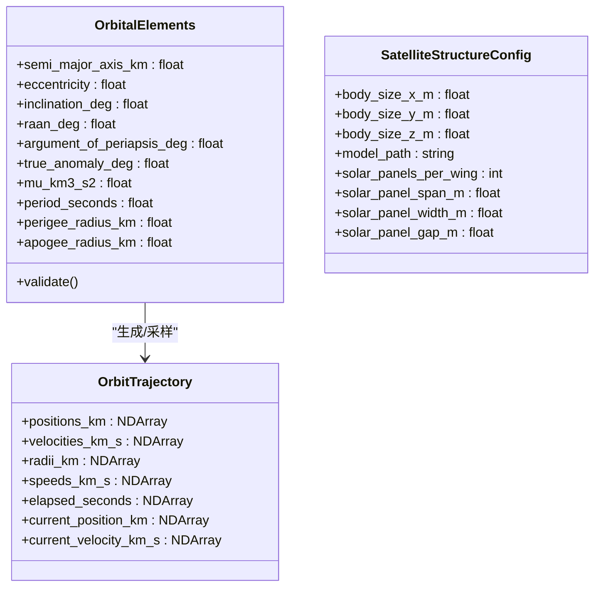
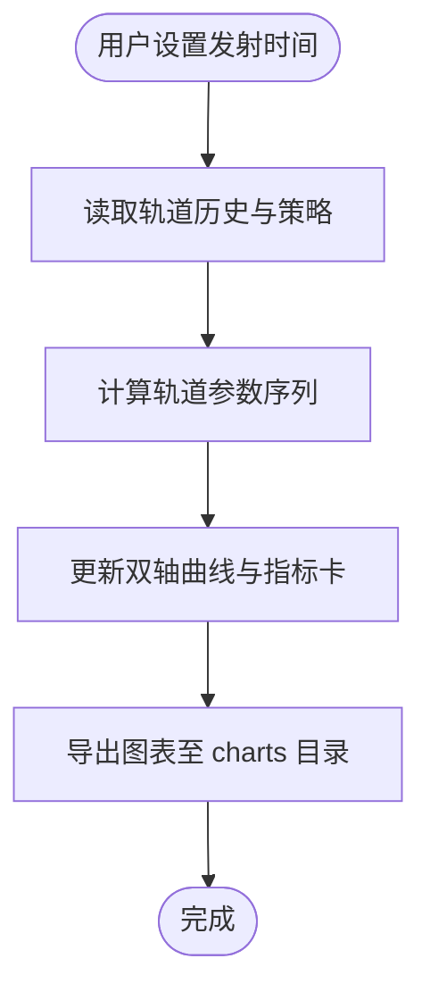
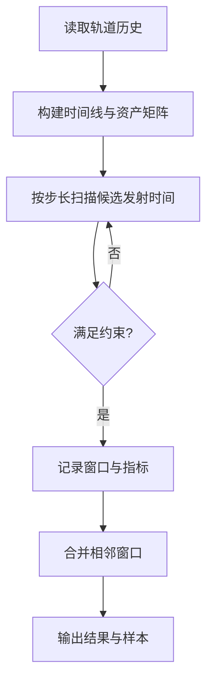
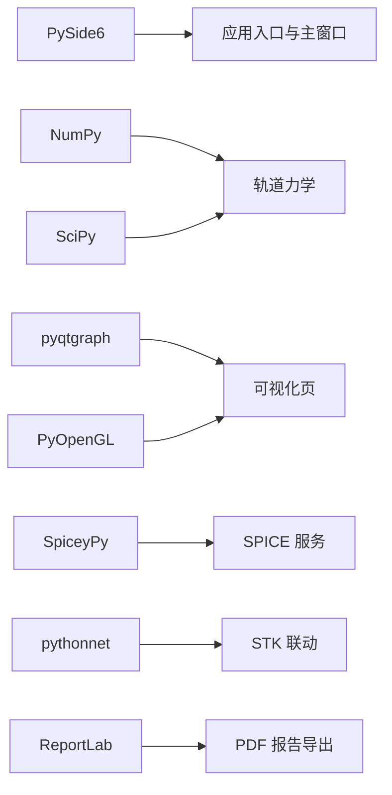

# 技术架构

<cite>
**本文引用的文件**
- [README.md](file://README.md)
- [main.py](file://src/smart/main.py)
- [app_runtime.py](file://src/smart/app_runtime.py)
- [pyproject.toml](file://pyproject.toml)
- [main_window.py](file://src/smart/ui/main_window.py)
- [models.py](file://src/smart/domain/models.py)
- [project_workspace.py](file://src/smart/services/project_workspace.py)
- [spice_service.py](file://src/smart/services/spice_service.py)
- [stk_link.py](file://src/smart/services/stk_link.py)
- [dashboard_page.py](file://src/smart/ui/widgets/dashboard_page.py)
- [data_visualization_page.py](file://src/smart/ui/widgets/data_visualization_page.py)
- [orbital_mechanics.py](file://src/smart/services/orbital_mechanics.py)
- [launch_window.py](file://src/smart/services/launch_window.py)
</cite>

## 目录
1. [引言](#引言)
2. [项目结构](#项目结构)
3. [核心组件](#核心组件)
4. [架构总览](#架构总览)
5. [详细组件分析](#详细组件分析)
6. [依赖关系分析](#依赖关系分析)
7. [性能考虑](#性能考虑)
8. [故障排查指南](#故障排查指南)
9. [结论](#结论)

## 引言
SMART 是一个面向航天任务设计与工程分析的桌面软件，围绕 STK 11.6 + SPICE + PySide6 构建统一工作流，旨在解决传统任务分析中多工具切换、时间与坐标系转换易错、结果留痕分散等问题。项目提供从轨道初始化、设计变轨策略、连续推力优化、发射窗口分析、跟踪弧段分析、飞行程序设计到 STK 联动与可视化的一体化桌面分析环境。

## 项目结构
项目采用分层架构组织，主要分为三层：
- UI 层：PySide6 桌面界面，负责用户交互与可视化。
- 服务层：封装数值计算、SPICE 星历查询、STK 联动、项目数据持久化等业务逻辑。
- 领域层：定义轨道、卫星、约束等核心领域模型与算法。

**图表来源**
- [main_window.py:53-136](file://src/smart/ui/main_window.py#L53-L136)
- [dashboard_page.py:263-302](file://src/smart/ui/widgets/dashboard_page.py#L263-L302)
- [data_visualization_page.py:282-341](file://src/smart/ui/widgets/data_visualization_page.py#L282-L341)
- [project_workspace.py:64-116](file://src/smart/services/project_workspace.py#L64-L116)
- [spice_service.py:174-221](file://src/smart/services/spice_service.py#L174-L221)
- [stk_link.py:199-240](file://src/smart/services/stk_link.py#L199-L240)
- [orbital_mechanics.py:277-310](file://src/smart/services/orbital_mechanics.py#L277-L310)
- [launch_window.py:565-620](file://src/smart/services/launch_window.py#L565-L620)
- [models.py:17-36](file://src/smart/domain/models.py#L17-L36)

**章节来源**
- [README.md:1-50](file://README.md#L1-L50)
- [pyproject.toml:11-22](file://pyproject.toml#L11-L22)

## 核心组件
- 主入口与应用初始化
  - 应用入口负责初始化图形后端、主题与图标，创建主窗口并进入事件循环。
  - 关键路径：[main.py:10-31](file://src/smart/main.py#L10-L31)、[app_runtime.py:31-90](file://src/smart/app_runtime.py#L31-L90)

- 主窗口与导航
  - 主窗口承载侧边栏导航、项目管理、页面切换与自动保存机制。
  - 关键路径：[main_window.py:53-136](file://src/smart/ui/main_window.py#L53-L136)

- 项目工作区
  - 提供项目生命周期管理、配置与数据文件的读写、哈希校验与版本更新。
  - 关键路径：[project_workspace.py:64-116](file://src/smart/services/project_workspace.py#L64-L116)

- SPICE 服务
  - 封装 SPICE 内核加载、时间转换、坐标变换与天体状态查询。
  - 关键路径：[spice_service.py:174-305](file://src/smart/services/spice_service.py#L174-L305)

- STK 联动
  - 通过 COM 或 Socket 与 STK 11.6 通信，创建场景、导入轨道/姿态、生成导出文件。
  - 关键路径：[stk_link.py:199-337](file://src/smart/services/stk_link.py#L199-L337)

- 轨道力学与可视化
  - 提供轨道采样、两体传播、Lambert 传输、可视化曲线绘制与图表导出。
  - 关键路径：[orbital_mechanics.py:277-310](file://src/smart/services/orbital_mechanics.py#L277-L310)、[data_visualization_page.py:282-341](file://src/smart/ui/widgets/data_visualization_page.py#L282-L341)

- 发射窗口分析
  - 基于轨道历史与约束配置进行候选发射时间扫描、阴影区间计算与窗口合并。
  - 关键路径：[launch_window.py:565-620](file://src/smart/services/launch_window.py#L565-L620)

**章节来源**
- [main.py:10-31](file://src/smart/main.py#L10-L31)
- [app_runtime.py:31-90](file://src/smart/app_runtime.py#L31-L90)
- [main_window.py:53-136](file://src/smart/ui/main_window.py#L53-L136)
- [project_workspace.py:64-116](file://src/smart/services/project_workspace.py#L64-L116)
- [spice_service.py:174-305](file://src/smart/services/spice_service.py#L174-L305)
- [stk_link.py:199-337](file://src/smart/services/stk_link.py#L199-L337)
- [orbital_mechanics.py:277-310](file://src/smart/services/orbital_mechanics.py#L277-L310)
- [data_visualization_page.py:282-341](file://src/smart/ui/widgets/data_visualization_page.py#L282-L341)
- [launch_window.py:565-620](file://src/smart/services/launch_window.py#L565-L620)

## 架构总览
SMART 采用分层架构，职责清晰：
- UI 层：负责用户交互、页面渲染与可视化，不直接参与业务计算。
- 服务层：封装业务逻辑与外部集成（SPICE、STK），提供稳定的接口。
- 领域层：定义核心数据模型与算法，确保业务规则一致性。

系统边界与交互关系：
- UI 通过服务层访问领域模型与外部资源。
- 服务层内部通过依赖注入与工厂模式解耦具体实现。
- 数据通过项目工作区统一落盘，保证可追溯性与版本控制。

**图表来源**
- [main_window.py:53-136](file://src/smart/ui/main_window.py#L53-L136)
- [project_workspace.py:213-232](file://src/smart/services/project_workspace.py#L213-L232)
- [spice_service.py:205-221](file://src/smart/services/spice_service.py#L205-L221)
- [stk_link.py:280-337](file://src/smart/services/stk_link.py#L280-L337)

## 详细组件分析

### UI 层：主窗口与页面
- 主窗口负责项目生命周期管理、页面切换、自动保存与状态同步。
- 页面组件通过信号槽与服务层交互，实现数据驱动的更新。
- 关键路径：[main_window.py:53-136](file://src/smart/ui/main_window.py#L53-L136)

**图表来源**
- [main_window.py:53-136](file://src/smart/ui/main_window.py#L53-L136)
- [project_workspace.py:82-116](file://src/smart/services/project_workspace.py#L82-L116)
- [spice_service.py:205-221](file://src/smart/services/spice_service.py#L205-L221)
- [data_visualization_page.py:342-344](file://src/smart/ui/widgets/data_visualization_page.py#L342-L344)

**章节来源**
- [main_window.py:53-136](file://src/smart/ui/main_window.py#L53-L136)
- [dashboard_page.py:263-302](file://src/smart/ui/widgets/dashboard_page.py#L263-L302)

### 服务层：SPICE 与 STK 集成
- SPICE 服务提供内核加载、时间转换、坐标变换与天体状态查询，具备降级回退到纯 Python 计算的能力。
- STK 联动通过 COM 或 Socket 控制 STK 11.6，导入轨道/姿态、创建场景与导出文件。
- 关键路径：[spice_service.py:174-305](file://src/smart/services/spice_service.py#L174-L305)、[stk_link.py:199-337](file://src/smart/services/stk_link.py#L199-L337)

**图表来源**
- [project_workspace.py:352-358](file://src/smart/services/project_workspace.py#L352-L358)
- [spice_service.py:241-250](file://src/smart/services/spice_service.py#L241-L250)
- [stk_link.py:280-337](file://src/smart/services/stk_link.py#L280-L337)

**章节来源**
- [spice_service.py:174-305](file://src/smart/services/spice_service.py#L174-L305)
- [stk_link.py:199-337](file://src/smart/services/stk_link.py#L199-L337)

### 领域层：轨道与约束模型
- 领域模型定义轨道根数、轨迹、卫星结构与约束参数，提供校验与派生属性。
- 轨道力学模块提供采样、传播、传输与异常计算，兼容 SPICE 与纯 Python 实现。
- 关键路径：[models.py:17-36](file://src/smart/domain/models.py#L17-L36)、[orbital_mechanics.py:277-310](file://src/smart/services/orbital_mechanics.py#L277-L310)

**图表来源**
- [models.py:17-36](file://src/smart/domain/models.py#L17-L36)
- [models.py:69-78](file://src/smart/domain/models.py#L69-L78)
- [models.py:188-204](file://src/smart/domain/models.py#L188-L204)

**章节来源**
- [models.py:17-36](file://src/smart/domain/models.py#L17-L36)
- [orbital_mechanics.py:277-310](file://src/smart/services/orbital_mechanics.py#L277-L310)

### 可视化与数据流
- 可视化页面基于 pyqtgraph 实现双轴曲线、游标联动与图表导出。
- 数据流从项目工作区读取轨道历史与策略，计算派生参数并更新曲线与指标卡。
- 关键路径：[data_visualization_page.py:282-341](file://src/smart/ui/widgets/data_visualization_page.py#L282-L341)

**图表来源**
- [data_visualization_page.py:346-372](file://src/smart/ui/widgets/data_visualization_page.py#L346-L372)
- [project_workspace.py:352-358](file://src/smart/services/project_workspace.py#L352-L358)

**章节来源**
- [data_visualization_page.py:282-341](file://src/smart/ui/widgets/data_visualization_page.py#L282-L341)

### 发射窗口分析流程
- 基于轨道历史与约束配置扫描候选发射时间，评估阴影、可见性与倾角等约束。
- 输出窗口结果与样本缓存，支持甘特图与持续时间统计。
- 关键路径：[launch_window.py:565-620](file://src/smart/services/launch_window.py#L565-L620)

**图表来源**
- [launch_window.py:565-620](file://src/smart/services/launch_window.py#L565-L620)
- [launch_window.py:787-800](file://src/smart/services/launch_window.py#L787-L800)

**章节来源**
- [launch_window.py:565-620](file://src/smart/services/launch_window.py#L565-L620)

## 依赖关系分析
技术栈选择与依赖关系如下：
- GUI：PySide6 提供跨平台桌面界面与 OpenGL 支持。
- 数值计算：NumPy 提供高性能数组运算，SciPy 提供优化与求根。
- 可视化：pyqtgraph 提供实时曲线绘制与交互。
- 星历与 SPICE：SpiceyPy 提供 SPICE 接口，支持内核加载与状态查询。
- STK 集成：pythonnet（Windows）用于 COM 通信，或 Socket 方案作为备选。
- 3D/图形：PyOpenGL 与 trimesh/pycollada 支持 3D 模型导入与渲染。

**图表来源**
- [pyproject.toml:11-22](file://pyproject.toml#L11-L22)
- [main.py:18-30](file://src/smart/main.py#L18-L30)
- [data_visualization_page.py:6-8](file://src/smart/ui/widgets/data_visualization_page.py#L6-L8)
- [stk_link.py:117-141](file://src/smart/services/stk_link.py#L117-L141)

**章节来源**
- [pyproject.toml:11-22](file://pyproject.toml#L11-L22)

## 性能考虑
- 图形后端与驱动兼容
  - 通过图形后端配置强制使用桌面 OpenGL，避免 Qt Quick 与桌面窗口组合导致的 D3D11 不兼容问题。
  - 关键路径：[app_runtime.py:31-90](file://src/smart/app_runtime.py#L31-L90)

- 数值计算优化
  - 使用 NumPy 向量化操作与 SciPy 优化器，减少 Python 循环开销。
  - 对 SPICE 可用性进行降级回退，确保在缺少依赖时仍可运行。
  - 关键路径：[orbital_mechanics.py:277-310](file://src/smart/services/orbital_mechanics.py#L277-L310)、[spice_service.py:260-274](file://src/smart/services/spice_service.py#L260-L274)

- I/O 与缓存
  - 项目工作区统一管理配置与数据文件，采用哈希校验与增量更新，减少重复计算。
  - 关键路径：[project_workspace.py:277-330](file://src/smart/services/project_workspace.py#L277-L330)

- 可视化性能
  - pyqtgraph 双轴联动与区域高亮，结合鼠标事件与自动缩放，提升交互效率。
  - 关键路径：[data_visualization_page.py:422-460](file://src/smart/ui/widgets/data_visualization_page.py#L422-L460)

## 故障排查指南
- SPICE 未安装或不可用
  - 现象：SPICE 相关功能不可用，状态提示为断开。
  - 处理：确认安装依赖，或在 UI 中查看运行摘要。
  - 关键路径：[spice_service.py:79-88](file://src/smart/services/spice_service.py#L79-L88)

- STK 无法连接
  - 现象：COM 或 Socket 连接失败。
  - 处理：检查 STK 11.6 是否运行，或启用 Socket 模式。
  - 关键路径：[stk_link.py:111-141](file://src/smart/services/stk_link.py#L111-L141)、[stk_link.py:144-167](file://src/smart/services/stk_link.py#L144-L167)

- 项目文件损坏或缺失
  - 现象：打开项目时报错或部分数据为空。
  - 处理：检查项目元数据与配置文件完整性，必要时重建默认配置。
  - 关键路径：[project_workspace.py:118-127](file://src/smart/services/project_workspace.py#L118-L127)

- 图形黑屏或驱动问题
  - 现象：WebEngine 或 OpenGL 渲染异常。
  - 处理：调整 SMART_WEBENGINE_BACKEND 环境变量，或切换到 SwiftShader。
  - 关键路径：[app_runtime.py:44-90](file://src/smart/app_runtime.py#L44-L90)

**章节来源**
- [spice_service.py:79-88](file://src/smart/services/spice_service.py#L79-L88)
- [stk_link.py:111-141](file://src/smart/services/stk_link.py#L111-L141)
- [project_workspace.py:118-127](file://src/smart/services/project_workspace.py#L118-L127)
- [app_runtime.py:44-90](file://src/smart/app_runtime.py#L44-L90)

## 结论
SMART 通过 PySide6 + SPICE + STK 的技术栈，构建了统一的桌面分析工作流。分层架构明确了 UI、服务与领域层的职责边界，配合项目工作区的数据落盘与哈希校验，实现了可追溯、可复算的工程闭环。技术选型兼顾了专业精度与开发效率，同时提供了完善的错误处理与性能优化策略，适合在工程化场景中持续演进与扩展。