# 核心能力

<cite>
**本文引用的文件**
- [README.md](file://README.md)
- [main.py](file://src/smart/main.py)
- [app_runtime.py](file://src/smart/app_runtime.py)
- [models.py](file://src/smart/domain/models.py)
- [project_workspace.py](file://src/smart/services/project_workspace.py)
- [design_maneuver_strategy.py](file://src/smart/services/design_maneuver_strategy.py)
- [design_continuous_thrust_optimizer.py](file://src/smart/services/design_continuous_thrust_optimizer.py)
- [launch_window.py](file://src/smart/services/launch_window.py)
- [tracking_arc.py](file://src/smart/services/tracking_arc.py)
- [stk_link.py](file://src/smart/services/stk_link.py)
- [spice_service.py](file://src/smart/services/spice_service.py)
- [mission_agent.py](file://src/smart/services/mission_agent.py)
- [llm_client.py](file://src/smart/services/llm_client.py)
</cite>

## 目录
1. [简介](#简介)
2. [项目结构](#项目结构)
3. [核心组件](#核心组件)
4. [架构总览](#架构总览)
5. [详细组件分析](#详细组件分析)
6. [依赖分析](#依赖分析)
7. [性能考虑](#性能考虑)
8. [故障排查指南](#故障排查指南)
9. [结论](#结论)
10. [附录](#附录)

## 简介
SMART 是面向航天任务设计与工程分析的桌面软件，围绕 STK 11.6 + SPICE + PySide6 构建统一工作流，解决传统任务分析中多工具切换、时间与坐标系转换易错、结果留痕分散等问题。当前仓库提供可运行的桌面工程原型，已覆盖以下核心能力：
- 项目管理：新建/打开项目，按 config/data/charts 结构落盘
- 卫星3D模型配置：设计当前项目卫星3D模型，供 SMART 三维场景与 STK 场景导入使用
- 轨道初始化：支持经典轨道根数、TLE 与 STK .e 星历导入；地固系星历优先通过 SPICE 转到 J2000
- 设计变轨策略：基于 V5.1 硬约束脉冲规划，搜索 q 序列、控后近地点目标、终端经度/倾角约束与方向角优化
- 连续推力优化：从脉冲规划生成 5 次连续推力点火参数，输出偏航角、点火/熄火时刻、推进剂消耗与控后轨道状态
- 导入变轨策略：把设计页生成的连续推力策略引入工程变轨页面，并计算 full_orbit_history.csv
- 发射窗口分析：复用变轨输出轨道历史，完成约束扫描、窗口结果表、样本缓存与甘特图输出
- 跟踪弧段分析：围绕测控可见性、发射窗口与轨道历史生成可跟踪弧段结果
- 飞行程序设计：复用变轨结果与 STK 联动数据，形成飞行程序参考段、事件表与时间线
- STK 联动：面向 STK 11.6 的对象创建、轨道/姿态/图形标注与结果导出链路
- SPICE 内核管理：本地内核扫描、加载、下载提示与运行状态检查
- AI 辅助解读：面向项目摘要的任务分析说明页，支持报告式输出

## 项目结构
SMART 采用分层架构：
- domain 层：任务与轨道领域模型（轨道根数、卫星结构、天体状态等）
- services 层：动力学计算与 SPICE 服务、发射窗口、跟踪弧段、STK 联动、项目工作区等
- ui 层：PySide6 桌面界面与控件
- tests：数值与功能测试
- data/kernels：本地 SPICE 内核

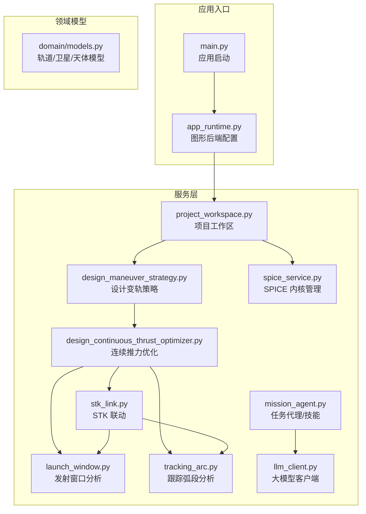

**图表来源**
- [main.py:10-31](file://src/smart/main.py#L10-L31)
- [app_runtime.py:31-90](file://src/smart/app_runtime.py#L31-L90)
- [models.py:17-255](file://src/smart/domain/models.py#L17-L255)
- [project_workspace.py:64-116](file://src/smart/services/project_workspace.py#L64-L116)
- [design_maneuver_strategy.py:535-672](file://src/smart/services/design_maneuver_strategy.py#L535-L672)
- [design_continuous_thrust_optimizer.py:44-200](file://src/smart/services/design_continuous_thrust_optimizer.py#L44-L200)
- [launch_window.py:565-619](file://src/smart/services/launch_window.py#L565-L619)
- [tracking_arc.py:66-92](file://src/smart/services/tracking_arc.py#L66-L92)
- [stk_link.py:280-337](file://src/smart/services/stk_link.py#L280-L337)
- [spice_service.py:174-305](file://src/smart/services/spice_service.py#L174-L305)
- [mission_agent.py:145-240](file://src/smart/services/mission_agent.py#L145-L240)
- [llm_client.py:69-162](file://src/smart/services/llm_client.py#L69-L162)

**章节来源**
- [README.md:1-204](file://README.md#L1-L204)
- [main.py:1-36](file://src/smart/main.py#L1-L36)
- [app_runtime.py:1-96](file://src/smart/app_runtime.py#L1-L96)
- [models.py:1-255](file://src/smart/domain/models.py#L1-L255)
- [project_workspace.py:1-920](file://src/smart/services/project_workspace.py#L1-L920)

## 核心组件
- 项目工作区（ProjectWorkspace）：负责项目生命周期管理、配置与数据落盘、跨模块数据读写与一致性校验
- 设计变轨策略（Design Maneuver Strategy）：脉冲规划与 q 序列搜索、硬约束满足、方向角优化与结果归档
- 连续推力优化（Continuous Thrust Optimizer）：基于脉冲链路生成连续推力参数，联合优化尾段经度与倾角
- 发射窗口分析（Launch Window）：以轨道历史为输入，结合测控与光照约束生成发射窗口与样本
- 跟踪弧段分析（Tracking Arc）：基于测控资产与轨道历史生成可跟踪时段与统计
- STK 联动（STK Link）：将轨道/姿态/事件导入 STK，创建场景、对象与标注
- SPICE 内核管理（SPICE Service）：内核发现/加载/下载、时间与坐标系转换
- AI 辅助解读（Mission Agent + LLM Client）：基于项目上下文与技能文档进行工程解读与报告生成

**章节来源**
- [project_workspace.py:64-116](file://src/smart/services/project_workspace.py#L64-L116)
- [design_maneuver_strategy.py:535-672](file://src/smart/services/design_maneuver_strategy.py#L535-L672)
- [design_continuous_thrust_optimizer.py:44-200](file://src/smart/services/design_continuous_thrust_optimizer.py#L44-L200)
- [launch_window.py:565-619](file://src/smart/services/launch_window.py#L565-L619)
- [tracking_arc.py:66-92](file://src/smart/services/tracking_arc.py#L66-L92)
- [stk_link.py:280-337](file://src/smart/services/stk_link.py#L280-L337)
- [spice_service.py:174-305](file://src/smart/services/spice_service.py#L174-L305)
- [mission_agent.py:145-240](file://src/smart/services/mission_agent.py#L145-L240)
- [llm_client.py:69-162](file://src/smart/services/llm_client.py#L69-L162)

## 架构总览
SMART 的数据与控制流遵循“项目工作区为中心”的模式：各功能模块通过工作区读写配置与中间结果，形成闭环。SPICE 与 STK 作为外部系统被服务层封装，既保证了精度又降低了耦合。

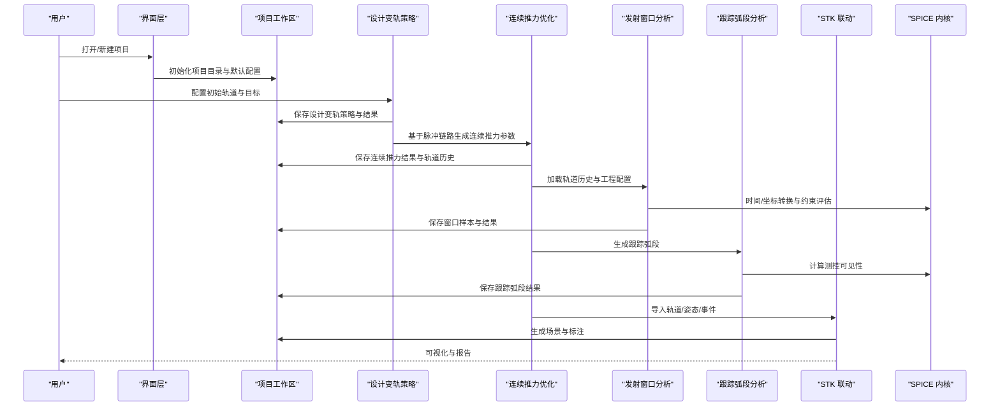

**图表来源**
- [project_workspace.py:227-330](file://src/smart/services/project_workspace.py#L227-L330)
- [design_maneuver_strategy.py:535-672](file://src/smart/services/design_maneuver_strategy.py#L535-L672)
- [design_continuous_thrust_optimizer.py:44-200](file://src/smart/services/design_continuous_thrust_optimizer.py#L44-L200)
- [launch_window.py:565-619](file://src/smart/services/launch_window.py#L565-L619)
- [tracking_arc.py:66-92](file://src/smart/services/tracking_arc.py#L66-L92)
- [stk_link.py:280-337](file://src/smart/services/stk_link.py#L280-L337)
- [spice_service.py:241-305](file://src/smart/services/spice_service.py#L241-L305)

## 详细组件分析

### 项目管理
- 责任：项目创建/打开/关闭、目录结构初始化、默认配置生成、数据落盘与更新时间戳维护
- 关键点：自动创建 data/kernels/charts/config 子目录；默认生成卫星3D模型、设计/工程变轨策略、发射窗口与跟踪弧段配置
- 数据流：工作区负责读写 config/*.json 与 data/*.csv，确保跨模块一致性

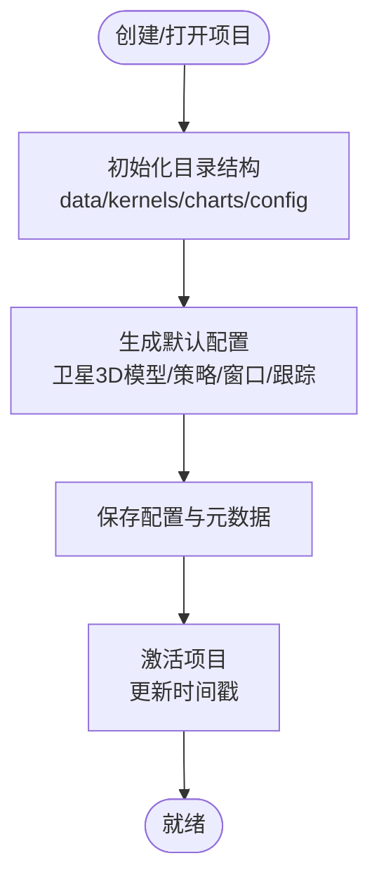

**图表来源**
- [project_workspace.py:82-116](file://src/smart/services/project_workspace.py#L82-L116)
- [project_workspace.py:100-116](file://src/smart/services/project_workspace.py#L100-L116)

**章节来源**
- [project_workspace.py:64-116](file://src/smart/services/project_workspace.py#L64-L116)
- [README.md:125-152](file://README.md#L125-L152)

### 卫星3D模型配置
- 责任：定义卫星结构尺寸、天线布局、太阳能板数量与姿态，以及推进系统参数
- 价值：统一工程参数，支撑 STK 三维可视化与飞行程序姿态标注
- 数据模型：SatelliteStructureConfig、AntennaConfig、GroundAssetConfig、RelaySatelliteConfig、SatelliteStatusSettings

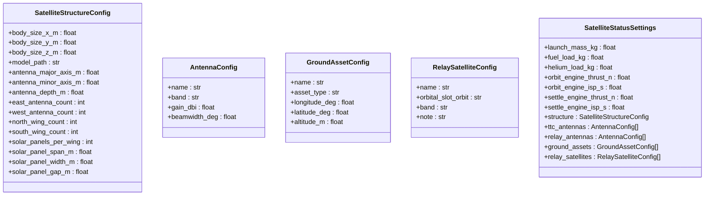

**图表来源**
- [models.py:163-255](file://src/smart/domain/models.py#L163-L255)

**章节来源**
- [models.py:163-255](file://src/smart/domain/models.py#L163-L255)
- [project_workspace.py:398-422](file://src/smart/services/project_workspace.py#L398-L422)

### 轨道初始化
- 责任：支持经典轨道根数、TLE 与 STK .e 星历导入；地固系星历通过 SPICE 转到 J2000
- 价值：统一时间基准与坐标系，避免人工换算误差
- 数据模型：OrbitalElements、OrbitInitializationSettings、OrbitTrajectory

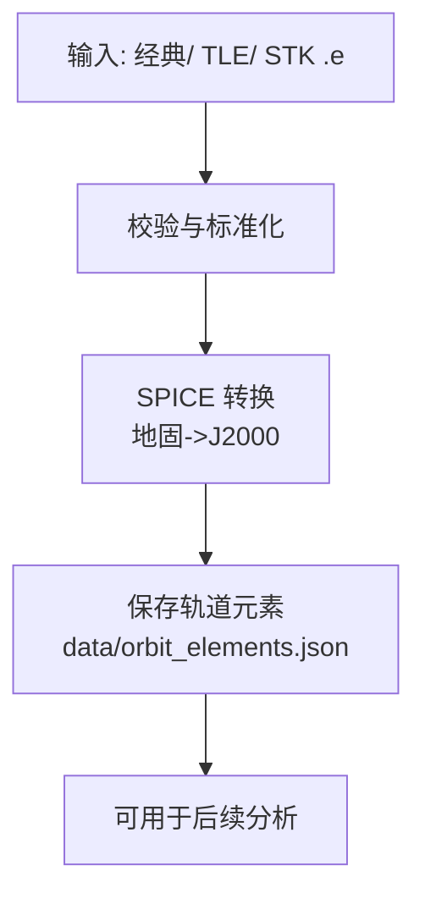

**图表来源**
- [models.py:17-78](file://src/smart/domain/models.py#L17-L78)
- [project_workspace.py:213-226](file://src/smart/services/project_workspace.py#L213-L226)
- [spice_service.py:241-305](file://src/smart/services/spice_service.py#L241-L305)

**章节来源**
- [models.py:17-78](file://src/smart/domain/models.py#L17-L78)
- [project_workspace.py:213-226](file://src/smart/services/project_workspace.py#L213-L226)
- [spice_service.py:241-305](file://src/smart/services/spice_service.py#L241-L305)

### 设计变轨策略
- 责任：脉冲规划、q 序列搜索、硬约束满足、方向角优化、结果归档
- 价值：在工程约束下生成可行的脉冲序列，指导后续连续推力优化
- 关键产物：DesignManeuverResult、DesignManeuverBurn、summary/checks/warnings

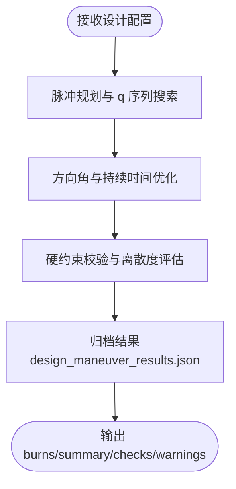

**图表来源**
- [design_maneuver_strategy.py:535-672](file://src/smart/services/design_maneuver_strategy.py#L535-L672)
- [project_workspace.py:277-298](file://src/smart/services/project_workspace.py#L277-L298)

**章节来源**
- [design_maneuver_strategy.py:535-672](file://src/smart/services/design_maneuver_strategy.py#L535-L672)
- [project_workspace.py:277-298](file://src/smart/services/project_workspace.py#L277-L298)

### 连续推力优化
- 责任：基于脉冲链路生成 5 次推力参数，联合优化尾段经度与倾角，满足持续时间与高度约束
- 价值：将脉冲方案转化为连续推力链路，提升工程可实现性与推进剂经济性
- 关键产物：ContinuousThrustOptimizationResult、orbit_history_rows

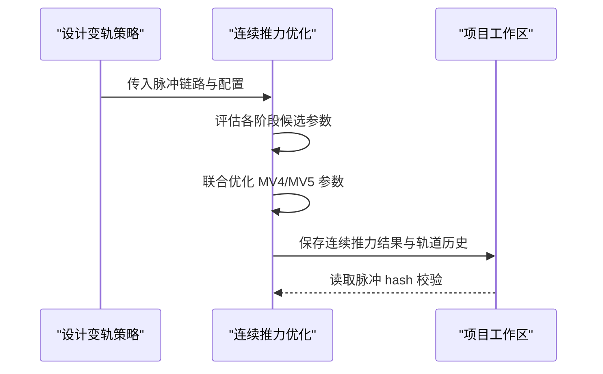

**图表来源**
- [design_maneuver_strategy.py:737-800](file://src/smart/services/design_maneuver_strategy.py#L737-L800)
- [design_continuous_thrust_optimizer.py:44-200](file://src/smart/services/design_continuous_thrust_optimizer.py#L44-L200)
- [project_workspace.py:300-330](file://src/smart/services/project_workspace.py#L300-L330)

**章节来源**
- [design_maneuver_strategy.py:737-800](file://src/smart/services/design_maneuver_strategy.py#L737-L800)
- [design_continuous_thrust_optimizer.py:44-200](file://src/smart/services/design_continuous_thrust_optimizer.py#L44-L200)
- [project_workspace.py:300-330](file://src/smart/services/project_workspace.py#L300-L330)

### 导入变轨策略
- 责任：将连续推力结果转换为工程变轨策略，生成 full_orbit_history.csv
- 价值：打通设计与工程环节，形成可复算的轨道历史
- 关键流程：参数映射、姿态采样、历史导出

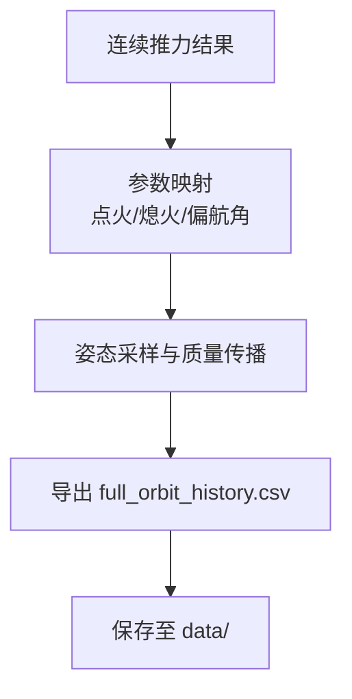

**图表来源**
- [design_maneuver_strategy.py:737-800](file://src/smart/services/design_maneuver_strategy.py#L737-L800)
- [project_workspace.py:269-276](file://src/smart/services/project_workspace.py#L269-L276)

**章节来源**
- [design_maneuver_strategy.py:737-800](file://src/smart/services/design_maneuver_strategy.py#L737-L800)
- [project_workspace.py:269-276](file://src/smart/services/project_workspace.py#L269-L276)

### 发射窗口分析
- 责任：以轨道历史为输入，结合测控与光照约束扫描发射窗口，生成样本与结果表
- 价值：量化发射时机可行性，支持甘特图与进度规划
- 关键流程：时间线构建、约束评估、窗口合并

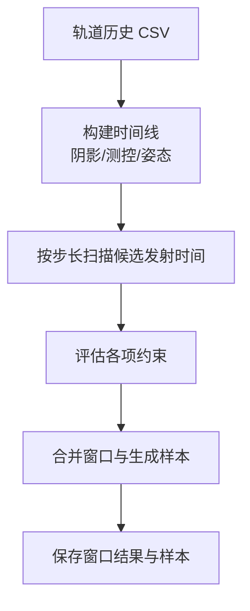

**图表来源**
- [launch_window.py:565-619](file://src/smart/services/launch_window.py#L565-L619)
- [launch_window.py:676-770](file://src/smart/services/launch_window.py#L676-L770)

**章节来源**
- [launch_window.py:565-619](file://src/smart/services/launch_window.py#L565-L619)
- [launch_window.py:676-770](file://src/smart/services/launch_window.py#L676-L770)

### 跟踪弧段分析
- 责任：围绕测控可见性、发射窗口与轨道历史生成可跟踪弧段结果
- 价值：直观展示地面/中继测控覆盖情况，支撑任务规划与资源调度
- 关键流程：测控资产配置、可见性判定、区间合并与统计

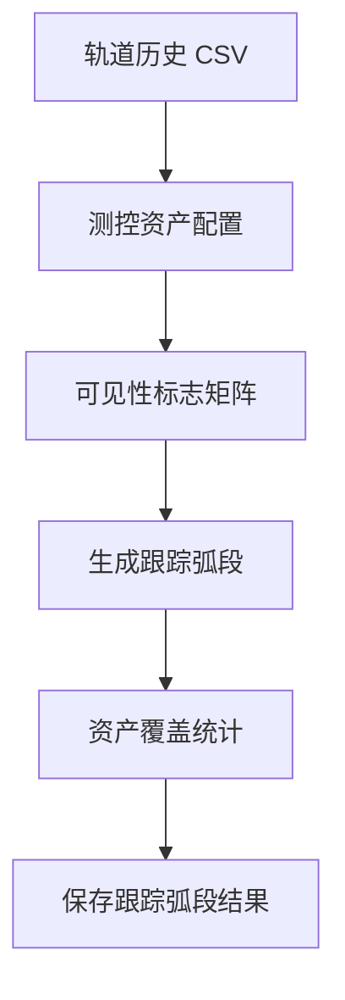

**图表来源**
- [tracking_arc.py:66-92](file://src/smart/services/tracking_arc.py#L66-L92)
- [tracking_arc.py:160-268](file://src/smart/services/tracking_arc.py#L160-L268)

**章节来源**
- [tracking_arc.py:66-92](file://src/smart/services/tracking_arc.py#L66-L92)
- [tracking_arc.py:160-268](file://src/smart/services/tracking_arc.py#L160-L268)

### 飞行程序设计
- 责任：复用变轨结果与 STK 联动数据，形成飞行程序参考段、事件表与时间线
- 价值：统一飞行程序描述，便于评审与执行
- 关键流程：姿态事件标注、时间区间划分、注释生成

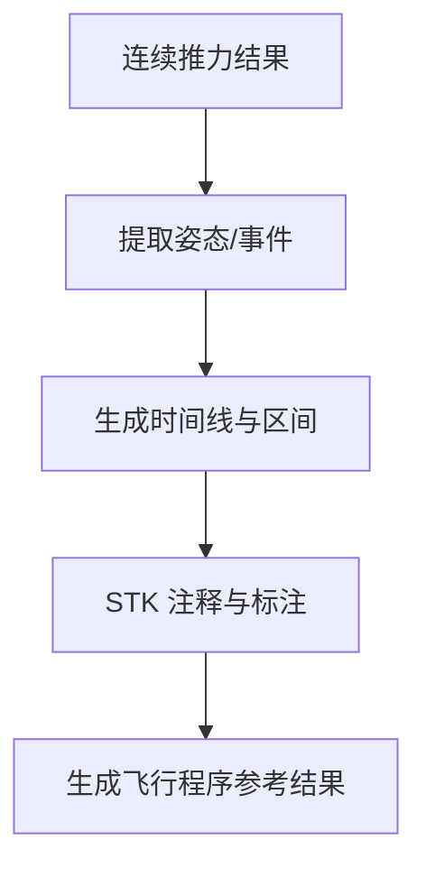

**图表来源**
- [stk_link.py:406-450](file://src/smart/services/stk_link.py#L406-L450)
- [project_workspace.py:386-396](file://src/smart/services/project_workspace.py#L386-L396)

**章节来源**
- [stk_link.py:406-450](file://src/smart/services/stk_link.py#L406-L450)
- [project_workspace.py:386-396](file://src/smart/services/project_workspace.py#L386-L396)

### STK 联动
- 责任：创建/同步 STK 场景，导入轨道/姿态/事件，设置图形与标注
- 价值：本地 STK 可视化与工程验证，支持报告导出
- 关键流程：COM/Socket 连接、场景建立、对象导入、图形设置

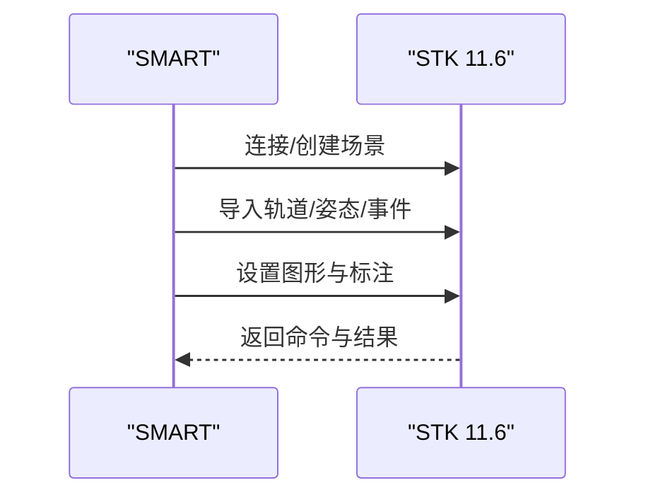

**图表来源**
- [stk_link.py:111-142](file://src/smart/services/stk_link.py#L111-L142)
- [stk_link.py:280-337](file://src/smart/services/stk_link.py#L280-L337)

**章节来源**
- [stk_link.py:111-142](file://src/smart/services/stk_link.py#L111-L142)
- [stk_link.py:280-337](file://src/smart/services/stk_link.py#L280-L337)

### SPICE 内核管理
- 责任：内核发现/加载/下载、UTC/ET 转换、坐标系变换、天体状态查询
- 价值：统一时间与坐标系处理，确保轨道与几何计算精度
- 关键流程：内核扫描、按需加载、状态查询

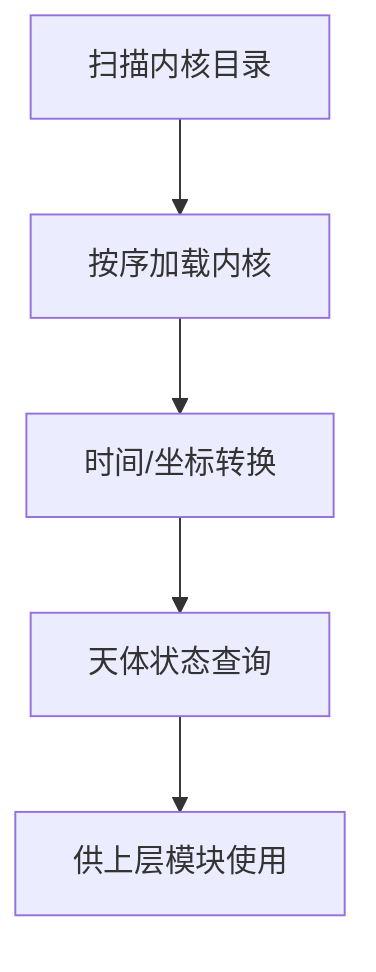

**图表来源**
- [spice_service.py:102-221](file://src/smart/services/spice_service.py#L102-L221)
- [spice_service.py:241-305](file://src/smart/services/spice_service.py#L241-L305)

**章节来源**
- [spice_service.py:102-221](file://src/smart/services/spice_service.py#L102-L221)
- [spice_service.py:241-305](file://src/smart/services/spice_service.py#L241-L305)

### AI 辅助解读
- 责任：基于项目上下文与技能文档，通过 LLM 生成工程解读与报告
- 价值：降低人工解读成本，提供报告式输出
- 关键流程：系统提示词渲染、工具调用、流式响应

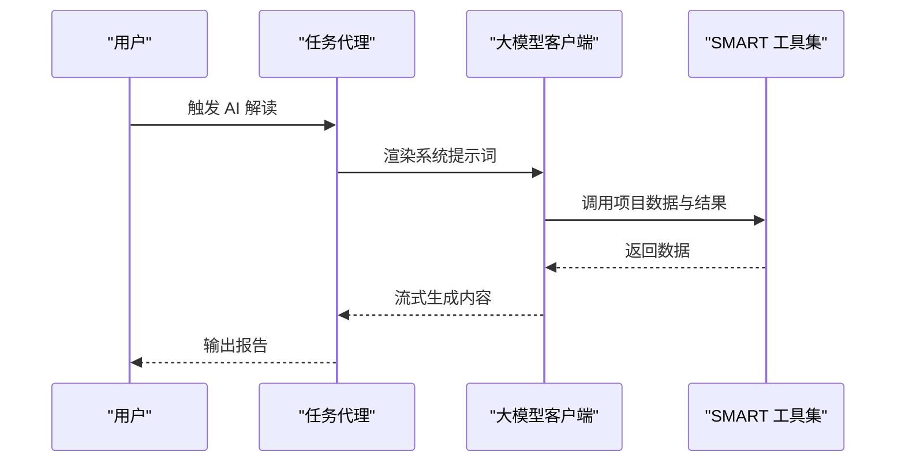

**图表来源**
- [mission_agent.py:145-240](file://src/smart/services/mission_agent.py#L145-L240)
- [llm_client.py:69-162](file://src/smart/services/llm_client.py#L69-L162)

**章节来源**
- [mission_agent.py:145-240](file://src/smart/services/mission_agent.py#L145-L240)
- [llm_client.py:69-162](file://src/smart/services/llm_client.py#L69-L162)

## 依赖分析
- 模块内聚与耦合
  - ProjectWorkspace 作为中心枢纽，被所有分析模块依赖，承担数据一致性与落盘职责
  - 设计变轨策略与连续推力优化存在强依赖（前者为后者提供脉冲链路）
  - 发射窗口与跟踪弧段均依赖轨道历史与测控资产配置
  - STK 联动依赖轨道历史与飞行程序配置，同时反向影响窗口与弧段的可视化
  - SPICE 作为底层服务被轨道初始化、发射窗口、跟踪弧段共享
- 外部依赖
  - STK 11.6：COM/Socket 接口用于场景与对象管理
  - SpiceyPy：SPICE 内核与时间/坐标转换
  - PySide6：桌面界面与控件
  - NumPy/pyqtgraph：数值计算与可视化

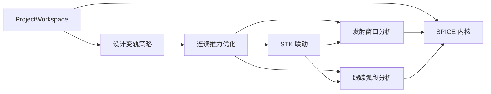

**图表来源**
- [project_workspace.py:64-116](file://src/smart/services/project_workspace.py#L64-L116)
- [design_maneuver_strategy.py:535-672](file://src/smart/services/design_maneuver_strategy.py#L535-L672)
- [design_continuous_thrust_optimizer.py:44-200](file://src/smart/services/design_continuous_thrust_optimizer.py#L44-L200)
- [launch_window.py:565-619](file://src/smart/services/launch_window.py#L565-L619)
- [tracking_arc.py:66-92](file://src/smart/services/tracking_arc.py#L66-L92)
- [stk_link.py:280-337](file://src/smart/services/stk_link.py#L280-L337)
- [spice_service.py:174-305](file://src/smart/services/spice_service.py#L174-L305)

**章节来源**
- [project_workspace.py:64-116](file://src/smart/services/project_workspace.py#L64-L116)
- [design_maneuver_strategy.py:535-672](file://src/smart/services/design_maneuver_strategy.py#L535-L672)
- [design_continuous_thrust_optimizer.py:44-200](file://src/smart/services/design_continuous_thrust_optimizer.py#L44-L200)
- [launch_window.py:565-619](file://src/smart/services/launch_window.py#L565-L619)
- [tracking_arc.py:66-92](file://src/smart/services/tracking_arc.py#L66-L92)
- [stk_link.py:280-337](file://src/smart/services/stk_link.py#L280-L337)
- [spice_service.py:174-305](file://src/smart/services/spice_service.py#L174-L305)

## 性能考虑
- 数值稳定性
  - 使用 J2 项与高阶摄动模型提升轨道传播精度
  - 连续推力积分采用分步细化策略，先粗后精
- 计算效率
  - 脉冲规划阶段采用多起点预筛选与局部优化，减少搜索空间
  - 发射窗口扫描按分钟步长并行化评估（建议在 UI 层异步执行）
- I/O 与缓存
  - 轨道历史 CSV 作为中间结果缓存，避免重复计算
  - 项目工作区对配置与结果进行哈希校验，防止过期数据污染
- 可视化
  - OpenGL 与 pyqtgraph 结合，确保 2D/3D 轨道视图流畅

## 故障排查指南
- SPICE 相关
  - 症状：无法进行时间/坐标转换
  - 排查：确认内核目录与文件名后缀符合要求；检查内核是否成功加载
- STK 联动
  - 症状：连接失败或命令无响应
  - 排查：确认 STK 11.6 已安装且可访问；检查 COM/Socket 端口；查看返回的命令列表
- 发射窗口/跟踪弧段
  - 症状：窗口为空或弧段缺失
  - 排查：检查轨道历史是否为空；确认测控资产配置正确；核对约束阈值
- 项目数据
  - 症状：重新打开项目后结果丢失
  - 排查：确认 config/*.json 与 data/*.csv 是否存在；检查工作区路径与权限

**章节来源**
- [spice_service.py:174-305](file://src/smart/services/spice_service.py#L174-L305)
- [stk_link.py:111-142](file://src/smart/services/stk_link.py#L111-L142)
- [launch_window.py:565-619](file://src/smart/services/launch_window.py#L565-L619)
- [tracking_arc.py:66-92](file://src/smart/services/tracking_arc.py#L66-L92)
- [project_workspace.py:277-330](file://src/smart/services/project_workspace.py#L277-L330)

## 结论
SMART 通过“项目工作区 + 服务层 + UI 层”的分层架构，将轨道初始化、设计变轨、连续推力优化、发射窗口与跟踪弧段、飞行程序设计、STK 联动与 SPICE 内核管理整合为统一工作流。项目已实现从设计到可视化的闭环能力，具备良好的扩展性与工程复用价值。建议后续继续完善约束校验、结果版本控制与端到端验收流程。

## 附录
- 快速开始与运行脚本参见项目根目录说明
- 功能文档与技术细节可在 doc 目录查阅

**章节来源**
- [README.md:82-204](file://README.md#L82-L204)