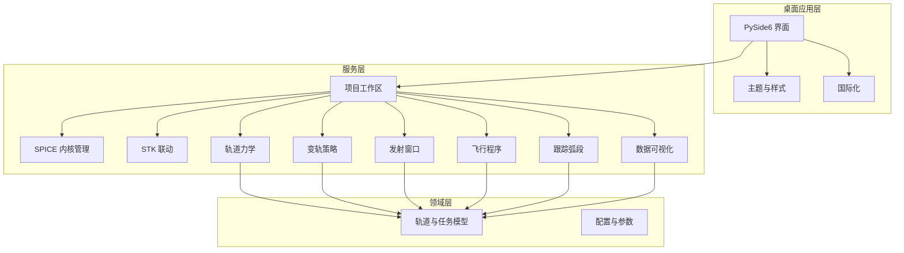
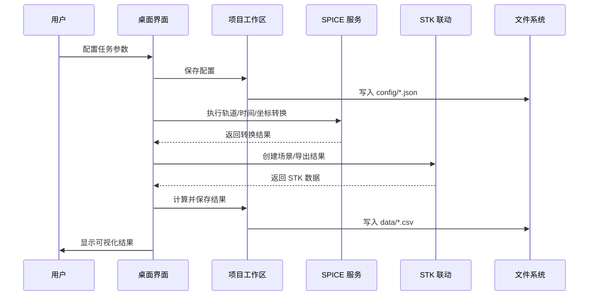
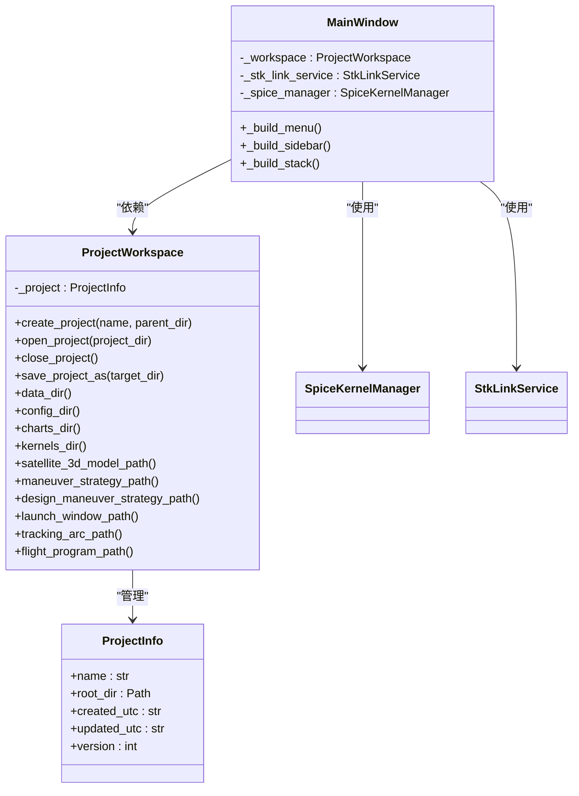
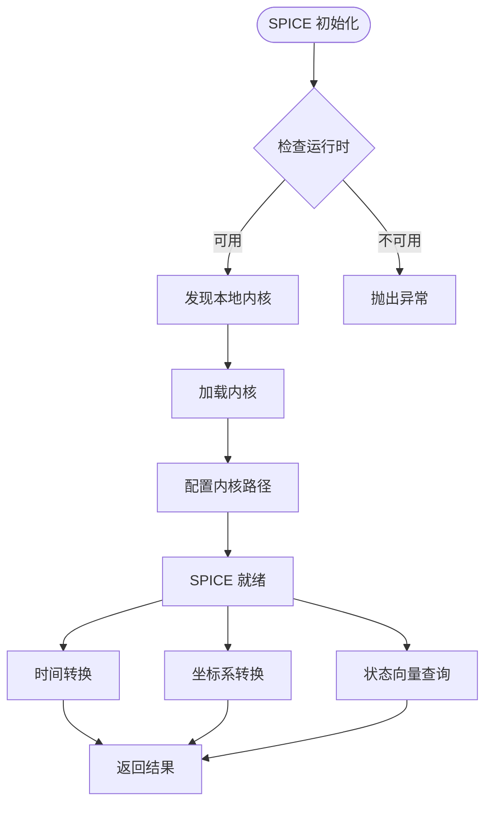
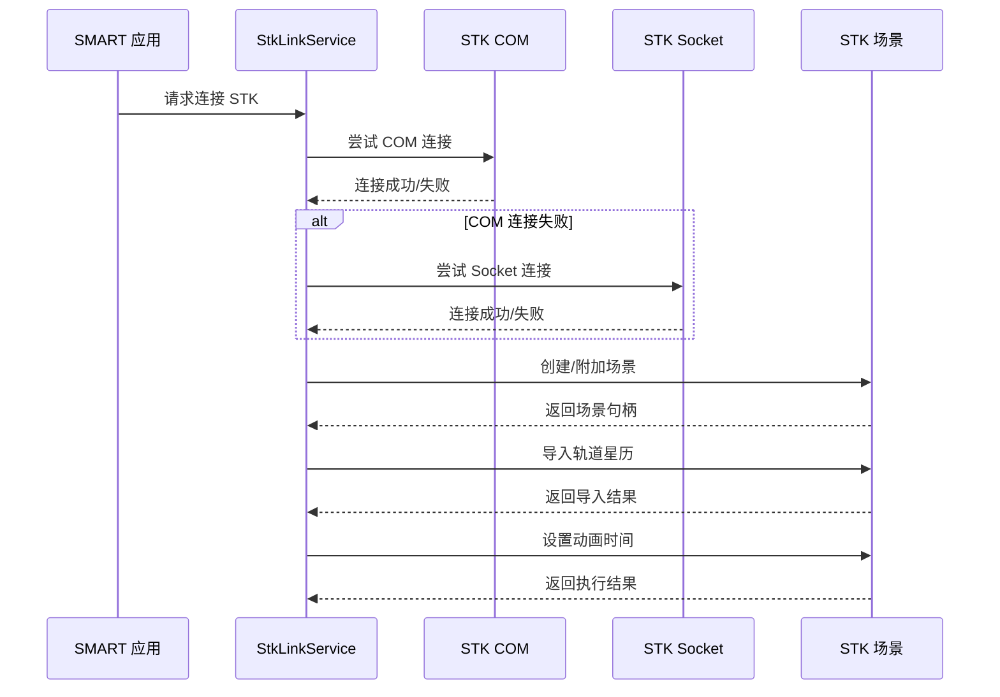
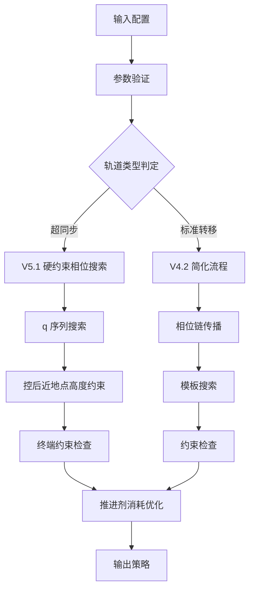
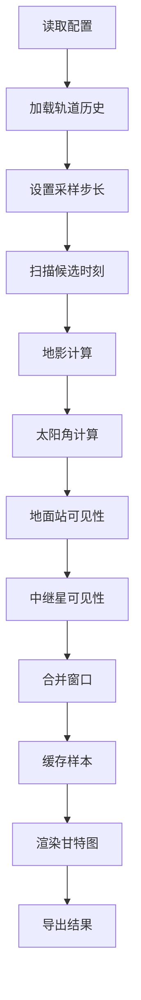
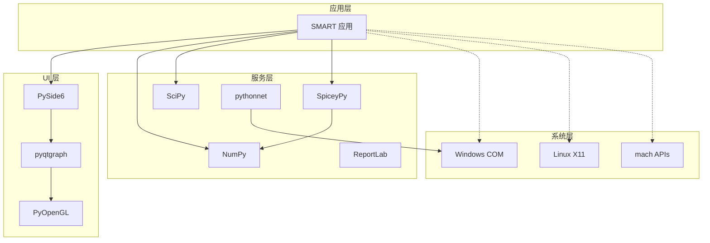

# 项目介绍

<cite>
**本文引用的文件**
- [README.md](file://README.md)
- [AGENTS.md](file://AGENTS.md)
- [HANDOFF.md](file://HANDOFF.md)
- [updates.md](file://updates.md)
- [src/smart/__init__.py](file://src/smart/__init__.py)
- [src/smart/main.py](file://src/smart/main.py)
- [src/smart/services/project_workspace.py](file://src/smart/services/project_workspace.py)
- [src/smart/services/spice_service.py](file://src/smart/services/spice_service.py)
- [src/smart/services/stk_link.py](file://src/smart/services/stk_link.py)
- [src/smart/ui/main_window.py](file://src/smart/ui/main_window.py)
- [doc/design_maneuver_pulse_planning_algorithm.md](file://doc/design_maneuver_pulse_planning_algorithm.md)
- [doc/launch_window_workflow.md](file://doc/launch_window_workflow.md)
- [doc/spice_usage.md](file://doc/spice_usage.md)
- [pyproject.toml](file://pyproject.toml)
</cite>

## 目录
1. [引言](#引言)
2. [项目结构](#项目结构)
3. [核心组件](#核心组件)
4. [架构总览](#架构总览)
5. [详细组件分析](#详细组件分析)
6. [依赖关系分析](#依赖关系分析)
7. [性能考量](#性能考量)
8. [故障排查指南](#故障排查指南)
9. [结论](#结论)
10. [附录](#附录)

## 引言
SMART 全称为 Spacecraft Mission Analysis, Research & Toolkit，是一个面向航天任务设计与工程分析的桌面软件。项目围绕 STK 11.6 + SPICE + PySide6 构建统一工作流，旨在解决传统任务分析中多工具切换、时间与坐标系转换易错、结果留痕分散等问题。

SMART 的目标不是单独替代 STK 或 SPICE，而是把任务建模、约束分析、图形验证、结果导出和工程说明收敛到一个可复用、可追溯的桌面分析环境中：
- UI 层统一以北京时间配置任务参数，降低人工换算成本
- 服务层优先复用 SPICE 与本地 STK 11.6 能力，减少手写公式漂移
- 图形验证基于本地桌面绘图与 OpenGL 轨道视图运行
- 项目结果按 config / data / charts 结构自动沉淀，便于复算和交接
- AI 分析页只读取摘要上下文做辅助说明，不直接修改任务配置

## 项目结构
SMART 采用清晰的分层架构，主要分为三层：
- UI 层：PySide6 实现的桌面界面，负责交互与可视化
- 服务层：基于 SPICE/STK 的数值计算与数据服务
- 领域层：任务与轨道的领域模型与算法实现

项目采用模块化组织方式，核心目录结构如下：
- src/smart/domain/：任务与轨道领域模型
- src/smart/services/：动力学计算与 SPICE 服务
- src/smart/ui/：桌面界面与控件
- data/kernels/：本地 SPICE 内核
- doc/：算法与工作流文档
- projects/：项目工程数据与结果

**图表来源**
- [src/smart/ui/main_window.py:53-137](file://src/smart/ui/main_window.py#L53-L137)
- [src/smart/services/project_workspace.py:64-127](file://src/smart/services/project_workspace.py#L64-L127)
- [src/smart/services/spice_service.py:174-200](file://src/smart/services/spice_service.py#L174-L200)

**章节来源**
- [README.md:187-196](file://README.md#L187-L196)

## 核心组件
SMART 的核心能力覆盖从轨道设计到工程交付的完整链路：

### 任务管理与工作区
- 项目创建与持久化：自动创建 config/data/charts 目录结构
- 配置文件管理：卫星3D模型、设计变轨策略、导入变轨策略、发射窗口、跟踪弧段、飞行程序等
- 数据落盘：轨道元素、设计结果、连续推力结果、轨道历史、样本缓存等

### 轨道与动力学
- 轨道初始化：经典轨道根数、TLE、STK .e 星历导入
- SPICE 集成：内核自动发现与加载、UTC/ET 转换、坐标系转换、天体状态查询
- 轨道力学：两体/J2 传播、轨道根数与状态向量转换

### 变轨策略设计
- 脉冲规划：V5.1 硬约束相位搜索，q 序列、控后近地点目标、终端经度/倾角约束
- 连续推力：基于脉冲规划的 5 次连续推力参数优化
- 导入策略：将设计结果引入工程变轨页面

### 发射窗口分析
- 约束扫描：地影、太阳角、地面站可见性、中继星可见性
- 窗口合并：连续通过样本合并为发射窗口
- 结果输出：样本缓存、结果表、甘特图

### 飞行程序设计
- 参考段生成：基于变轨结果和 STK 联动数据
- 事件表与时间线：飞行程序参考结果

### STK 联动
- 场景创建：对象创建、轨道/姿态/图形标注
- 结果导出：轨道星历、姿态文件、事件标注

### 数据可视化
- 2D/3D 轨道视图
- 科学曲线与结果图表

**章节来源**
- [README.md:32-47](file://README.md#L32-L47)
- [README.md:125-152](file://README.md#L125-L152)

## 架构总览
SMART 采用分层架构，通过服务层统一抽象底层复杂性，UI 层专注于用户体验。核心架构特点：

### 技术栈
- GUI：PySide6 (Qt 6)
- 数值计算：NumPy、SciPy
- 2D 绘图：pyqtgraph
- 3D 轨道视图：pyqtgraph OpenGL + PyOpenGL
- 星历与 SPICE：SpiceyPy
- 其他：pythonnet (Windows COM)、reportlab (PDF)

### 工作流架构

**图表来源**
- [src/smart/services/project_workspace.py:82-116](file://src/smart/services/project_workspace.py#L82-L116)
- [src/smart/services/spice_service.py:174-200](file://src/smart/services/spice_service.py#L174-L200)
- [src/smart/services/stk_link.py:199-250](file://src/smart/services/stk_link.py#L199-L250)

**章节来源**
- [pyproject.toml:11-22](file://pyproject.toml#L11-L22)
- [README.md:48-55](file://README.md#L48-L55)

## 详细组件分析

### 项目工作区组件
项目工作区是整个系统的数据中枢，负责项目生命周期管理：

**图表来源**
- [src/smart/services/project_workspace.py:64-127](file://src/smart/services/project_workspace.py#L64-L127)
- [src/smart/ui/main_window.py:53-137](file://src/smart/ui/main_window.py#L53-L137)

项目工作区的关键特性：
- 自动目录结构：config/data/charts/kernels 四大目录
- 配置文件标准化：统一的 JSON 配置格式
- 数据落盘策略：按模块分类存储中间结果
- 版本管理：自动更新项目元数据

**章节来源**
- [src/smart/services/project_workspace.py:82-116](file://src/smart/services/project_workspace.py#L82-L116)
- [src/smart/services/project_workspace.py:174-200](file://src/smart/services/project_workspace.py#L174-L200)

### SPICE 集成组件
SPICE 服务提供统一的星历与坐标转换能力：

**图表来源**
- [src/smart/services/spice_service.py:174-200](file://src/smart/services/spice_service.py#L174-L200)
- [src/smart/services/spice_service.py:91-117](file://src/smart/services/spice_service.py#L91-L117)

SPICE 服务的核心能力：
- 内核自动发现与加载：支持多种内核格式
- UTC/ET 转换：标准时间处理
- 坐标系转换：位置/速度向量转换
- 天体状态查询：目标相对观测体状态

**章节来源**
- [src/smart/services/spice_service.py:50-76](file://src/smart/services/spice_service.py#L50-L76)
- [src/smart/services/spice_service.py:174-200](file://src/smart/services/spice_service.py#L174-L200)

### STK 联动组件
STK 联动服务实现 SMART 与 STK 11.6 的无缝集成：

**图表来源**
- [src/smart/services/stk_link.py:111-142](file://src/smart/services/stk_link.py#L111-L142)
- [src/smart/services/stk_link.py:144-167](file://src/smart/services/stk_link.py#L144-L167)

STK 联动的关键特性：
- 多连接模式：COM 优先，Socket 备用
- 场景管理：自动创建或附加现有场景
- 数据交换：轨道星历导入、姿态文件导出
- 实时同步：动画时间与飞行程序同步

**章节来源**
- [src/smart/services/stk_link.py:57-109](file://src/smart/services/stk_link.py#L57-L109)
- [src/smart/services/stk_link.py:199-250](file://src/smart/services/stk_link.py#L199-L250)

### 变轨策略设计组件
变轨策略设计是 SMART 的核心算法模块，支持脉冲规划和连续推力优化：

**图表来源**
- [doc/design_maneuver_pulse_planning_algorithm.md:10-17](file://doc/design_maneuver_pulse_planning_algorithm.md#L10-L17)

变轨策略的关键算法：
- V5.1 硬约束相位搜索：q 序列、控后近地点高度、终端约束
- V4.2 简化流程：相位链传播、模板搜索
- 连续推力优化：基于脉冲规划的 5 次推力参数优化

**章节来源**
- [doc/design_maneuver_pulse_planning_algorithm.md:1-200](file://doc/design_maneuver_pulse_planning_algorithm.md#L1-L200)

### 发射窗口分析组件
发射窗口分析组件提供完整的发射窗口计算与可视化：

**图表来源**
- [doc/launch_window_workflow.md:5-17](file://doc/launch_window_workflow.md#L5-L17)

发射窗口分析的核心流程：
- 样本缓存：data/launch_window_samples.csv
- 结果表：data/launch_window_results.csv
- 甘特图：可视化约束通过情况
- 性能优化：NumPy 向量化、节流刷新

**章节来源**
- [doc/launch_window_workflow.md:1-117](file://doc/launch_window_workflow.md#L1-L117)

## 依赖关系分析
SMART 的依赖关系呈现典型的分层依赖模式：

**图表来源**
- [pyproject.toml:11-22](file://pyproject.toml#L11-L22)

依赖管理特点：
- 核心依赖集中在数值计算与 GUI
- SPICE 作为可选依赖，提供标准天文计算能力
- STK 联动通过 COM/Socket 实现跨平台兼容
- 报告生成功能支持 PDF 输出

**章节来源**
- [pyproject.toml:1-50](file://pyproject.toml#L1-L50)

## 性能考量
SMART 在多个层面进行了性能优化：

### 计算性能
- SPICE 内核缓存：避免重复加载与解析
- NumPy 向量化：发射窗口分析中的批量计算
- LRU 缓存：地球定向计算的重复利用
- 低阶优化：RK4 积分的热点路径优化

### UI 性能
- 滚动区域：避免窗口几何警告
- 节流刷新：进度条更新频率控制
- 异步操作：STK 联动使用后台线程
- 资源管理：及时释放图形资源

### 存储性能
- 分层存储：config/data/charts 分离
- 增量更新：只更新变更内容
- 压缩格式：CSV 文件的高效存储

## 故障排查指南
针对 SMART 常见问题提供系统化的排查方法：

### SPICE 相关问题
- 内核加载失败：检查 data/kernels/ 目录结构
- 时间转换错误：验证 UTC/ET 格式与精度
- 坐标系转换异常：确认参考系名称正确性

### STK 联动问题
- COM 连接失败：检查 STK 11.6 是否正确安装
- Socket 连接超时：验证端口配置与防火墙设置
- 场景创建失败：检查权限与路径有效性

### 性能问题
- 计算缓慢：检查 NumPy 向量化实现
- UI 卡顿：确认进度条节流机制
- 内存泄漏：验证资源释放时机

**章节来源**
- [AGENTS.md:31-42](file://AGENTS.md#L31-L42)
- [AGENTS.md:100-111](file://AGENTS.md#L100-L111)

## 结论
SMART 项目通过构建 STK 11.6 + SPICE + PySide6 的统一工作流，有效解决了传统航天任务分析中的痛点问题。项目不仅提供了完整的桌面分析环境，更重要的是建立了一套可复用、可追溯的工程化流程。

项目的核心价值体现在：
- **工程化集成**：将多工具切换简化为单一工作流
- **标准化流程**：从轨道设计到工程交付的完整链路
- **可追溯性**：项目化数据沉淀，便于复算与交接
- **可扩展性**：模块化架构支持功能扩展与定制

随着项目的持续演进，SMART 将在航天任务分析领域发挥越来越重要的作用，为工程实践提供强有力的技术支撑。

## 附录

### 应用场景
SMART 适用于以下应用场景：
- 航天器轨道设计与优化
- 发射窗口分析与选择
- 飞行程序制定与验证
- 测控资源规划与分配
- 任务风险评估与分析

### 用户群体
- 航天器设计师
- 飞行程序工程师
- 发射场工程师
- 任务分析师
- 研究人员

### 实际价值
- **效率提升**：减少工具切换时间，提高分析效率
- **质量保证**：统一的计算流程减少人为错误
- **知识传承**：项目化数据沉淀便于经验积累
- **成本控制**：降低重复计算与返工成本

**章节来源**
- [README.md:22-31](file://README.md#L22-L31)
- [updates.md:1-20](file://updates.md#L1-L20)