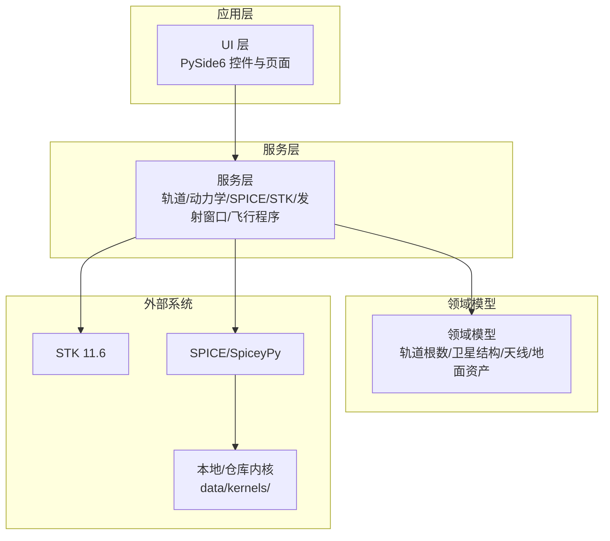
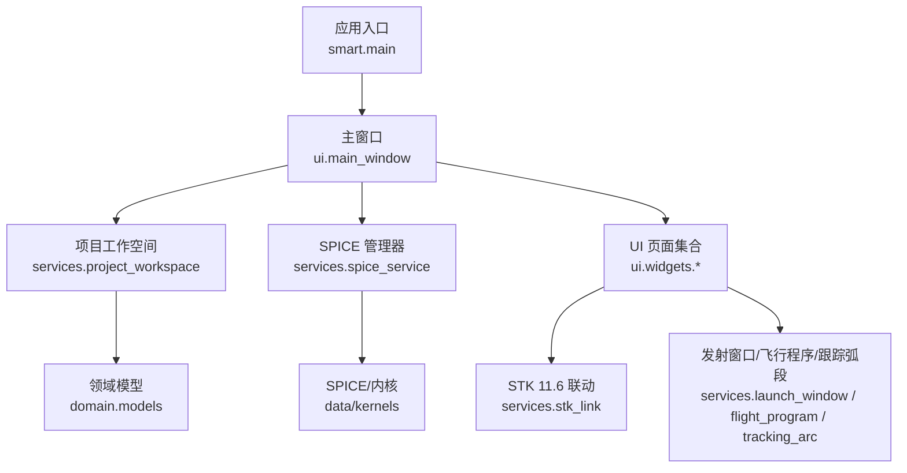
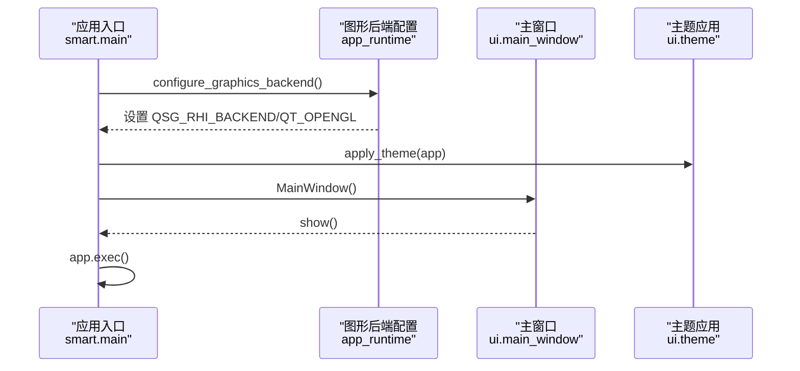
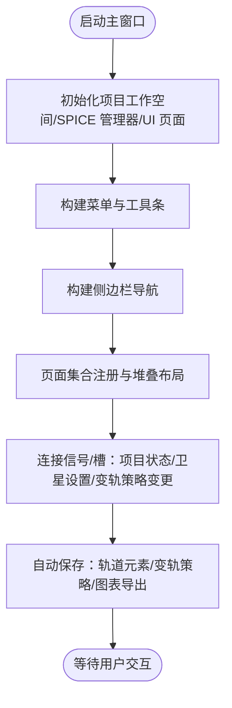
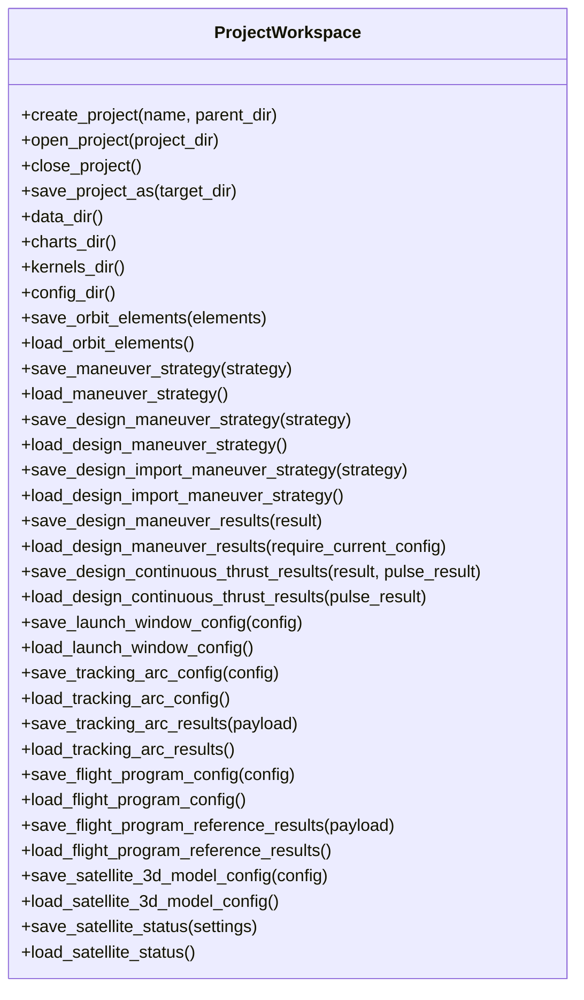
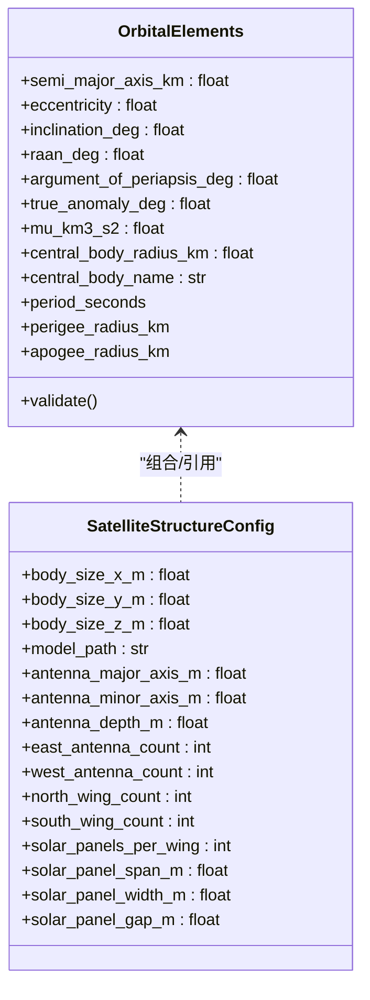
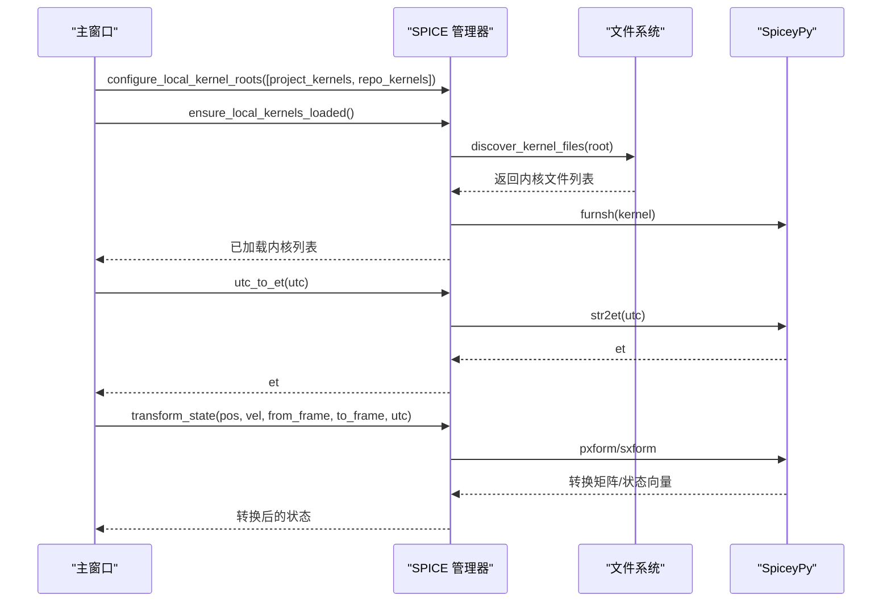
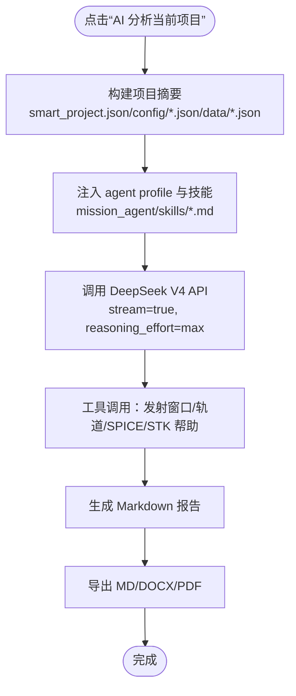
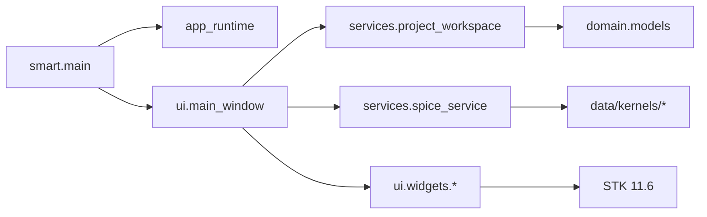

# 项目概述

<cite>
**本文引用的文件**
- [README.md](file://README.md)
- [updates.md](file://updates.md)
- [pyproject.toml](file://pyproject.toml)
- [AGENTS.md](file://AGENTS.md)
- [src/smart/main.py](file://src/smart/main.py)
- [src/smart/app_runtime.py](file://src/smart/app_runtime.py)
- [src/smart/ui/main_window.py](file://src/smart/ui/main_window.py)
- [src/smart/services/project_workspace.py](file://src/smart/services/project_workspace.py)
- [src/smart/domain/models.py](file://src/smart/domain/models.py)
- [src/smart/services/spice_service.py](file://src/smart/services/spice_service.py)
- [doc/spice_usage.md](file://doc/spice_usage.md)
- [doc/ai_project_analysis.md](file://doc/ai_project_analysis.md)
</cite>

## 目录
1. [引言](#引言)
2. [项目结构](#项目结构)
3. [核心组件](#核心组件)
4. [架构总览](#架构总览)
5. [详细组件分析](#详细组件分析)
6. [依赖关系分析](#依赖关系分析)
7. [性能考虑](#性能考虑)
8. [故障排查指南](#故障排查指南)
9. [结论](#结论)
10. [附录](#附录)

## 引言
SMART 全称为“Spacecraft Mission Analysis, Research & Toolkit”，是一个面向航天任务设计与工程分析的桌面软件。项目围绕“STK 11.6 + SPICE + PySide6”构建统一工作流，旨在解决传统任务分析中多工具切换、时间与坐标系转换易错、结果留痕分散等问题。当前仓库提供可运行的桌面工程原型，覆盖项目管理、卫星3D模型配置、轨道初始化、设计变轨策略、连续推力参数优化、导入变轨策略、发射窗口计算、跟踪弧段分析、飞行程序设计、STK 联动、SPICE 内核管理、项目化数据落盘和 AI 辅助项目解读等核心链路。

SMART 的目标不是单独替代 STK 或 SPICE，而是把任务建模、约束分析、图形验证、结果导出和工程说明收敛到一个可复用、可追溯的桌面分析环境中：
- UI 层统一以北京时间配置任务参数，降低人工换算成本
- 服务层优先复用 SPICE 与本地 STK 11.6 能力，减少手写公式漂移
- 图形验证基于本地桌面绘图与 OpenGL 轨道视图运行
- 项目结果按 config / data / charts 结构自动沉淀，便于复算和交接
- AI 分析页只读取摘要上下文做辅助说明，不直接修改任务配置

## 项目结构
SMART 采用分层与模块化的组织方式，核心目录与职责如下：
- src/smart/domain/：任务与轨道领域模型，定义轨道根数、天线/地面资产、卫星结构等数据结构
- src/smart/services/：动力学计算与 SPICE 服务，提供轨道传播、SPICE 内核管理、发射窗口、飞行程序、STK 联动等服务
- src/smart/ui/：桌面界面与控件，包含仪表板、设计变轨策略、导入变轨策略、发射窗口、跟踪弧段、飞行程序、数据可视化、STK 联动、SPICE 内核管理、AI 项目分析等页面
- data/kernels/：本地 SPICE 内核
- tests/：数值与功能测试
- doc/：算法与工作流文档，如发射窗口工作流、SPICE 使用说明、AI 项目分析说明等
- scripts/：开发与运行脚本，如安装依赖、启动应用、测试、安装 Git hooks 等

**图表来源**
- [src/smart/ui/main_window.py:53-125](file://src/smart/ui/main_window.py#L53-L125)
- [src/smart/services/project_workspace.py:64-116](file://src/smart/services/project_workspace.py#L64-L116)
- [src/smart/services/spice_service.py:174-305](file://src/smart/services/spice_service.py#L174-L305)

**章节来源**
- [README.md:187-196](file://README.md#L187-L196)

## 核心组件
- 主入口与应用生命周期
  - 应用入口位于 [src/smart/main.py](file://src/smart/main.py)，负责初始化图形后端、主题、窗口与事件循环
  - 图形后端配置在 [src/smart/app_runtime.py](file://src/smart/app_runtime.py)，确保 Qt Quick/QML 与 QWidget 的渲染 API 一致，避免混合 D3D11 与 OpenGL 导致的兼容问题
- 主窗口与导航
  - 主窗口 [src/smart/ui/main_window.py](file://src/smart/ui/main_window.py) 负责项目管理、侧边栏导航、页面切换、最近项目、菜单与工具条、SPICE 内核设置入口等
- 项目工作空间
  - 项目工作空间 [src/smart/services/project_workspace.py](file://src/smart/services/project_workspace.py) 提供项目创建、打开、关闭、保存、路径管理、配置与数据落盘、结果缓存一致性校验等
- 领域模型
  - 领域模型 [src/smart/domain/models.py](file://src/smart/domain/models.py) 定义轨道根数、轨道轨迹、卫星结构与天线/地面资产等核心数据结构
- SPICE 服务
  - SPICE 服务 [src/smart/services/spice_service.py](file://src/smart/services/spice_service.py) 提供内核发现与加载、UTC/ET 转换、位置/状态向量参考系转换、天体状态向量查询等接口

**章节来源**
- [src/smart/main.py:10-31](file://src/smart/main.py#L10-L31)
- [src/smart/app_runtime.py:31-90](file://src/smart/app_runtime.py#L31-L90)
- [src/smart/ui/main_window.py:53-136](file://src/smart/ui/main_window.py#L53-L136)
- [src/smart/services/project_workspace.py:64-116](file://src/smart/services/project_workspace.py#L64-L116)
- [src/smart/domain/models.py:17-255](file://src/smart/domain/models.py#L17-L255)
- [src/smart/services/spice_service.py:174-305](file://src/smart/services/spice_service.py#L174-L305)

## 架构总览
SMART 的架构以“桌面应用 + 服务层 + 领域模型 + 外部系统集成”的方式组织，强调：
- 统一工作流：STK 11.6 + SPICE + PySide6 的组合，避免多工具切换
- 可追溯性：所有结果按 config / data / charts 结构落盘，支持复算与交接
- 可扩展性：服务层抽象轨道/动力学/可视化/联动等能力，UI 层专注交互与呈现
- 安全边界：AI 分析页只读摘要上下文，不直接修改任务配置

**图表来源**
- [src/smart/main.py:10-31](file://src/smart/main.py#L10-L31)
- [src/smart/ui/main_window.py:53-125](file://src/smart/ui/main_window.py#L53-L125)
- [src/smart/services/project_workspace.py:64-116](file://src/smart/services/project_workspace.py#L64-L116)
- [src/smart/services/spice_service.py:174-305](file://src/smart/services/spice_service.py#L174-L305)

## 详细组件分析

### 应用入口与图形后端
- 应用入口负责初始化图形后端、主题、窗口图标与事件循环
- 图形后端配置强制 Qt Quick 与 QWidget 使用相同的渲染 API，避免混合 D3D11 与 OpenGL 导致的兼容问题；同时支持多种后端（SwiftShader、D3D11、Desktop），并可通过环境变量控制

**图表来源**
- [src/smart/main.py:10-31](file://src/smart/main.py#L10-L31)
- [src/smart/app_runtime.py:31-90](file://src/smart/app_runtime.py#L31-L90)

**章节来源**
- [src/smart/main.py:10-31](file://src/smart/main.py#L10-L31)
- [src/smart/app_runtime.py:31-90](file://src/smart/app_runtime.py#L31-L90)

### 主窗口与导航
- 主窗口负责项目管理（新建/打开/保存/关闭）、侧边栏导航、菜单与工具条、最近项目、SPICE 内核设置入口、页面切换与状态同步
- 项目激活时自动加载轨道元素、卫星3D模型配置、各页面结果；关闭项目时清理并重置 SPICE 工作区

**图表来源**
- [src/smart/ui/main_window.py:53-136](file://src/smart/ui/main_window.py#L53-L136)
- [src/smart/ui/main_window.py:534-580](file://src/smart/ui/main_window.py#L534-L580)
- [src/smart/ui/main_window.py:618-660](file://src/smart/ui/main_window.py#L618-L660)

**章节来源**
- [src/smart/ui/main_window.py:53-136](file://src/smart/ui/main_window.py#L53-L136)
- [src/smart/ui/main_window.py:534-580](file://src/smart/ui/main_window.py#L534-L580)
- [src/smart/ui/main_window.py:618-660](file://src/smart/ui/main_window.py#L618-L660)

### 项目工作空间
- 项目工作空间负责项目生命周期管理：创建、打开、关闭、保存为新项目；管理 config/data/charts 目录；提供配置与数据落盘；进行结果缓存一致性校验（通过哈希）
- 提供大量文件路径常量与读写接口，确保项目结果可追溯与可复算

**图表来源**
- [src/smart/services/project_workspace.py:64-414](file://src/smart/services/project_workspace.py#L64-L414)

**章节来源**
- [src/smart/services/project_workspace.py:64-414](file://src/smart/services/project_workspace.py#L64-L414)

### 领域模型
- 领域模型定义了轨道根数、轨道轨迹、卫星结构与天线/地面资产等核心数据结构，提供基本的轨道参数计算与校验
- 例如轨道根数校验确保半长轴大于中心体半径、离心率满足椭圆条件、近地点高于中心体表面等

**图表来源**
- [src/smart/domain/models.py:17-255](file://src/smart/domain/models.py#L17-L255)

**章节来源**
- [src/smart/domain/models.py:17-255](file://src/smart/domain/models.py#L17-L255)

### SPICE 服务
- SPICE 服务提供内核发现与加载、UTC/ET 转换、位置/状态向量参考系转换、天体状态向量查询等接口
- 默认优先使用本地内核目录（项目 data/kernels 与仓库 data/kernels），支持自动加载与去重
- 对于 STK .e 星历导入，支持惯性系直接使用，地固系需通过 SPICE 转换到 J2000

**图表来源**
- [src/smart/ui/main_window.py:581-599](file://src/smart/ui/main_window.py#L581-L599)
- [src/smart/services/spice_service.py:174-305](file://src/smart/services/spice_service.py#L174-L305)
- [doc/spice_usage.md:54-96](file://doc/spice_usage.md#L54-L96)

**章节来源**
- [src/smart/services/spice_service.py:174-305](file://src/smart/services/spice_service.py#L174-L305)
- [doc/spice_usage.md:54-96](file://doc/spice_usage.md#L54-L96)

### AI 项目分析页面
- AI 项目分析页面通过大语言模型分析当前项目的配置与数据，内置“SMART 航天器任务分析专家”agent profile，支持工具调用（如发射窗口扫描、轨道根数/状态矢量/SPICE 转换、曲线/CSV/甘特图解释等）
- 页面以“分析提示词”为中心，支持模板选择与技能选择，报告以 Markdown/DOCX/PDF 导出
- 严格的安全边界：不直接上传二进制文件、不发送完整大 CSV、不写入 API key 到项目配置

**图表来源**
- [doc/ai_project_analysis.md:1-103](file://doc/ai_project_analysis.md#L1-L103)

**章节来源**
- [doc/ai_project_analysis.md:1-103](file://doc/ai_project_analysis.md#L1-L103)

## 依赖关系分析
SMART 的依赖关系体现为“应用入口依赖图形后端配置与 UI”，“UI 依赖服务层”，“服务层依赖领域模型与外部系统（STK/SPICE）”，“SPICE 依赖本地内核”。

**图表来源**
- [src/smart/main.py:10-31](file://src/smart/main.py#L10-L31)
- [src/smart/ui/main_window.py:53-125](file://src/smart/ui/main_window.py#L53-L125)
- [src/smart/services/project_workspace.py:64-116](file://src/smart/services/project_workspace.py#L64-L116)
- [src/smart/services/spice_service.py:174-305](file://src/smart/services/spice_service.py#L174-L305)

**章节来源**
- [pyproject.toml:11-22](file://pyproject.toml#L11-L22)

## 性能考虑
- 图形后端一致性：通过强制 QSG_RHI_BACKEND=opengl 与 QT_OPENGL=desktop，避免 D3D11 与 OpenGL 混合导致的黑屏或合成错误
- 向量化计算：发射窗口等性能敏感环节建议使用 NumPy 向量化，避免逐样本 Qt processEvents 调用
- 内核加载策略：SPICE 内核按文件名去重，优先保留项目级内核，减少重复加载
- 自动保存与缓存：项目结果按结构化目录落盘，支持缓存一致性校验（哈希），避免重复计算

[本节为通用指导，无需特定文件分析]

## 故障排查指南
- 图形后端错误
  - 症状：Qt Quick/WebView 相关错误，提示顶层窗口未使用预期图形 API
  - 处理：确保在应用启动时调用图形后端配置，保持 QSG_RHI_BACKEND=opengl 与 QT_OPENGL=desktop
  - 参考：[src/smart/app_runtime.py:31-90](file://src/smart/app_runtime.py#L31-90)
- SPICE 不可用
  - 症状：提示 SpiceyPy 未安装或内核未加载
  - 处理：安装依赖并在主窗口中加载本地内核；确认 data/kernels/ 下存在必要内核
  - 参考：[src/smart/services/spice_service.py:174-305](file://src/smart/services/spice_service.py#L174-L305)、[doc/spice_usage.md:54-96](file://doc/spice_usage.md#L54-L96)
- 项目路径与权限
  - 症状：保存/打开项目失败或目录不存在
  - 处理：确认项目目录存在且为空；检查权限；使用“保存为”创建新项目
  - 参考：[src/smart/ui/main_window.py:370-504](file://src/smart/ui/main_window.py#L370-504)
- 最近项目失效
  - 症状：最近项目列表中出现不存在的项目
  - 处理：打开项目时会自动清理无效路径；可在设置中查看 recent_projects
  - 参考：[src/smart/ui/main_window.py:712-758](file://src/smart/ui/main_window.py#L712-758)

**章节来源**
- [src/smart/app_runtime.py:31-90](file://src/smart/app_runtime.py#L31-L90)
- [src/smart/services/spice_service.py:174-305](file://src/smart/services/spice_service.py#L174-L305)
- [doc/spice_usage.md:54-96](file://doc/spice_usage.md#L54-L96)
- [src/smart/ui/main_window.py:370-504](file://src/smart/ui/main_window.py#L370-L504)
- [src/smart/ui/main_window.py:712-758](file://src/smart/ui/main_window.py#L712-L758)

## 结论
SMART 通过“STK 11.6 + SPICE + PySide6”的统一工作流，有效解决了传统任务分析中的痛点：多工具切换、时间与坐标系转换易错、结果留痕分散。其架构以桌面应用为核心，服务层抽象轨道/动力学/可视化/联动能力，领域模型提供稳定的轨道与卫星结构数据，SPICE 与 STK 提供权威的数值与可视化支撑。项目当前处于 v0.1 版本，核心链路已覆盖设计变轨策略、连续推力优化、发射窗口、跟踪弧段、飞行程序、STK 联动与 AI 辅助解读，后续将持续完善工程验收与更多约束校验。

[本节为总结，无需特定文件分析]

## 附录

### 技术选型与版本状态
- GUI：PySide6
- 数值计算：NumPy
- 2D 绘图：pyqtgraph
- 3D 轨道视图：pyqtgraph OpenGL + PyOpenGL
- 星历与 SPICE：SpiceyPy
- 当前版本：0.1.0（参见 [pyproject.toml:6-7](file://pyproject.toml#L6-L7)）

**章节来源**
- [pyproject.toml:11-22](file://pyproject.toml#L11-L22)

### 发展历程与版本状态
- 项目自 2026-05-01 初次提交以来，经历了多次迭代，涵盖 UI 视觉系统刷新、飞行程序工作流、发射窗口与跟踪弧段、AI 报告 PDF 导出、Cesium 诊断自动化、launch_window 性能优化、拆分大型页面文件、数据可视化轨道参数曲线、LLM 进度隐私边界加固、STK 帮助工具路径可配置、SPICE 内核管理增强、项目一致性审计技能、STK 11.6 操作技能等
- 版本状态：v0.1（参见 [updates.md:53-62](file://updates.md#L53-L62)）

**章节来源**
- [updates.md:53-62](file://updates.md#L53-L62)
- [updates.md:1-736](file://updates.md#L1-L736)

### 项目管理与数据落盘
- 项目管理：新建/打开项目，按 config / data / charts 保存配置、CSV、图表和中间结果
- 数据落盘：轨道元素、设计变轨策略、导入变轨策略、发射窗口、跟踪弧段、飞行程序、AI 分析报告等均按结构化目录落盘，便于复算与交接

**章节来源**
- [README.md:125-152](file://README.md#L125-L152)

### SPICE 内核与使用规范
- 默认本地内核目录：项目 data/kernels 与仓库 data/kernels
- 推荐内核：naif0012.tls、pck00011.tpc、earth_assoc_itrf93.tf、earth_latest_high_prec.bpc、de440s.bsp
- 使用规范：优先 SPICE 实现，仅在 SPICE 不可用或失败时回退手工公式；涉及参考系转换与历元标准化时优先通过 SpiceKernelManager 完成

**章节来源**
- [doc/spice_usage.md:22-96](file://doc/spice_usage.md#L22-L96)
- [doc/spice_usage.md:152-164](file://doc/spice_usage.md#L152-L164)