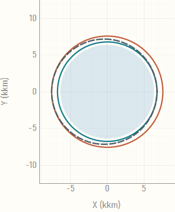

# SMART

SMART 全称为 `Spacecraft Mission Analysis, Research & Toolkit`，是一个面向航天任务设计与工程分析的桌面软件。项目围绕 `STK 11.6 + SPICE + PySide6` 构建统一工作流，用来解决传统任务分析中多工具切换、时间与坐标系转换易错、结果留痕分散的问题。

当前仓库提供的是一版可运行的桌面 MVP，已经覆盖轨道初始化、变轨分析、发射窗口计算、跟踪弧段分析、项目化数据落盘和 AI 辅助项目解读等核心链路。

<p align="center">
  
  
  
</p>

<p align="center">
  
  
</p>

## 项目定位

SMART 的目标不是单独替代 STK 或 SPICE，而是把任务建模、约束分析、图形验证、结果导出和工程说明收敛到一个可复用、可追溯的桌面分析环境中：

- UI 层统一以北京时间配置任务参数，降低人工换算成本
- 服务层优先复用 SPICE 与本地 STK 11.6 能力，减少手写公式漂移
- 图形验证基于本地桌面绘图与 OpenGL 轨道视图运行
- 项目结果按 `config / data / charts` 结构自动沉淀，便于复算和交接
- AI 分析页只读取摘要上下文做辅助说明，不直接修改任务配置

## 当前能力

- 卫星状态设置：质量、推进系统、天线、地面站/测控船、中继星等任务参数配置
- 轨道初始化：支持轨道参数配置、项目级配置保存和初始化流程固化
- 变轨策略分析：圆轨道霍曼转移估算、分阶段机动参数编辑、轨迹与趋势图生成
- 发射窗口分析：约束扫描、窗口结果表、样本缓存和甘特图输出
- 跟踪弧段分析：围绕测控可见性生成可跟踪弧段结果
- 任务可视化：2D/3D 轨道视图、科学曲线与结果图表
- AI 辅助解读：面向项目摘要的任务分析说明页，支持报告式输出
- 项目管理：新建/打开项目，自动保存配置、CSV、图表和中间结果

## 技术选型

- GUI：PySide6
- 数值计算：NumPy
- 2D 绘图：pyqtgraph
- 3D 轨道视图：pyqtgraph OpenGL + PyOpenGL
- 星历与 SPICE：SpiceyPy

## 模块规划

- 卫星状态设置（Satellite Status）
- 变轨策略（Maneuver Strategy）
- 发射窗口分析（Launch Window Analysis）
- 跟踪弧段分析（Tracking Arc Analysis）
- 飞行程序设计（Flight Program Design）
- 科学数据可视化（Scientific Data Visualization）

目前已实装卫星状态设置、变轨策略和共享可视化栈，其余模块在应用中以可扩展页面形式预留。

## 功能文档

- 发射窗口工作流、缓存文件、结果 CSV 和甘特图说明：`doc/launch_window_workflow.md`
- 发射窗口角度定义、公式和可见性判据：`doc/launch_window_angle_reference.md`
- AI 项目分析页面、API 配置和数据发送范围：`doc/ai_project_analysis.md`
- SPICE 内核要求、默认加载顺序和调用示例：`doc/spice_usage.md`

## 快速开始

```powershell
python -m venv .venv
.venv\Scripts\Activate.ps1
python -m pip install --upgrade pip
python -m pip install -e .[dev]
smart
```

也可以直接模块启动：

```powershell
$env:PYTHONPATH = "src"
python -m smart.main
```

## 运行脚本（PowerShell）

```powershell
.\scripts\setup.ps1    # 创建 .venv 并安装依赖
.\scripts\run.ps1      # 启动 SMART 桌面程序
.\scripts\test.ps1     # 运行测试
.\scripts\install-git-hooks.ps1  # 安装 Git hooks（setup 会自动调用）
```

如果当前终端执行策略限制脚本运行：

```powershell
Set-ExecutionPolicy -Scope Process Bypass
```

## 更新记录

- 仓库根目录 `updates.md` 由 Git hook 自动维护。
- 正常执行 `git commit` 时，`.githooks/commit-msg` 会调用 `scripts/update_updates_md.py` 自动追加本次更新记录。
- 新环境可执行 `.\scripts\setup.ps1` 或 `.\scripts\install-git-hooks.ps1` 安装 hook。
- 如果需要手工回填或重建记录，可执行：

```powershell
python .\scripts\update_updates_md.py
```

## 项目管理

使用顶部菜单 `项目 / Project`：

- `新建项目 / New Project`：在仓库根目录下的 `projects/` 中创建项目文件夹
- `打开项目 / Open Project`：默认从 `projects/` 目录开始选择已有 SMART 项目

项目激活后，程序会自动保存：

- 卫星状态配置文件：`config/satellite_status.json`
- 变轨策略配置文件：`config/maneuver_strategy.json`
- 轨道与状态数据：`data/orbit_elements.json`
- 变轨策略计算结果：`data/full_orbit_history.csv`
- 发射窗口样本缓存：`data/launch_window_samples.csv`
- 发射窗口结果表：`data/launch_window_results.csv`
- 图表文件：`charts/altitude_trend.png`、`charts/velocity_trend.png`

其中 `config/satellite_status.json` 和 `config/maneuver_strategy.json` 会在项目创建时自动生成；用户修改“卫星状态设置”和“变轨策略”页面参数后会同步覆盖保存。变轨策略页面可编辑顶层 `launch_mass_kg`、`t0_orbit` 以及逐次机动参数，并用这些配置生成 `data/full_orbit_history.csv`。

## SPICE 内核

将任务内核放置在 `data/kernels/`。SMART 当前对轨道、时间、坐标系相关处理采用 SPICE 优先策略，默认本地自动加载项目级和仓库级内核。

完整约束、内核要求、默认加载顺序、STK `.e` 导入限制与调用示例见：

- `doc/spice_usage.md`

`smart.services.spice_service` 当前提供的核心接口包括：

- 内核自动发现与加载
- UTC 与 ET 转换
- 位置/状态向量参考系转换
- 天体状态向量查询

推荐目录结构：

```text
data/kernels/
  naif0012.tls
  pck00011.tpc
  earth_assoc_itrf93.tf
  earth_latest_high_prec.bpc
  de440s.bsp
```

## 项目结构

```text
src/smart/
  domain/         # 任务与轨道领域模型
  services/       # 动力学计算与 SPICE 服务
  ui/             # 桌面界面与控件
tests/            # 数值与功能测试
data/kernels/     # 本地 SPICE 内核
```

## 验证测试

```powershell
$env:PYTHONPATH = "src"
python -m pytest
```
